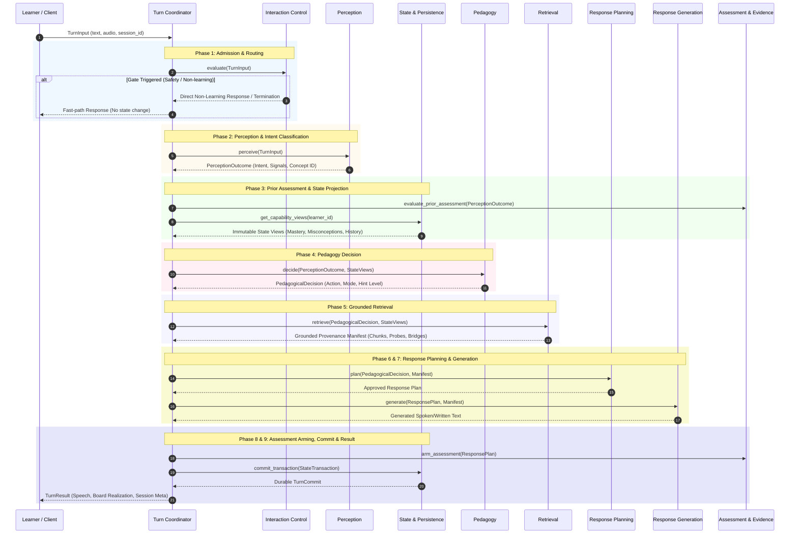

# Wini Tutor Runtime — Complete Architecture & Execution Flow

This document provides a comprehensive technical reference for the Wini Tutor Runtime architecture, detailing the architectural refactoring from the legacy monolithic `tutor_loop.py` into a modular, multi-user friendly, and fault-tolerant turn-coordinated system.

---

## 1. Executive Summary & Refactoring Motivation

The **Wini Tutor Runtime** is a pedagogy-first intelligent tutoring engine that turns learner interactions (spoken or typed) into pedagogically grounded responses and evidence-backed learner-state transitions.

### Why Split `tutor_loop.py`?
Originally, `cloud_run_service/tutor_loop.py` operated as a single **170KB+ monolithic god-object**. Every step of a tutoring turn—from input normalization, intent classification, concept resolution, state math, pedagogy rule selection, RAG retrieval, LLM prompt assembly, response generation, speech pacing, board presentation, and state persistence—was tightly coupled in a single file and execution chain.

This created several critical challenges:
1. **Debugging & Testing Complexity**: Isolating issues in perception, pedagogy, or RAG required running the full 170KB execution loop.
2. **Multi-User & Concurrency Hazards**: Global session state, mutable shared dicts, and uncommitted side-effects caused state bleeding and hindered multi-tenant Cloud Run execution.
3. **Lack of Fault Isolation**: A minor failure in RAG retrieval or speech generation would crash the entire turn, instead of triggering a graceful degradation or safe fallback.
4. **Parallel Feature Development**: Team members could not work on perception, pedagogy, or retrieval independently without constantly causing merge conflicts in `tutor_loop.py`.

### Refactoring Strategy: The Feature-Neutral Turn Coordinator
The codebase has been refactored around a **Turn Coordinator** pattern (`cloud_run_service/runtime/coordinator.py`). The Turn Coordinator sequences a turn across **independent Feature Modules**, enforcing typed boundaries, atomic state transactions (`TurnCommit`), and deterministic recovery policies without taking ownership of individual feature logic.

---

## 2. Comparison: Remote Repository (`origin/main`) vs Connected Workspace

A detailed comparison between the remote base (`origin/main`) and the current project folder (`cloud-CLI-feat-t9-display-and-grading-fixes` branch + workspace):

| Dimension | `origin/main` (Remote Base) | Connected Project Folder (Current Branch) |
|---|---|---|
| **Architecture Pattern** | Monolithic `tutor_loop.py` handling all responsibilities. | Modular **Turn Coordinator** + 8 decoupled **Feature Modules**. |
| **Commit Delta** | Baseline branch. | **21 Commits ahead** of `origin/main` (+ 100+ modified/new files). |
| **Turn Sequencing** | Direct sequential execution inside `TutorLoop.turn()`. | Explicit 9-Phase lifecycle controlled by `TurnCoordinator`. |
| **State Management** | Direct inline mutation of learner state dicts. | Atomic `StateTransaction` & `TurnCommit` boundary via `state_and_persistence`. |
| **Fault Recovery** | Unhandled exceptions bubble up; partial state saved mid-turn. | Typed `FailureSignal`s mapped to `RecoveryAction` (DEGRADE, SAFE_FALLBACK, FAIL_CLOSED). |
| **Multi-User Readiness** | Single-user local memory structures. | Stateless Cloud Run ready; Firestore backend per learner ID; concurrency safe. |
| **Regression Testing** | Manual test scripts; high risk of breaking changes. | Automated **`baseline_oracle`** harness verifying behavioral equivalence against legacy runs. |

---

## 3. Implemented Architecture Layers & Feature Modules

The runtime is organized into **8 Feature Modules** sequenced across **9 Logical Turn Phases**. Below is the status of each layer:

```
┌────────────────────────────────────────────────────────────────────────────────────────┐
│                                   TURN COORDINATOR                                     │
│  Phase 1        Phase 2        Phase 3        Phase 4      Phase 5     Phase 6..9  │
│ ┌──────────┐   ┌──────────┐   ┌──────────┐   ┌──────────┐ ┌──────────┐ ┌─────────────┐ │
│ │  Layer 1 │   │  Layer 2 │   │  Layer 3 │   │  Layer 4 │ │  Layer 5 │ │ Layers 6..8 │ │
│ │Interact. │──>│Perception│──>│Assessment│──>│ Pedagogy │>│Retrieval │>│ Generation  │ │
│ │ Control  │   │ & Intent │   │ & State  │   │ Decision │ │ Manifest │ │  & Commit   │ │
│ └──────────┘   └──────────┘   └──────────┘   └──────────┘ └──────────┘ └─────────────┘ │
└────────────────────────────────────────────────────────────────────────────────────────┘
```

### Layer Status Breakdown

| Layer / Module | Package Directory | Responsibility & Extraction Status |
|---|---|---|
| **1. Interaction Control** | `cloud_run_service/interaction_control/` | **Extracted & Active**. Handles admission, safety/nonsense deterministic gates, intent routing (SOCIAL, META, OFF-DOMAIN, EMOTIONAL, SESSION-CONTROL), topic continuity, and session termination. |
| **2. Perception** | `cloud_run_service/perception/` | **Extracted & Active**. Fuses Gemini 2.5 Flash / MiniLM signals into typed cognitive intent, affective state (confusion, frustration), and NCERT concept resolution (108 concepts). |
| **3. Assessment & Evidence** | `cloud_run_service/assessment_evidence/` | **Extracted & Active**. Governs assessable items, grades learner attempts, records evidence-backed outcomes to an append-only ledger, and updates mastery/misconceptions. |
| **4. State & Persistence** | `cloud_run_service/state_and_persistence/` | **Extracted & Active**. Manages Learner State & Session State integrity. Applies state projections and guarantees atomic `TurnCommit` to Firestore / local disk. |
| **5. Pedagogy** | `cloud_run_service/pedagogy/` | **Extracted & Active**. Selects teaching move (v4 rules / policy-shadow), mode progression (EXPLAIN, PRACTICE, TEST), hint escalation chain, and pacing constraints. |
| **6. Grounded Retrieval** | `cloud_run_service/retrieval/` | **Extracted & Active**. Assembles 7-term ranked provenance manifests from 108 concepts, 3.5k graph nodes, 1k FAISS chunks, probes, and bridge recaps with cohesion validation. |
| **7. Response Planning** | `cloud_run_service/response_planning/` | **Extracted & Active**. Translates pedagogical action and retrieval evidence into an approved multi-modal response plan (speech budget, board buddy diagrams). |
| **8. Response Generation** | `cloud_run_service/response_generation/` | **Extracted & Active**. Generates learner-facing speech/text from approved response plans using local Qwen / Vertex Gemini Flash, enforcing post-stream assessment checks. |
| **Infrastructure / Foundation** | `cloud_run_service/runtime/` | **Extracted & Active**. Central `TurnCoordinator`, `contracts.py`, `supervisor.py`, `legacy_adapter.py`, and `model_gateway.py`. |
| **Verification & Replay** | `cloud_run_service/baseline_oracle/` | **Extracted & Active**. Baseline replay & golden outcome oracle harness to guarantee zero regression during extraction. |

---

## 4. End-to-End Architecture Data Flow (9-Phase Turn Pipeline)

Each turn (learner input → committed response) flows deterministically through 9 phases:



### Phase Detail Overview:

1. **Phase 1: Admission and Routing (`interaction_control`)**
   - Evaluates safety rules, nonsense detection, and intent classification.
   - Non-learning intents (e.g., greetings, off-domain chatter, leave requests) receive an instant persona reply without touching cognitive learner state.
2. **Phase 2: Perception and Prior Grading (`perception`)**
   - Calls structured perception model (Gemini 2.5 Flash / MiniLM) to extract:
     - Spoken Intent (`LEARNING`)
     - Cognitive Signals (Frustration, Confusion, Engagement)
     - Subject Concept pick mapped against the 108 NCERT Math concepts.
3. **Phase 3: State Projection and Prior Assessment (`state_and_persistence` & `assessment_evidence`)**
   - Computes immutable snapshot views of current mastery, misconceptions, active hint chains, and session history.
   - Evaluates any pending assessment responses from the previous turn.
4. **Phase 4: Pedagogical Move Selection (`pedagogy`)**
   - Evaluates v4 pedagogy rules (and logs shadow policy predictions).
   - Determines teaching strategy: e.g., `PROBE_MISCONCEPTION`, `GATED_BRIDGE`, `FADE_HINT`, `DIRECT_EXPLANATION`, `QUIZ_ITEM`.
5. **Phase 5: Grounded Evidence Retrieval (`retrieval`)**
   - Executes multi-term vector and graph search over `rag_store/`.
   - Constructs a strict **provenance manifest**: only retrieved NCERT chunks, figures, bridge recaps, and probe questions are made available to response generation. Free LLM memory is strictly forbidden.
6. **Phase 6 & 7: Response Planning & Generation (`response_planning` & `response_generation`)**
   - **Planning**: Allocates speech word budgets, determines board display components (Board Buddy geometry/rendering).
   - **Generation**: Formulates natural, encouraging spoken output strictly grounded in the provenance manifest.
7. **Phase 8: Assessment Arming & Turn Commit (`assessment_evidence` & `state_and_persistence`)**
   - Arms any pending diagnostic check or practice item.
   - Atomically commits all authorized Learner State and Session State changes (`TurnCommit`). If state save fails, the turn rolls back without corrupting history.
8. **Phase 9: Final Turn Result (`coordinator`)**
   - Compiles final `TurnResult` with realization payload (speech text/audio stream, board rendering JSON) and diagnostic telemetry.

---

## 5. Fault Tolerance & Recovery Policy

The `TurnCoordinator` uses a feature-neutral `RecoveryPolicy` (`cloud_run_service/runtime/coordinator.py`) to handle `FailureSignal`s emitted by any Feature Module:

```
                  ┌──────────────────────────────┐
                  │      Module Exception        │
                  └──────────────┬───────────────┘
                                 ▼
                  ┌──────────────────────────────┐
                  │    Typed FailureSignal       │
                  └──────────────┬───────────────┘
                                 ▼
                    /══════════════════════════\
                   <   Select RecoveryAction    >
                    \══════════════════════════/
                     /           │          \
                    /            │           \
                   ▼             ▼            ▼
          ┌──────────────┐ ┌──────────────┐ ┌──────────────┐
          │   DEGRADE    │ │ SAFE_FALLBACK│ │ FAIL_CLOSED  │
          │(Use neutral  │ │(Non-assessing│ │(Abort turn,  │
          │ intent/signal│ │ default msg) │ │ no state chg)│
          └──────────────┘ └──────────────┘ └──────────────┘
```

- **FAIL_CLOSED**: Required if identity, safety, state persistence, or assessment evidence fails. Aborts the turn and keeps state untouched.
- **SAFE_NON_ASSESSING_FALLBACK**: If retrieval or LLM generation fails, emits a safe, pre-scripted explanation prompt without advancing state.
- **DEGRADE**: If optional perception enrichment fails, falls back to neutral cognitive signals and inherits previous concept context.

---

## 6. Summary of Architectural Wins

1. **Clean Modular Boundaries**: Each capability lives in its own folder with a single `interface.py`, README, and isolated test suite.
2. **Multi-User Concurrency & Firestore Persistence**: Learner state transactions are atomic, preventing cross-learner state leakage in multi-tenant environments.
3. **Behavioral Integrity**: Verified via `baseline_oracle` replay tests, ensuring 100% equivalence with legacy behaviors while gaining modern modularity.
4. **Latency Streaming Ready**: Supports chunked NDJSON streaming (`/voice_turn`) for instant audio output (3.3s time-to-first-audio).

---
*Document Version: 1.0 — Created for Wini Tutor Runtime Refactoring Track.*
