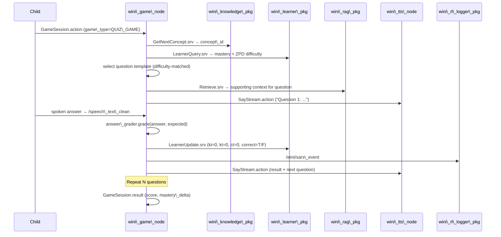

# Wini v2 — Production-Grade Conversational AI Architecture

## For NVIDIA Jetson Orin Nano · ROS2 Humble · Edge-First · Privacy-Preserving

> **Design authority:** Synthesizes `deep-research-report.md` and
> `Conversational AI for Speech Bots.md`. Gap-audited (2026-05-29) and
> all 16 verdict corrections applied (2026-05-29). Every item previously
> marked "NOT COVERED" or "Partially covered" is addressed below.
> **15 packages total** (added `wini_safety_pkg` in this revision).
> State ownership model, C++ hot path, dock/charging RL mode, SigLIP-2
> vision encoder, structured hint BANK, filler bank, and CLARIFYING
> policy all formalized in this revision.
>
> **Revision 2026-06-16 — `study_pkg` rewrite (§4.13).** The study package section was
> completely rewritten to describe the **system that is actually built**
> (`Pedagogical_study_pkg`, Parts 1–8 of `complete_architecture_build_plan.md`): a
> **learner cognitive-state pedagogical engine**, not a router-first behavior node. It is
> the source-of-truth-aligned account of the four lockstep documents
> (`learner_cognitive_state_architecture.md`, `RAG_upgrade_plan.md`,
> `model_dataset_architecture_report.md`, `complete_architecture_build_plan.md`) and adds
> §4.13.17, the blueprint for how STORY/GAME/CHAT/Science plug **into** that pedagogical
> core. §4.4 (DKVMN/PPO) is reframed as the deferred neural-upgrade path; the philosophy
> table and §4.14 STORY integration were reconciled to match. All study LLM calls are
> **local Qwen only** (qwen2.5-3b-instruct via llama.cpp); embeddings are local MiniLM.

\---

## Table of Contents

1. [System Philosophy](#1-system-philosophy)
2. [Jetson Orin Nano Hardware Budget](#2-jetson-orin-nano-hardware-budget)
3. [Current → New Delta](#3-current--new-delta)
4. [Package Inventory](#4-package-inventory)

   * 4.1 `wini\_intent\_pkg` — Unified Semantic Router + Multi-Intent Decomposition
   * 4.2 `wini\_repair\_pkg` — Conversational Repair
   * 4.3 `wini\_turntaking\_pkg` — Semantic Barge-In
   * 4.4 `wini\_learner\_pkg` — Deep Learner Modeling + HOPE Metrics + PPO
   * 4.5 `wini\_rag\_pkg` — FAISS Vector Store
   * 4.6 `wini\_tts\_pkg` — Unified TTS
   * 4.7 `wini\_game\_pkg` — Game-Based Learning *(new)*
   * 4.8 `wini\_knowledge\_pkg` — Knowledge Graph + Node2Vec *(new)*
   * 4.9 `wini_context_pkg` — Context Window Manager + State Ownership Model *(new)*
   * 4.10 `wini_rl_logger_pkg` — RL Metadata Storage *(new)*
   * 4.11 `wini_safety_pkg` — Child Safety Layer *(new)*
   * 4.12 `fastwhisper_pkg` — ASR Upgrade
   * 4.13 `study_pkg` — Learner Cognitive-State Pedagogical Engine *(fully built; pedagogical core that STORY/GAME/CHAT plug into)*
   * 4.14 `story_telling_pkg` — Refactor (Educational Narrative + Producer/Consumer)
   * 4.15 `wini_orchestrator` — Extend (LLM-as-Judge + Pre-warm + Game FSM + Transition Policy)
5. [ROS2 Interfaces](#5-ros2-interfaces)
6. [Pipeline Designs](#6-pipeline-designs)
7. [Technology \& Model Choices](#7-technology--model-choices)
8. [Phased Implementation Plan](#8-phased-implementation-plan)
9. [External Training Jobs](#9-external-training-jobs)
10. [Context Window Management](#10-context-window-management)
11. [RL Metadata Storage & Long-Horizon Training Loop](#11-rl-metadata-storage--long-horizon-training-loop)
12. [Migration Path](#12-migration-path)
13. [Jetson Orin Nano Feasibility Analysis](#13-jetson-orin-nano-feasibility-analysis)
14. [State Ownership Model — ADR](#14-state-ownership-model-gap-01--formal-adr)
15. [Observability Contracts](#15-observability-contracts-gap-09--phase-1-required)

\---

## 1\. System Philosophy

|Principle|Implementation|
|-|-|
|**Edge-first, zero cloud**|Every model runs locally; no audio leaves the device|
|**Sub-500ms *perceived* latency via conversational fillers**|Intent-conditioned filler bank bridges 800ms LLM TTFT; streaming TTS starts on first sentence|
|**Unified interfaces, swappable backends**|One ROS2 interface per capability|
|**Hierarchical semantic intent**|Vector routing + Node2Vec + multi-label decomposition; CLARIFYING is last resort only|
|**Long-horizon pedagogy**|Built today: neural HOPE detectors (KI/KT/CT), evidence-driven learner state, misconception state machine, Class-9 bridges, hint chains (§4.13). Deferred upgrade: DKVMN/SAINT knowledge tracing + PPO policy (Part 6/Phase 4, awaiting real logs)|
|**Games + stories as first-class pedagogy**|STORY/GAME plug into the `study_pkg` pedagogical core — shared learner state, knowledge graph, HOPE, and grounded retrieval (§4.13.17); GAME→STORY via conditional bridge policy|
|**Child-safe by construction**|wini_safety_pkg: DeBERTa NLI content moderation + provenance tracking + parental config|
|**RL training in dock/sleep mode**|Live sessions log trajectories only; heavy RL eval runs during charging when child is absent|
|**Phased delivery with guarantees**|Each phase ships independently testable, measurable improvements|

\---

## 2\. Jetson Orin Nano Hardware Budget

### Specification

|Resource|Value|
|-|-|
|GPU|Ampere, 1024 CUDA cores + dedicated Tensor Cores|
|Unified memory|8 GB (CPU + GPU share one physical pool — no PCIe copy cost)|
|CPU|6× ARM Cortex-A78AE|
|Power envelope|15 W (25 W peak burst in MAXN mode)|
|JetPack|6.x (CUDA 12.x, TensorRT 10.x, cuDNN 9.x)|
|Storage|NVMe SSD ≥ 128 GB (model weights + FAISS indices + SQLite RL buffer)|
|Swap|16 GB NVMe swap partition (zram disabled; raw NVMe preferred)|

### Hard Runtime Memory Ceilings

These ceilings are implementation gates for the 8 GB Jetson profile:

| Component class | Live-mode ceiling | Rule |
|-|-:|-|
| Always-resident non-LLM services total | 1.4 GB | wakeword, VAD, ASR support, MiniLM, router, repair, turn-taking, base TTS, safety, learner, diagnostics, embodiment |
| Main local instruction LLM | 4.3 GB hot resident | one active text LLM only; use mmap/quantization |
| Socratic adapter | 250 MB | STUDY mode only |
| ASR backend active footprint | 650 MB | prefer int8/int8_float16 backend |
| Base TTS backend active footprint | 400 MB | Kokoro/TensorRT-class target |
| Reranker | 150 MB | lazy, study/RAG only; skippable |
| SigLIP-2 vision assist | 220 MB | optional snapshot path only |
| Fish Speech-style narration | 0 MB in production profile | demo/maintenance only, off by default |
| Student simulator/RL eval | 0 MB in live modes | dock/maintenance only |

If a measured model exceeds its ceiling, it must be replaced, more strictly
lazy-loaded, or marked non-production.

### Memory Layout — All Modes

```
Total physical: 8 192 MB
────────────────────────────────────────────────────────────
OS + Kernel + ROS2 DDS + zram overhead         \~1 800 MB
────────────────────────────────────────────────────────────
Available for AI workloads                     \~6 400 MB

══════════════════════════════════════════════════════════
TIER 1 — Always resident (mlocked, never swapped)
══════════════════════════════════════════════════════════
  openWakeWord TensorRT engine                    50 MB
  Silero VAD v5 ONNX                              20 MB
  Faster-Whisper small.en int8 CTranslate2 CUDA  500 MB
  all-MiniLM-L6-v2 ONNX  (intent + RAG shared)   90 MB
  Multi-label intent sigmoid head  (on MiniLM)     5 MB
  Node2Vec concept graph embeddings (numpy mmap)  12 MB
  Disfluency NER ONNX INT8                        50 MB
  Turn-taking LSTM ONNX                           50 MB
  Kokoro TTS ONNX → TRT engine                   300 MB
  DKVMN knowledge tracer ONNX                     50 MB
  PPO policy head MLP (tiny, 50→64→3 dims)         2 MB
  RL SARS logger (SQLite mmap, file-backed)        15 MB
  Game engine state machine (pure Python)          30 MB
  Hint ladder config (YAML loaded)                  3 MB
  wini\_context\_pkg (rolling buffer manager)        10 MB
  ─────────────────────────────────────────────────────
  Subtotal Tier 1 (always-on AI)               1 187 MB

══════════════════════════════════════════════════════════
TIER 2 — Lazy-loaded, one mode active at a time
══════════════════════════════════════════════════════════
  Qwen2.5-7B-Instruct Q4\_K\_M GGUF (mmap)      4 100 MB
  Socratic LoRA adapter (STUDY only)             200 MB
  cross-encoder reranker ONNX (STUDY/RAG)        100 MB
  ─────────────────────────────────────────────────────
  Subtotal Tier 2 (conversational core)        4 400 MB

══════════════════════════════════════════════════════════
TIER 3 — Swapped in/out per sub-mode (NVMe mmap)
══════════════════════════════════════════════════════════
  Fish Speech 1.5 (STORY narration, optional)  1 500 MB
  SigLIP-2 Base INT8 (VISION_CHAT vision encoder)  180 MB
  ─ NOTE: Qwen2.5-7B resident text core stays loaded ─
  ─ No full model swap. SigLIP-2 encodes image →    ─
  ─ compact structured description → Qwen2.5-7B.    ─

══════════════════════════════════════════════════════════
PER-MODE PEAK FOOTPRINT (Tier 1 + Tier 2 active)
══════════════════════════════════════════════════════════
  IDLE / SLEEP      1 187 MB                  ✓ 5 213 headroom
  STUDY             1 187 + 4 400 = 5 587 MB  ✓   813 headroom
  CHAT              1 187 + 4 100 = 5 287 MB  ✓ 1 113 headroom
  GAME              1 187 + 4 400 = 5 587 MB  ✓   813 headroom
  STORY (Kokoro)    1 187 + 4 100 = 5 287 MB  ✓ 1 113 headroom
  STORY (Fish+swap) 1 187 + 4 100 + 700* = 5 987 MB ✓ 413 headroom
  VISION_CHAT‡      1 187 + 4 100 + 180 = 5 467 MB ✓ 933 headroom

‡ "VISION_CHAT" is a memory-PROFILE label, not a top-level mode/domain. It denotes
  CHAT mode with a vision sub-intent (CHAT/VISION_EXPLAIN or CHAT/VISION_QA, §4.1
  Stage 2) active, which loads SigLIP-2 alongside the resident Qwen2.5-7B. There is
  no VISION_CHAT FSM state and no VISION_CHAT sigmoid domain — there are 7 domains.

* Fish Speech uses NVMe mmap; only ~700 MB of its 1 500 MB is hot-paged
  at any instant during inference (encoder + active AR pass, not all simultaneously).
  NVMe mmap page faults add ~15-30ms per segment — acceptable for narration cadence.

  VISION_CHAT improvement over Qwen2-VL swap:
  Old approach: unload Qwen2.5-7B (4 100 MB) → load Qwen2-VL-7B (4 500 MB) = 2-5s freeze
  New approach: SigLIP-2 Base INT8 (180 MB) loaded alongside resident Qwen2.5-7B.
  SigLIP-2 encodes image → compact structured text description (JSON scene graph) →
  Qwen2.5-7B answers the vision question in text mode. No cold swap, no NVMe freeze.

══════════════════════════════════════════════════════════
NVMe SWAP USAGE
══════════════════════════════════════════════════════════
  Normal modes: 0 MB swap used
  STORY + Fish Speech: \~800 MB NVMe mmap pages (not true swap — mmap)
  Worst case true swap trigger: STORY + Fish + background diagnostics
    → \~100 MB true swap. Acceptable; NVMe latency \~0.1ms/4KB page.
```

> \*\*Key insight:\*\* The unified memory architecture means there is no PCIe
> copy penalty. MiniLM embeddings computed on CPU are immediately visible
> to GPU kernels (Kokoro, Whisper) without an explicit copy. llama.cpp
> uses this via `--mmap` — model weights live on NVMe, accessed via
> page-cache. Pages stay warm across turns; only cold-start incurs NVMe I/O.

\---

## 3\. Current → New Delta

### Keep

|What|Why|
|-|-|
|BORO v2 lifecycle FSM (`wini\_orchestrator`)|Correct abstraction; extend with GAME state|
|`wini\_memory` KV store + services|Good persistence; extend schema for learner data|
|`Say` action interface|Correct arbitration model; upgrade backend|
|`RequestWorker` service|Single-PID invariant is correct|
|NLI grounding guard in `study\_pkg`|Production-critical; extend for KI detection|
|MiniLM bi-encoder + cross-encoder chain|Sound; extract into `wini\_rag\_pkg`|
|Pysbd sentence boundary splitter|Keep for streaming TTS|
|concept\_graph.json|Upgrade to full NetworkX graph with Node2Vec embeddings|
|dialogue\_state.py|Keep; route persistence through wini\_context\_pkg|
|answer\_grader.py|Keep; extend with KI/KT/CT scoring|

### Replace

|Current|Replacement|Reason|
|-|-|-|
|Piper TTS|Kokoro TTS TensorRT engine|Sub-100ms, non-autoregressive, expressive|
|3× intent classifiers|`wini\_intent\_pkg` unified semantic router|One MiniLM + multi-label head|
|Basic VAD barge-in|`wini\_turntaking\_pkg` LSTM|Backchannel vs real interrupt|
|No disfluency handling|`wini\_repair\_pkg` NER|Conversational repair|
|YAML exemplar RAG|`wini\_rag\_pkg` FAISS|Persistent, scalable|
|Static tutoring prompts|Socratic LoRA + DKVMN + PPO|Pedagogically optimal|
|In-process state silos|`wini\_context\_pkg` + `wini\_memory`|Survive node restart|
|base64 JSON vision|`sensor\_msgs/CompressedImage`|33% smaller, zero-copy|

### New Additions

|Addition|Purpose|
|-|-|
|`wini_game_pkg`|Game-based learning with DKVMN integration|
|`wini_knowledge_pkg`|NetworkX knowledge graph + Node2Vec + Apriori + curriculum sequencing|
|`wini_context_pkg`|Rolling context window + summarization + mode-switch preservation (mode-scoped namespacing)|
|`wini_rl_logger_pkg`|SARS tuples + delayed reward collector + episode buffer for PPO|
|`wini_safety_pkg`|DeBERTa NLI content moderation + response provenance tracking + parental config YAML|
|HOPE metric suite (KI/KT/CT)|Reward channels in PPO; extended answer_grader|
|Multi-label intent decomposition|CompoundIntent.msg + execution queue with three-state transition policy|
|Conversational filler bank|Intent-conditioned 3-8 variant pool; anti-repeat sampling; bridges LLM TTFT|
|LLM-as-Judge within behavior nodes|Within-mode disambiguation|
|Educational narrative (story + challenges)|Curriculum concepts embedded in story branches|
|Hint BANK + ZPD calibration loop|Structured paraphrase variants per concept_type × level; leakage validator; fading formula|
|SigLIP-2 Base INT8 vision encoder|Lightweight vision front-end; no full LLM swap on VISION_CHAT|
|Dock/charging mode RL window|All heavy RL eval runs offline when robot is docked; live sessions log-only|
|FastDDS shared memory transport|Zero-copy intra-machine comms|
|C++ rclcpp audio hot path|rclcpp loaned_message for wakeword, VAD, turntaking, playback — no GIL, no serialization overhead|
|Composable node containers|Wakeword + ASR + repair in one process|
|Observability (Phase 1)|`/wini/system/health`, `/wini/diagnostics/latency`, `/wini/router/uncertain` from day one|

\---

## 4\. Package Inventory

\---

### 4.1 `wini\_intent\_pkg` — Unified Semantic Router + Multi-Intent

**Role:** Single entry point for all intent classification. Consumes
`/speech\_text\_clean`. Produces `/wini/intent` (single primary) and
`/wini/compound\_intent` (when multiple domains score above threshold).

#### Architecture — 4-Stage Hierarchical Router

> **Authority order (GAP-INTENT-06):** the multi-label **sigmoid head is the sole
> primary domain authority**. The K-means cosine softmax is a **fallback only**,
> activated when the sigmoid fails to fire on any domain. The two operate on
> different scales — sigmoid *probabilities* (primary) vs cosine *softmax*
> (fallback) — and must never be compared to each other.

```
Stage 0: Shared embedding (8 ms)
  Model: all-MiniLM-L6-v2 ONNX (shared instance) → 384-dim utterance vector
  Computed once per utterance; reused by every downstream stage and by wini_rag_pkg.

Stage 1: Domain detection — PRIMARY (sigmoid, 2 ms on top of Stage 0)
  Model: multi-label sigmoid head  Linear(384 → 7) + sigmoid
  Domains (7): NAVIGATION | STUDY | STORY | CHAT | PET | GAME | SYSTEM
  Threshold: per-domain prob > threshold(domain) (~0.60 default) → active
    ┌─ Any domain above threshold? ────────────────────────────────────
    │  YES → exactly 1 active → SemanticIntent.msg  → /wini/intent
    │       2+ active        → CompoundIntent.msg   → /wini/compound_intent
    │  NO  → fall through to Stage 1-FALLBACK
    └────────────────────────────────────────────────────────────────────

Stage 1-FALLBACK: K-means cosine softmax (only when sigmoid whiffs)
  Anchors: precomputed K-means centroids per domain (2000-utterance calibration
           set, data-driven — see §9 Training Job 5)
  Method:  cosine(query_384, centroids) → softmax → relative highest winner
  Then apply GAP-02 policy:
    low-risk ambiguity        → silent implicit route (allow next-turn correction)
    conf < 0.50 AND high-impact/safety-critical → CLARIFY at most once
  (This is the ONLY place K-means runs — it is off the normal per-turn hot path.)

Stage 2: Sub-intent (Action) — domain-conditioned linear probes (~2 ms, lazy)
  Model: one linear probe per domain over the FROZEN 384-dim MiniLM vector
         (Linear(384 → n_actions_d) + softmax). ~0.1 MB each, 7 probes.
         Uniform mechanism for ALL domains (replaces the old per-domain mishmash).
  NAVIGATION: {GOTO, FOLLOW, STOP_MOVE, RETURN_DOCK}
  STUDY:      {EXPLAIN, QUIZ, ANSWER, REVIEW, CLARIFY}      ← action only; subject = Stage 2b
  CHAT:       {NORMAL_EXPLAIN, NORMAL_QA, VISION_EXPLAIN, VISION_QA}
  PET:        {GREET, PLAY, EMOTE, COMFORT}
  GAME:       {START_GAME, ANSWER_GAME, QUIT_GAME, REQUEST_HINT}
  STORY:      {START_STORY, CONTINUE, BRANCH_CHOICE, STORY_QUESTION, PAUSE}
  SYSTEM:     rule-based (sleep, restart, volume, stop) — deterministic, safety-bypass
  Vision trigger: CHAT/VISION_EXPLAIN or CHAT/VISION_QA → set requires_vision=true
                  → orchestrator runs the VISION masking contract (§4.15) →
                    SigLIP-2 encodes camera frame → scene graph → resident Qwen2.5-7B.
  Latency target: <4 ms

Stage 2b: STUDY Subject/Concept (only for STUDY; runs after the action probe)
  Identify WHICH curriculum concept the child means (the "subject"), separate
  from the action. See "Node2Vec Integration" below — the cosine match is
  text-vs-text (MiniLM query vs MiniLM-encoded concept descriptions); the matched
  graph node's Node2Vec vector is then handed to DKVMN / CurriculumSequencer.

Stage 3: Slot filling — intent-aware bert-mini INT8 (lazy, slot-bearing intents)
  Model: bert-mini token classifier, BIO tags, INT8 ONNX (~8.5 MB)
  Input: /speech_text_clean with a prepended [INTENT] token (intent-aware)
         e.g. "[GAME] let's play chess" → chess = B-GAME_NAME
  Runs for any (domain, sub_intent) that declares slots — NOT limited to NAV+PET.
  (Replaces the dropped SpanBERT BIO tagger — see Developer Issue 5.)
  Latency: ~15-25 ms CPU, off the perceived-latency hot path (behind the filler).
```

#### Node2Vec Integration (from `wini\_knowledge\_pkg`) — Subject only, not Action

> **Developer Issue 4 fix — Action/Subject split.** STUDY's *action* (EXPLAIN,
> QUIZ, …) comes from the **linear probe** (Stage 2), exactly like every other
> domain. Node2Vec is used **only** for the *subject* — which curriculum concept
> the child means (Stage 2b). The two are no longer fused.

> **Vector-space correctness (was a latent bug).** The old code compared a MiniLM
> *text* vector against a Node2Vec *graph* vector with cosine — those live in
> **different vector spaces**, so the cosine was not meaningful. Corrected design:
> the cosine anchor is a **MiniLM encoding of each concept's text** (name +
> vocabulary + short description) → text-vs-text. The Node2Vec embedding is
> reserved for graph structure (DKVMN `M_K` init, curriculum sequencing,
> prerequisite traversal) and is fetched *after* the concept is matched.

```python
# Stage 2b — STUDY subject/concept identification (runs only for STUDY)
# Anchors are MiniLM-encoded concept descriptions (text space == query space):
concept_text_anchors = knowledge_pkg.get_concept_text_embeddings()  # (N_concepts, 384) MiniLM
query_embed = minilm.encode(utterance)                              # (384,) MiniLM
scores      = cosine_similarity(query_embed, concept_text_anchors)  # valid: text vs text
concept_node = concept_graph.nodes[argmax(scores)]                  # matched graph node
concept_id   = concept_node["id"]                                   # → SemanticIntent.concept_id

# Node2Vec is now used for STRUCTURE only (not for the text match above):
node2vec_vec = knowledge_pkg.get_node2vec_embedding(concept_id)     # → DKVMN M_K / sequencer
```

This gives routing that understands concept proximity — "explain how leaves
make food" matches the photosynthesis concept — while keeping the action
(EXPLAIN) decision in the linear probe and the similarity math valid.

#### Apriori Association Rules

An offline Apriori miner (run on session logs) produces frequent intent
sequence patterns, stored as `intent\_rules.json`:

```json
{"antecedent": \["STUDY/EXPLAIN"], "consequent": "STUDY/QUIZ", "confidence": 0.72,
 "support": 0.41, "lift": 1.8}
```

At runtime, `wini\_intent\_node` checks if the LAST intent matches an antecedent
and proactively suggests the consequent to the pedagogy engine via
`/wini/intent\_suggestion`. This powers the "proactive follow-up" feature —
after an EXPLAIN, the system suggests "want to try a quick question on this?"

> **Apriori scope constraints (Developer Issue 1):**
> 1. **Active-mode only.** At runtime, `intent_rules.json` antecedents/consequents
>    are filtered to the **current `active_mode`** before matching. Apriori never
>    suggests crossing into another mode — a cross-mode jump must go through the
>    Mode-Switch Guard (below), never an association rule.
> 2. **Soft recommendations only.** A suggestion is published for the pedagogy
>    engine to *optionally* surface; it **never** auto-dispatches an intent and
>    **never** triggers a mode switch on its own.

#### Multi-Intent Handling (CompoundIntent flow)

```
"Tell me a story about photosynthesis and then quiz me on it"
    ↓ Stage 1 sigmoid: STORY=0.82, STUDY=0.71, PET=0.02
    ↓ 2 domains above threshold → CompoundIntent
    ↓ CompoundIntent.msg:
      primary=STORY, sub\_intent=START\_STORY
      secondary=\[{domain=STUDY, sub\_intent=QUIZ, execute\_after="story\_end",
                  switch\_authorized=true}]   ← explicit compound = user-authorized
      execution\_order=SEQUENTIAL
    → mode\_manager: enqueue STUDY/QUIZ in pending\_intents
    → start STORY immediately
    → on story end: dequeue → STUDY/QUIZ transition is PRE-AUTHORIZED
      (switch\_authorized=true) so the Mode-Switch Guard does NOT re-prompt
```

> **Why `switch_authorized`:** an *explicit* compound utterance ("do X **then**
> Y") is the child authorizing both modes up front, so the queued cross-mode
> transition skips the confirmation prompt. A cross-mode jump that originates
> from Apriori or low confidence has `switch_authorized=false` and **does** pass
> through the Mode-Switch Guard.

#### Mode-Switch Guard (Developer Issue 1 — Universal False-Trigger Protection)

**Problem:** while a mode is active (e.g. STUDY mid-explanation), the explanatory
content itself can false-trigger another domain and yank the child out of the
lesson. **A high sigmoid score for a different domain is not, by itself, a
licence to switch modes.**

**Solution:** every turn carries an `active_mode` (owned by `wini_orchestrator`,
persisted in `wini_memory`, passed to the router in `context_json`). A cross-mode
prediction must be **confirmed** before the switch happens. The guard runs after
domain detection (Stage 1), before dispatch, and applies to **all** modes
(STUDY, GAME, STORY, CHAT, NAVIGATION, PET, SYSTEM, and any future mode).

```
Decision rule (per turn):
  safety_critical(intent)          → execute immediately, bypass guard       [STOP/EMERGENCY/SYSTEM]
  predicted_domain == active_mode  → process normally (in-mode turn)
  predicted_domain ∈ allowlist(active_mode) → treat as in-mode FOLLOW-UP (no switch)
  switch_authorized == true        → switch (pre-authorized compound, §CompoundIntent)
  else (cross-mode, non-safety, unauthorized):
      → enter MODE_SWITCH_CONFIRM (§4.15): ask
        "Do you really want to change to {new_mode} mode?"
      → next utterance interpreted ONLY as confirm/decline:
           yes | confirm | okay | switch  → switch to new_mode
           no | anything ambiguous        → STAY in active_mode
      → confirmation state RESET after this one turn (no stale leakage)
```

```python
# wini_intent_pkg/mode_switch_guard.py
SAFETY = {"SYSTEM", "STOP", "EMERGENCY"}
CONFIRM_TOKENS = {"yes", "confirm", "okay", "ok", "switch", "yeah"}

class ModeSwitchGuard:
    def __init__(self, allowlist: dict[str, set[str]]):
        self.allowlist = allowlist        # loaded from mode_allowlist.yaml
        self._pending_switch: str | None = None   # one-turn confirmation window

    def evaluate(self, active_mode: str, predicted_domain: str,
                 sub_intent: str, switch_authorized: bool,
                 utterance: str, debug: bool = False) -> dict:
        # 0. Resolve any pending confirmation FIRST (one-turn window).
        if self._pending_switch is not None:
            target = self._pending_switch
            self._pending_switch = None                      # reset after one response
            confirmed = utterance.strip().lower() in CONFIRM_TOKENS
            self._log(active_mode, target, "confirmed" if confirmed else "declined", debug)
            return {"action": "switch" if confirmed else "stay",
                    "mode": target if confirmed else active_mode}

        # 1. Safety / SYSTEM always wins, immediately.
        if predicted_domain in SAFETY or sub_intent in SAFETY:
            return {"action": "switch", "mode": predicted_domain, "reason": "safety"}

        # 2. Same mode → normal in-mode turn.
        if predicted_domain == active_mode:
            return {"action": "process", "mode": active_mode}

        # 3. Compatible follow-up listed in the active mode's allowlist.
        if predicted_domain in self.allowlist.get(active_mode, set()):
            return {"action": "follow_up", "mode": active_mode}

        # 4. Pre-authorized (explicit compound utterance) → switch without prompt.
        if switch_authorized:
            return {"action": "switch", "mode": predicted_domain, "reason": "authorized"}

        # 5. Otherwise: prefer to STAY; ask for confirmation once.
        self._pending_switch = predicted_domain
        self._log(active_mode, predicted_domain, "prompt", debug)
        return {"action": "confirm", "mode": active_mode, "new_mode": predicted_domain,
                "prompt": f"Do you really want to change to {predicted_domain} mode?"}

    def _log(self, frm, to, outcome, debug):
        if debug:   # mode-switch logging is DEBUG-ONLY per Developer Issue 1
            logging.getLogger("mode_switch").info("%s→%s : %s", frm, to, outcome)
```

**Best practice (encoded above):** prefer *stay-in-current-mode* over switching on
ambiguity. Confirmation is a required state transition for **every** mode change
that is not safety-critical or explicitly pre-authorized.

`mode_allowlist.yaml` lists the domains/sub-intents that count as valid in-mode
follow-ups (e.g. in STUDY, a `CHAT/NORMAL_QA` about the current concept stays in
STUDY rather than switching to CHAT).

#### Conversational Filler Bank (GAP-04)

Bridges the ~800ms LLM TTFT so the child perceives a response immediately.
Published as `SayStream.action` within 30ms of intent classification.

```python
# wini_intent_pkg/filler_bank.py
FILLER_BANK = {
    "STUDY/EXPLAIN": [
        "Let me think about that for a moment.",
        "Great question — I am working on the answer.",
        "Hmm, let me explain that properly.",
    ],
    "STUDY/QUIZ": [
        "All right, here is a question for you.",
        "Let me think of a good one.",
        "I have just the question in mind.",
    ],
    "STUDY/CLARIFY": [
        "I want to make sure I understand what you mean.",
        "Good point — let me clarify that.",
        "That is worth looking into carefully.",
    ],
    "CHAT/NORMAL_EXPLAIN": [
        "That is interesting — let me think.",
        "Let me consider that.",
    ],
    "CHAT/NORMAL_QA": [
        "Good question — give me a second.",
        "Let me find the answer for you.",
    ],
    "CHAT/VISION_EXPLAIN": [
        "Let me take a quick look.",
        "Let me see what is in front of me.",
    ],
    "CHAT/VISION_QA": [
        "Let me look closely and answer that.",
        "One moment while I look.",
    ],
    "STORY": [
        "Once upon a time... let me set the scene.",
        "All right, here we go with the story.",
        "I am imagining the perfect story for you.",
    ],
    "GAME": [
        "Ready? Here we go!",
        "Let the game begin!",
        "All right, let us play!",
    ],
}

class FillerSampler:
    def __init__(self):
        self._history: dict[str, deque] = defaultdict(lambda: deque(maxlen=3))

    def sample(self, intent_key: str, tone: str = "neutral") -> str:
        candidates = FILLER_BANK.get(intent_key, ["Let me think about that."])
        history = self._history[intent_key]
        # Apply anti-repeat penalty: exclude last 2 used
        fresh = [c for c in candidates if c not in history]
        pool = fresh if fresh else candidates
        chosen = random.choice(pool)
        history.append(chosen)
        return chosen
```

Filler is published immediately on intent classification; LLM generation runs
in parallel. The child hears the filler while the real response is being computed.
No filler is repeated on consecutive turns for the same intent. The filler bank
is a curated phrase set — never LLM-generated at runtime. For vision sub-intents
(`CHAT/VISION_*`) the filler doubles as the VISION masking-contract transition
(§4.15) while SigLIP-2 warms.

> **No filler ahead of a confirmation.** When the Mode-Switch Guard returns
> `action="confirm"`, the confirmation question *is* the response — the filler
> bank is **not** triggered for that turn (the child must hear the question, not
> a "let me think" filler).

#### CLARIFYING State Policy (GAP-02)

CLARIFYING is a **last-resort path**, not a routine state.

```
Routing confidence hierarchy (NOTE: CLARIFYING is reached only via the
Stage 1-FALLBACK path — i.e. the sigmoid head fired on no domain. Confidence
here is the K-means COSINE softmax score, a different scale from the sigmoid
probability used for the primary route in §4.1 Stage 1):
  1. Sigmoid fired ≥1 domain → direct dispatch (primary)            [~99% of turns]
  2. Sigmoid whiffed → fallback cosine 0.50-0.65: use context +
     concept text anchors to disambiguate                          [~0.9% of turns]
  3. For LOW-RISK ambiguity: implicit route + allow correction on next turn
     (never interrupt the child with a clarifying question for low-stakes choices)
  4. CLARIFYING state: only if fallback cosine < 0.50 AND safety-critical or
     high-impact transition (e.g., session-changing mode switch)    [<0.1% of turns]
     → clarify AT MOST ONCE → if still ambiguous, fall back to safest low-friction intent

Calibration target: ~99.99% of turns routed without CLARIFYING.
Corner-case testing is the user's responsibility externally
(the model is trained/calibrated outside the robot; see Job 5 §9).
```

**New topics:**

* `/wini/intent` (`SemanticIntent.msg`) — primary single-domain intent
* `/wini/compound_intent` (`CompoundIntent.msg`) — multi-domain queue
* `/wini/intent_suggestion` (`std_msgs/String`) — Apriori-driven proactive suggestion
* `/wini/router/uncertain` (`SemanticIntent.msg` with uncertain=true) — observability signal

#### Domain coverage & scope (no dangling routes)

The sigmoid head emits **7 domains**, but only domains with a live behavior
package may be *dispatched*. Current coverage:

| Domain | Behavior package | Status |
|--------|------------------|--------|
| STUDY | `study_pkg` | ✅ live |
| STORY | `story_telling_pkg` | ✅ live |
| GAME | `wini_game_pkg` | ✅ live |
| CHAT (+ vision) | `wini_orchestrator` chat path + SigLIP-2 | ✅ live |
| SYSTEM | `wini_orchestrator` (rules) | ✅ live |
| **NAVIGATION** | *(no `wini_navigation_pkg` yet)* | ⚠️ **out-of-scope this revision** |
| **PET** | *(no `wini_pet_pkg` yet)* | ⚠️ **out-of-scope this revision** |

Until NAVIGATION/PET behavior packages exist, the router must **not** route to a
void: their sigmoid logits are kept (for future use and calibration) but masked
out of dispatch via `enabled_domains` in the router config. A masked-domain hit
is logged to `/wini/router/uncertain` and handled as a CHAT fallback. Adding
either package = unmask the domain + register its FSM state and allowlist entry.

\---

### 4.2 `wini\_repair\_pkg` — Conversational Repair

**Role:** Strip disfluencies from raw ASR output before downstream processing.
Emit repair signal so downstream nodes can truncate their context.

**Architecture:**

```
/speech\_text (SpeechSegment.msg)
    ↓
BERT-base NER ONNX INT8 (fine-tuned Switchboard + Fisher + synthetic child speech)
  Tags: O | B-REPARANDUM | I-REPARANDUM | B-INTERREGNUM | B-REPAIR | I-REPAIR
  Latency: \~28 ms on CPU
    ↓
  clean\_text = strip(REPARANDUM + INTERREGNUM tokens), keep REPAIR
  If repair detected:
    → /wini/repair\_signal (RepairSignal.msg)
    → /speech\_text\_clean with clean\_text
    → dialogue\_context\_manager in active behavior node must:
         truncate context window to remove reparandum tokens
         insert clean repair in place
  If no repair:
    → /speech\_text\_clean = original (pass-through, \~1 ms overhead)
```

> Prevents "attention self-repair failure" — the known LLM failure mode
> where the model acknowledges a correction but continues generating the
> old content because the reparandum is still in the context window.

\---

### 4.3 `wini\_turntaking\_pkg` — Semantic Barge-In

**Role:** Full-duplex barge-in detection. Distinguishes backchannel
("uh-huh", "yeah", "right") from genuine interruption. Prevents TTS
from stopping on affirmations.

**Architecture:**

```
Mic audio (streaming, 16kHz) ─── always running ───► Silero VAD
                                                         │ voice detected?
                                                    ─────▼─────
                                              Semantic Barge-in LSTM
                                              Input: MFCC (40-dim) +
                                                     partial transcript embed
                                              Window: 200 ms sliding
                                              Output: P(INTERRUPT) | P(BACKCHANNEL)
                                                         │
                           P(INTERRUPT) > 0.72 ──────────┴──── < 0.30
                                    │                              │
                         /wini/turn\_signal                /wini/turn\_signal
                         type=INTERRUPT                   type=BACKCHANNEL
                                    │
               wini\_tts\_node receives INTERRUPT:
               1. Halt TTS buffer immediately
               2. Record truncation point (sentence index)
               3. Publish /wini/tts/interrupted (context trim signal)
               4. Set /robot\_speaking = False
               → Pipeline re-enters LISTENING state
```

Active only when `/robot_speaking = True`. Zero-overhead when child is speaking.

#### Adaptive Utterance Boundary (GAP-08)

A fixed 15-second cutoff is too rigid for children. The turntaking node implements
a dynamic endpoint strategy. Endpointing is an early-fusion decision over VAD,
ASR partials, ASR confidence, playback state, and explicit stop/cancel phrases.
Silence alone is not sufficient to commit the turn when the latest partial
transcript appears continuation-likely.

```python
class AdaptiveEndpointDetector:
    SOFT_CAP_S = 15.0          # start monitoring at 15s
    MAX_CAP_S  = 45.0          # absolute hard cap
    SILENCE_THRESHOLD_S = 0.8  # silence after speech = end of utterance
    EVOLVING_THRESHOLD_S = 0.4 # partial transcript still changing = keep listening
    CONTINUATION_TOKENS = {"and", "because", "so", "then", "the", "a", "to", "of"}

    def should_commit(self, vad_active: bool, partial_wer_delta: float,
                      latest_partial: str, elapsed_s: float) -> tuple[bool, str]:
        if elapsed_s < self.SOFT_CAP_S:
            return False, "within_soft_cap"
        if elapsed_s >= self.MAX_CAP_S:
            return True, "hard_cap"
        last_token = latest_partial.strip().lower().split(" ")[-1]
        if not vad_active and last_token in self.CONTINUATION_TOKENS:
            return False, "continuation_likely"
        if not vad_active and elapsed_s > self.SOFT_CAP_S:
            # Silence after soft cap → commit
            return True, "endpoint_silence"
        if vad_active and partial_wer_delta > 0.05:
            # Transcript still evolving → extend; emit gentle prompt once
            if elapsed_s > self.SOFT_CAP_S + 5.0 and not self._prompted:
                self._emit_patience_prompt()  # "Take your time, I am listening."
                self._prompted = True
            return False, "transcript_evolving"
        return False, "vad_active"

    def _emit_patience_prompt(self):
        # One-time low-priority TTS: does not interrupt the child's flow
        tts_pub.publish(SayGoal(
            text="Take your time, I am listening.",
            priority=0,  # lowest priority
            barge_in_allowed=True
        ))
```

This handles long child utterances (e.g., multi-sentence story re-tellings) without
a hard cut-off. The patience prompt fires at most once per utterance.

\---

### 4.4 `wini\_learner\_pkg` — Deep Learner Modeling + HOPE Metrics + PPO

> **Reconciliation with the built system (read first).** The pedagogical brain is **already
> built and lives inside `study_pkg`** (§4.13): the shipped stack is a MiniLM cognitive
> classifier + rule-based evidence-driven `learner_state.py` + **neural HOPE detectors
> (KI/KT/CT, gate-passing)** + an ordinal-logreg pedagogy policy in shadow mode. Treat this
> §4.4 as the **deferred neural-upgrade path**, not a separate live package: the **DKVMN /
> SAINT knowledge tracer (4.4.1) and PPO policy (4.4.3) are Part 6 / Phase 4 — they wait for
> real `learning_log.jsonl` data and then slot in behind the same Learner State Model and HOPE
> services `study_pkg` already exposes** (§4.13.17). No synthetic-data KT or PPO is trained.
> The DKVMN dimensions below describe how that upgrade will be shaped; the HOPE-metric design
> below is realised today by `hope_detector/` (§4.13.8). Until then, the rule-based deltas in
> `learner_state.py` are authoritative.

This package is the pedagogical brain. Three sub-nodes.

#### 4.4.1 `knowledge\_tracer\_node` — DKVMN

```
Per-turn input:
  concept\_id (from knowledge graph node)
  response\_correct (bool)
  response\_time\_ms (float)
  hints\_used (int)
  ki\_score (float, from HOPE detector)    ← NEW
  kt\_score (float, from HOPE detector)    ← NEW
  ct\_score (float, from HOPE detector)    ← NEW

DKVMN forward pass:
  query\_embed = embed(concept\_id)         # from Node2Vec (384-dim)
  attention\_weights = softmax(M\_K @ query\_embed)   # over N=concept\_graph\_size
  read\_vector = attention\_weights @ M\_V            # current knowledge state
  input\_embed = concat(query\_embed, response\_embed, behavioral\_signals)
  erase\_vec, add\_vec = write\_head(input\_embed, read\_vector)
  M\_V\_new = M\_V \* (1 - attention\_weights ⊗ erase\_vec) + attention\_weights ⊗ add\_vec

Output: p\_correct (next-answer prediction), updated M\_V (knowledge state)
```

**DKVMN dimensions (current scope — OBS-06):**

> **Current scope:** 3 users max, math + science subjects only, ~80 concept
> nodes per domain. Do not over-engineer for 25 domains or thousands of learners
> yet. Domain-partitioned structure is preserved for future extensibility but the
> present implementation stays lean. Add users/domains by expanding namespaces.

* N = number of concept graph nodes (currently ~80 per domain for math + science)
* Key memory `M_K`: static (80 × 384) — initialized from Node2Vec embeddings
  (graph-**structure** init only; `M_K` is never cosine-matched against a MiniLM
  text query — that is the job of the Stage 2b text anchors in §4.1)
* Value memory `M_V`: dynamic (80 × 200) — learner's actual knowledge state
* One `M_V` matrix persisted per `(user_id, domain)` via `wini_memory` MemorySet.srv
* Concept dimensions are directly interpretable (each row = one concept in graph)
* Expanding to new subject: add new domain graph → Node2Vec re-embed → new M_V slot

#### 4.4.2 HOPE Metric Detectors (run inside knowledge\_tracer\_node)

These three detectors extend `answer\_grader.py` output and feed reward signals.

**Knowledge Integration (KI) — Linn's Framework:**

```
Detector: NLI cross-concept synthesizer
Reuses: existing NLI model already in grounding.py (no extra RAM)

Input: student's answer text
Method:
  1. Extract noun phrases (spaCy lightweight)
  2. For each pair of noun phrases: check if both are concept-graph nodes
  3. If two distinct concept nodes appear in one answer:
     → hypothesis: "student connected concept\_A and concept\_B"
     → NLI entailment score against "these two concepts are related"
     → ki\_score = max entailment score across all pairs

Reward mapping:
  ki\_score > 0.75: +2.5 (strong integration)
  ki\_score > 0.50: +1.0 (moderate)
  ki\_score < 0.30:  0.0

Example trigger: "photosynthesis is like charging a battery because both
store energy" → detects {photosynthesis, battery} → checks graph adjacency
→ KI reward if they are connected (energy storage sub-graph)
```

**Knowledge Transfer (KT) — Perkins High-Road Transfer:**

```
Mechanism: transfer\_problem\_generator in quiz\_generator.py

When DKVMN mastery\_score(concept) > 0.7 (concept mastered in domain A):
  generator creates a TRANSFER problem in domain B using same underlying principle
  Example: if child mastered percentage calculation in math →
           generate: "A recipe uses 60% flour. If you have 500g total, how much flour?"
           (same calculation, cooking domain)

Evaluation:
  answer\_grader scores transfer answer
  If correct: kt\_score = 1.0 → reward +3.0
  If incorrect: kt\_score = 0.0, but do NOT penalize (transfer is hard)
  Transfer problems: max 1 per session per mastered concept
```

**Critical Thinking (CT) — Self-Regulation:**

```
Detector: critical\_thinking\_detector.py (NLI + pattern, reuses NLI model)

Trigger patterns (linguistic indicators):
  - "but why does..." / "what if instead..." / "I don't think that's right because..."
  - "can you explain WHY" (emphasis on why, not what)
  - Student corrects the system: "actually I think..."

NLI check: does the student utterance contain a COUNTER-CLAIM or QUESTIONING stance?

ct\_score = sigmoid(NLI\_score \* linguistic\_pattern\_weight)
Reward: ct\_score > 0.6 → +1.5 (reward questioning assumptions)

Side effect: CT events are logged to LearnerState.msg.ct\_events\_count
The pedagogy policy learns to ASK questions that elicit CT responses.
```

#### 4.4.3 `pedagogy\_policy\_node` — Rule-Based (Phase 3) → PPO (Phase 4)

**State vector fed to policy:**

```python
state = {
    "dkvmn\_read\_vector": read\_vector,      # 200-dim knowledge state
    "mastery\_score": float,                # 0.0-1.0 for target concept
    "hint\_dependency\_rate": float,         # rolling avg (↓ is better)
    "engagement\_score": float,             # from response time + turn length
    "session\_turn\_count": int,
    "consecutive\_correct": int,            # within-session streak
    "consecutive\_incorrect": int,
    "ki\_recent": float,                    # last KI score
    "kt\_recent": float,                    # last KT score
    "ct\_recent": float,                    # last CT score
    "pending\_transfer\_concepts": list,     # mastered concepts eligible for KT
}
# Total dimensionality: 200 (DKVMN) + 9 scalars = 209 dims
# PPO policy head: Linear(209, 128) → ReLU → Linear(128, N\_actions)
# N\_actions = 8: EXPLAIN | QUIZ | SOCRATIC\_Q | GIVE\_HINT | FADING\_HINT |
#                 ENCOURAGE | REVIEW | TRANSFER\_PROBLEM
```

**Hint BANK (OBS-05 — structured paraphrase bank, not a single fixed string per level):**

The hint system uses a curated bank with 3-5 paraphrase variants per
`(concept_type, level)` pair. Hints are policy-selected, not LLM-generated at
runtime for constrained paths. A leakage validator runs before delivery.

```python
# hint_bank.py — excerpt; full bank is hint_bank.yaml (loaded at startup, ~15 KB)
HINT_BANK = {
    "math_computation": {
        1: [  # level 1: vague directional nudge
            "Think about what operation connects these two numbers.",
            "What kind of math action might help here?",
            "Have you tried working with both numbers together?",
        ],
        2: [  # level 2: operation identified
            "This problem needs {operation}. What would you do first?",
            "Try using {operation} — what do you get?",
            "With {operation}, where would you start?",
        ],
        3: [  # level 3: operands shown
            "Try {operation} with {operand_a} and {operand_b}.",
            "What is {operand_a} {operation_symbol} {operand_b}?",
            "Apply {operation}: start with {operand_a} and {operand_b}.",
        ],
        4: [  # level 4: full scaffold (answer + walkthrough)
            "The answer is {result}. Let me show you step by step.",
            "It comes out to {result}. Here is how: {step_by_step}.",
            "So {result} is correct. Watch how I get there: {step_by_step}.",
        ],
    },
    "conceptual_recall": {
        1: [
            "We talked about this recently. What do you remember?",
            "Think back to what we covered earlier on this topic.",
            "You have seen this before — what comes to mind?",
        ],
        2: [
            "It has to do with {broad_topic}.",
            "The answer is somewhere in {broad_topic}.",
            "Think about {broad_topic} — does anything come to you?",
        ],
        3: [
            "The key word is {keyword}.",
            "One important word here is {keyword}.",
            "Does {keyword} ring a bell?",
        ],
        4: [
            "It is {answer}. Let us go through why together.",
            "The answer is {answer}. Here is the reasoning: {explanation}.",
            "{answer} is correct — let me explain why.",
        ],
    },
    "cause_effect": {
        1: [
            "What usually causes something like this to happen?",
            "What do you think leads to this kind of result?",
            "Think about what comes before this effect.",
        ],
        2: [
            "Think about what happens when {precondition}.",
            "If {precondition} is true, what follows?",
            "What changes when {precondition} occurs?",
        ],
        3: [
            "The cause is {cause}. What effect would that produce?",
            "Since {cause} happens, what do you expect next?",
            "{cause} is the trigger — what does it lead to?",
        ],
        4: [
            "Because {cause}, the result is {effect}.",
            "The chain is: {cause} → {effect}.",
            "{cause} causes {effect}. Let us walk through that.",
        ],
    },
}

class HintSelector:
    """Policy-based hint selection with anti-repeat and leakage validation."""

    def __init__(self):
        self._history: dict[str, deque] = defaultdict(lambda: deque(maxlen=2))

    def select(self, concept_type: str, level: int, slots: dict) -> str:
        variants = HINT_BANK.get(concept_type, {}).get(level, ["Think about it."])
        key = f"{concept_type}:{level}"
        history = self._history[key]
        fresh = [v for v in variants if v not in history]
        pool = fresh if fresh else variants
        template = random.choice(pool)
        history.append(template)
        hint = template.format(**slots)
        # Leakage validator: ensure hint does not contain the direct answer
        # (only relevant for levels 1-3; level 4 is intentionally explicit)
        if level < 4 and self._leaks_answer(hint, slots.get("result", "")):
            hint = random.choice(variants[0:1]).format(**slots)  # fallback to l1
        return hint

    def _leaks_answer(self, hint: str, answer: str) -> bool:
        if not answer:
            return False
        return answer.lower() in hint.lower()
```

**No LLM for constrained hints (Part A):** Levels 1-3 are template-instantiated —
deterministic, safe, no hallucination risk.

**LLM leakage guard (Part B):** For free-form LLM actions (EXPLAIN, SOCRATIC_Q),
the grounding NLI check in `grounding.py` serves as the leakage detector.
If the NLI entailment between the response and the correct answer exceeds 0.85
(response essentially contains the answer when it should not), the response is
replaced with a safe template from the bank. This uses the already-loaded
DeBERTa model at zero extra RAM cost.

**Hint fading formula (calibration accuracy):**

```python
# max\_hint\_level decreases as mastery increases
max\_hint\_level = max(0, 3 - floor(mastery\_score \* 4))
# mastery 0.00-0.25: max level 3 (most help)
# mastery 0.25-0.50: max level 2
# mastery 0.50-0.75: max level 1
# mastery 0.75-1.00: max level 0 (no hints → force independent)

# Anti-gaming: if child has requested hints 3 consecutive turns
# without attempting an answer → detect and respond with encouragement only
if consecutive\_hint\_requests >= 3 and no\_answer\_attempt:
    action = ENCOURAGE  # not another hint
    emit "I know you can figure this out! Give it a try."
```

**ZPD calibration feedback loop (within-session):**

```python
# difficulty adapts within a session, not just across sessions
class ZPDCalibrator:
    def \_\_init\_\_(self):
        self.difficulty = 0.5           # start at midpoint
        self.recent\_results = deque(maxlen=5)

    def update(self, correct: bool):
        self.recent\_results.append(correct)
        accuracy = mean(self.recent\_results)
        if accuracy > 0.85 and len(self.recent\_results) == 5:
            self.difficulty = min(1.0, self.difficulty + 0.1)   # too easy
        elif accuracy < 0.40 and len(self.recent\_results) >= 3:
            self.difficulty = max(0.0, self.difficulty - 0.1)   # too hard
        # Target: 60-75% accuracy = optimal ZPD zone

    def get\_difficulty\_for\_quiz(self) -> float:
        return self.difficulty
```

**PPO reward function (Phase 4):**

```
R\_total = R\_correctness + R\_ki + R\_kt + R\_ct + R\_hint + R\_retention

R\_correctness:
  +2.0  answered correctly with 0 hints
  +1.0  answered correctly with 1 hint
  +0.5  answered correctly with 2 hints
  -0.5  answered correctly with >2 hints (hint dependency)
  -0.2  answered incorrectly (not heavily penalized — learning from errors)

R\_ki  = ki\_score \* 2.5   (max +2.5 for strong cross-concept synthesis)
R\_kt  = kt\_correct \* 3.0 (binary; +3.0 for correct transfer problem)
R\_ct  = ct\_score \* 1.5   (max +1.5 for genuine critical questioning)

R\_hint:
  -0.3 per hint beyond max\_hint\_level(mastery)  (calibration violation)

R\_retention (delayed, one week later):
  +3.0  cold-recall quiz correct (no session context)
  -0.5  cold-recall quiz incorrect despite high mastery\_score (calibration error)
  Delivered by wini\_rl\_logger\_pkg delayed\_reward\_collector\_node
```

\---

### 4.5 `wini\_rag\_pkg` — Unified FAISS Vector Store

**Role:** Shared retrieval service for study, story Q\&A, game fact-checking.

```
Offline indexing:
  Documents → chunker (512 tokens, 64 overlap)
            → MiniLM-L6-v2 ONNX embeddings  (shared model)
            → FAISS IndexFlatIP (inner product on L2-normalized vecs = cosine)
            → Persisted: faiss\_<domain>.index + metadata\_<domain>.json

Runtime query:
  Retrieve.srv: {query\_text, domain, top\_k, use\_reranker}
    → MiniLM embed (shared, <8 ms)
    → FAISS ANN search (<5 ms)
    → cross-encoder reranker ONNX top-5 (<50 ms, skip if use\_reranker=False)
    → RagResult.msg

Domains: gecu103 | stories | games | general
```

**Knowledge gap detector (feeds back to pedagogy engine):**

```python
# If max retrieval score < 0.45, topic is outside knowledge base
if max(chunks\_scores) < 0.45:
    publish("/wini/rag/knowledge\_gap", topic\_description)
    # pedagogy\_policy\_node receives this and selects ENCOURAGE instead of QUIZ
    # prevents hallucinated quizzes on topics not in curriculum
```

\---

### 4.6 `wini\_tts\_pkg` — Unified TTS

**Architecture:**

```
SayStream.action goal
    ↓
  voice\_hint == "narration" AND STORY mode?
      YES → Fish Speech (lazy, NVMe mmap, \~700 MB hot pages)
      NO  → Kokoro TTS 82M ONNX (TensorRT EP, always loaded, <80 ms/sentence)
    ↓
  Emotion detection:
    1. LLM-injected \[EMOTION:excited] tags (primary)
    2. Keyword rule fallback (secondary, for backward compat)
    ↓
  pyrubberband pitch/tempo (8 emotion profiles, same as current)
    ↓
  sounddevice PCM stream → Speaker
    ↓
  /robot\_speaking (Bool)
  per-sentence Feedback → SayStream caller
```

**Story narration clarification:** Kokoro is the default for ALL modes. Fish Speech
is an **optional upgrade** for story narration only, gated by a config flag
`tts.use\_fish\_speech\_for\_narration: false` (default off). When disabled, Kokoro
handles story narration with a narration voice profile. This avoids NVMe swap
in standard deployments; Fish Speech is opt-in for high-fidelity setups.

\---

### 4.7 `wini\_game\_pkg` — Game-Based Learning *(New Package)*

**Role:** Provides structured game-based learning as a first-class mode
(GAME mode in BORO FSM). Games are pedagogically integrated — difficulty
follows the DKVMN learner state, correct answers update knowledge tracing.

**ROS2 mode:** Managed lifecycle node, activated by mode\_manager on GAME intent.

#### Game Types

```
Type 1: QUIZ\_GAME (Jeopardy-style)
  - N questions drawn from wini\_rag\_pkg (domain = subject)
  - Difficulty calibrated by ZPDCalibrator
  - Timer per question (age-adaptive: 20-40s for children)
  - Score tracked; published in GameState.msg
  - On correct: LearnerUpdate.srv (+0 hints, immediate)
  - On timeout/wrong: system offers next hint level, not the answer

Type 2: WORD\_GAME (Spelling / Vocabulary)
  - Word list filtered by concept graph node vocabulary
  - Spaced-repetition ordering (review\_scheduler)
  - Voice input: child spells aloud → STT → answer\_grader
  - Progressive: single word → definition → use in sentence

Type 3: MATH\_GAME (Number bonds, fractions, percentage)
  - Problem generator: parametric templates instantiated with ZPD difficulty
  - Chain-of-thought hint: level-1 hint shows step structure, not answer
  - Supports pencil-and-paper workflow: "tell me your answer when ready"

Type 4: STORY\_QUEST (Educational narrative with embedded challenges)
  ← See §4.13 for this hybrid type
```

#### `wini\_game\_pkg` Internal Architecture

```mermaid
graph TD
    IN\[/speech\_text\_clean/] --> GI\[GameIntentRouter\\n{START|ANSWER|HINT|QUIT}]
    LS\[/wini/learner/state/] --> GE\[GameEngine\\nstate machine per game type]
    GI --> GE
    GE -->|question| LLM\[llm\_runtime\\nquestion generation]
    GE -->|answer check| AG\[answer\_grader\\nNLI + fuzzy match]
    AG -->|result| LU\[LearnerUpdate.srv\\nDKVMN update]
    AG -->|result| GS\[GameState.msg\\nscore/lives/level]
    GS --> TTS\[SayStream.action\\nannounce result]
    GE -->|hint| HL\[hint\_ladder\\nlevel from ZPD calibrator]
    HL --> TTS
    GS --> PUB\[/wini/game/state\\nGameState.msg]
```

**DKVMN integration:** Each game question is tagged with its `concept\_id` from
the knowledge graph. `LearnerUpdate.srv` is called after every answer, updating
the DKVMN with game performance — exactly as tutoring does. Games and tutoring
share the same learner state model.

**New FSM state:** `GAME` added to BORO v2 as a sibling of STUDY/STORY/CHAT.
Mode transitions:

* Any mode → GAME: on `GameSession.action` goal received
* GAME → STUDY: on game completion (if compound intent had STUDY queued)
* GAME → SLEEP: on low battery / sleep word

\---

### 4.8 `wini\_knowledge\_pkg` — Knowledge Graph + Node2Vec + Apriori *(New Package)*

**Role:** Maintains the curriculum knowledge graph, generates concept embeddings,
mines association rules, sequences curriculum. Central dependency for
`wini\_intent\_pkg` (routing anchors), `wini\_learner\_pkg` (DKVMN concept IDs),
`wini\_rag\_pkg` (domain routing), and `study\_pkg` (prerequisite sequencing).

#### Knowledge Graph Structure

```
Format: NetworkX DiGraph persisted as JSON
  (replaces existing concept\_graph.json — fully backward compatible schema)

Node attributes:
  {
    "id": "photosynthesis",
    "name": "Photosynthesis",
    "domain": "biology",
    "curriculum\_depth": 2,          # 1=foundational, 5=advanced
    "prerequisite\_ids": \["plant\_cells", "sunlight\_energy"],
    "vocabulary": \["chlorophyll", "glucose", "CO2", "oxygen"],
    "node2vec\_embedding": \[0.21, -0.54, ...],  # 384-dim, precomputed
    "default\_quiz\_type": "cause\_effect",
    "bloom\_level": 3                # 1=remember, 6=create
  }

Edge attributes:
  {
    "relation": "prerequisite" | "related" | "applies\_to" | "extends",
    "weight": 0.8                   # strength of relationship
  }
```

#### Node2Vec Offline Pipeline

```
Input: concept\_graph.json (NetworkX DiGraph)
Algorithm: Node2Vec (walk\_length=80, num\_walks=20, p=1, q=0.5, window=10)
  p=1, q=0.5 → DFS-biased → captures structural roles (concept hierarchies)
Output: {node\_id: 384-dim embedding} → node2vec\_embeddings.npy

Loaded at startup by:
  wini\_intent\_pkg: graph-structure vectors for Stage 2b STUDY subject mapping
    (the cosine match itself uses MiniLM concept-text anchors, not these — §4.1)
  wini\_learner\_pkg: as M\_K (key memory) initialization for DKVMN
  wini\_rag\_pkg: as additional metadata for chunk-to-concept mapping

Re-run: whenever concept\_graph.json is updated (new syllabus loaded)
Tool: pecanpy (Node2Vec optimized for large graphs, single-file)
Time: <5 min on Jetson CPU for a 200-node graph
```

#### Curriculum Prerequisite Traversal

```python
# wini\_knowledge\_pkg/curriculum\_sequencer.py
class CurriculumSequencer:
    def get\_next\_concept(self, user\_id: str) -> str:
        """Return the next concept to teach based on mastery + prerequisites."""
        mastery = learner\_query(user\_id)
        unmastered = \[n for n in graph.nodes if mastery.get(n, 0) < 0.7]

        # Topological sort ensures prerequisites taught first
        for concept in nx.topological\_sort(graph):
            if concept in unmastered:
                prereqs = list(graph.predecessors(concept))
                if all(mastery.get(p, 0) >= 0.7 for p in prereqs):
                    return concept  # all prereqs mastered → teach this next

        return None  # curriculum complete
```

#### Apriori Association Rule Mining

```python
# Offline job — run on accumulated session logs from wini\_rl\_logger\_pkg
from mlxtend.frequent\_patterns import apriori, association\_rules

# Each "transaction" = one session's intent sequence
# e.g. \[STUDY/EXPLAIN, STUDY/QUIZ, STUDY/CLARIFY, STUDY/REVIEW]
frequent\_itemsets = apriori(sessions\_df, min\_support=0.3, use\_colnames=True)
rules = association\_rules(frequent\_itemsets, metric="confidence", min\_threshold=0.65)

# Stored as: intent\_rules.json  (loaded by wini\_intent\_pkg at startup)
# Re-mined: monthly (or on 1000 new sessions accumulated)
```

**Services exposed:**

* `GetNextConcept.srv` → `{user\_id}` → `{concept\_id, prerequisite\_met}`
* `GetConceptEmbedding.srv` → `{concept\_id}` → `{node2vec\_embedding\_json}` (graph structure)
* `GetPrerequisites.srv` → `{concept\_id}` → `{prerequisite\_ids\[]}`

**Startup artifacts loaded by `wini\_intent\_pkg` (Stage 2b):**

* `node2vec\_embeddings.npy` — graph-structure vectors (DKVMN `M_K`, sequencing).
* `concept\_text\_anchors.npy` — **MiniLM-encoded** concept descriptions (name +
  vocabulary + short gloss). These are the anchors used for the Stage 2b
  text-vs-text cosine match; they are regenerated whenever `concept_graph.json`
  changes (same trigger as the Node2Vec re-embed).

\---

### 4.9 `wini_context_pkg` — Context Window Manager *(New Package)*

**Role:** Manages LLM context windows across all behavior nodes. Prevents OOM
from unbounded context growth. Preserves context across mode switches.
Summarizes long sessions using the already-loaded Qwen2.5-7B (no extra model).

#### State Ownership Model (GAP-01)

Three tiers of state — never collapse them into one physical store:

| Tier | Owner | Consistency model | Contents |
|------|-------|-------------------|----------|
| **Mutable authority** | `wini_memory` (KV store) | Single writer, strong consistency | Learner DKVMN state, mastery scores, mode transitions, user profiles |
| **Immutable log** | `wini_rl_logger_pkg` (SQLite) | Append-only; never updated in place except `delayed_reward` backfill | SARS tuples, episode buffer, cold recall log |
| **Transient cache** | `wini_context_pkg` | Read-through cache; can be rebuilt from `wini_memory` at any time | Rolling context window, mode-switch snapshots, KV cache pointers |

Rules:
- Only `wini_memory` accepts writes for mutable session/learner state.
- `wini_rl_logger_pkg` never mutates rows (except the designated `delayed_reward` and `used_for_training` columns).
- `wini_context_pkg` is a pure cache — it never originates state; it reads from `wini_memory` and can be discarded and rebuilt on restart.
- Do **not** store correction history, LLM cache, or learner knowledge in the same physical store.

#### Rolling Context Strategy

```
Active context window (verbatim turns):  last 8 turns
Compressed context (LLM summary):        turns 9-40 → one paragraph summary
Archive (wini\_memory):                   turns 40+ → session\_summary key

When turn count hits 8:
  still store verbatim (slide the window — drop turn 1, add turn 9)

When window turns reach 20 verbatim:
  trigger background summarization:
    prompt Qwen2.5-7B: "Summarize this conversation for a student named {name}
                        in 3 sentences, noting key concepts covered, mistakes made,
                        and what was understood well. Conversation: {turns\_9\_to\_20}"
    result → wini\_memory MemorySet("context/{session\_id}/summary", summary\_text)
    drop turns 9-20 from active window; replace with summary paragraph

Active LLM prompt structure:
  \[system\_prompt]
  \[summary paragraph if exists]
  \[verbatim last 8 turns]
  \[current user utterance]
```

#### Mode-Switch Context Preservation (GAP-10 — mode-scoped namespacing)

Context keys are namespaced as `context/{mode}/{session_id}/...` so that STUDY,
CHAT, GAME, and STORY context snapshots never collide. Returning to a mode within
30 minutes seamlessly restores where the child left off.

```python
class ContextManager:
    def on_mode_exit(self, mode: str, session_id: str):
        context_snapshot = self.get_current_context(session_id)
        # Mode-scoped key: context/STUDY/sess_abc/snapshot
        memory.set(f"context/{mode}/{session_id}/snapshot", context_snapshot)
        memory.set(f"context/{mode}/{session_id}/exit_time", time.time())

    def on_mode_enter(self, mode: str, session_id: str):
        snapshot = memory.get(f"context/{mode}/{session_id}/snapshot")
        exit_time = memory.get(f"context/{mode}/{session_id}/exit_time")

        if snapshot and (time.time() - exit_time) < 1800:  # < 30 min
            self.restore_context(session_id, snapshot)
            return "resumed"  # tell behavior node to say "welcome back"
        else:
            self.clear_context(session_id)
            return "fresh"    # start fresh; long pause = new context
```

#### KV Cache Management (Phase 4)

```
llama.cpp flags:
  --ctx-size 4096      # hard cap — prevents OOM
  --cache-reuse        # reuse KV entries for unchanged prefix (system prompt)
  --rope-scaling linear# extends effective context window via RoPE

Flash Attention 2 (Phase 4):
  Reduces KV cache memory by \~40% via tiled computation
  Requires: llama.cpp compiled with --llama-flash-attn
  Effect: ctx-size 4096 uses \~500 MB instead of \~830 MB KV cache
```

#### Story Episode Memory

```python
# story\_telling\_node.py — every scene transition:
def on\_scene\_complete(self, scene\_id: int, scene\_state: dict):
    memory.set(f"story/{session\_id}/scene\_{scene\_id}", json.dumps(scene\_state))
    # scene\_state: {characters, plot\_points, choices\_made, concepts\_embedded}
    # \~1-3 KB per scene → persistent across restarts
    # Loaded at story resume: reconstruct narrative context
```

\---

### 4.10 `wini\_rl\_logger\_pkg` — RL Metadata Storage *(New Package)*

**Role:** Logs every pedagogical interaction as a (State, Action, Reward, NextState)
tuple for future offline PPO training. Also runs the delayed reward collector.

#### Two Sub-Nodes

**`sars\_logger\_node`:** Subscribes to turn completion events, writes SQLite.
**`delayed\_reward\_collector\_node`:** Fires at session start, runs cold-recall quizzes, backfills delayed rewards.

#### SQLite Schema

```sql
-- File: /data/wini/learner\_rl.db (NVMe, not tmpfs)

CREATE TABLE sars\_log (
    id              INTEGER PRIMARY KEY AUTOINCREMENT,
    user\_id         TEXT NOT NULL,
    session\_id      TEXT NOT NULL,
    turn\_id         INTEGER NOT NULL,
    -- State (DKVMN snapshot + behavioral context)
    state\_json      TEXT NOT NULL,      -- LearnerState serialized
    -- Action (what the pedagogy policy chose)
    action\_json     TEXT NOT NULL,      -- TutorAction serialized
    action\_source   TEXT NOT NULL,      -- "rule\_based" | "ppo"
    -- Rewards
    immediate\_reward        REAL,       -- correctness + hint cost
    ki\_reward               REAL DEFAULT 0.0,
    kt\_reward               REAL DEFAULT 0.0,
    ct\_reward               REAL DEFAULT 0.0,
    delayed\_reward          REAL DEFAULT NULL,  -- backfilled after cold recall
    total\_reward            REAL,       -- immediate sum (delayed added later)
    -- Next state
    next\_state\_json TEXT,               -- LearnerState after student response
    -- Metadata
    concept\_id      TEXT,
    correct         INTEGER,            -- 0/1
    hints\_used      INTEGER,
    response\_time\_ms REAL,
    timestamp       REAL NOT NULL,
    used\_for\_training INTEGER DEFAULT 0
);

CREATE INDEX idx\_sars\_user ON sars\_log(user\_id, timestamp);
CREATE INDEX idx\_sars\_delayed ON sars\_log(delayed\_reward, timestamp);

CREATE TABLE episode\_buffer (
    episode\_id      TEXT PRIMARY KEY,   -- uuid4
    user\_id         TEXT NOT NULL,
    session\_id      TEXT NOT NULL,
    episode\_return  REAL,               -- sum of discounted rewards
    episode\_length  INTEGER,
    trajectory\_blob BLOB,               -- zlib-compressed SARS sequence
    used\_for\_training INTEGER DEFAULT 0,
    created\_at      REAL NOT NULL
);

CREATE TABLE cold\_recall\_log (
    id              INTEGER PRIMARY KEY AUTOINCREMENT,
    user\_id         TEXT NOT NULL,
    original\_sars\_id INTEGER REFERENCES sars\_log(id),
    concept\_id      TEXT,
    days\_elapsed    REAL,
    correct         INTEGER,
    timestamp       REAL
);
```

#### Delayed Reward Collector

```python
# delayed\_reward\_collector\_node.py
# Fires: ROS2 timer, once at start of each new session

class DelayedRewardCollector(Node):
    def on\_session\_start(self, user\_id: str, session\_id: str):
        # Find SARS entries from previous sessions with no delayed reward
        pending = db.execute(
            "SELECT \* FROM sars\_log WHERE user\_id=? AND delayed\_reward IS NULL "
            "AND timestamp < ? ORDER BY concept\_id",
            (user\_id, time.time() - 86400)  # at least 24h ago
        )

        # Group by concept; generate one cold-recall question per concept
        for concept\_id, rows in groupby(pending, key=lambda r: r.concept\_id):
            question = quiz\_generator.generate\_cold\_recall(concept\_id)
            # Ask child: "Before we start today, quick question: ..."
            answer\_correct = await self.ask\_and\_grade(question, timeout=30)

            delayed\_reward = 3.0 if answer\_correct else -0.5
            db.execute(
                "UPDATE sars\_log SET delayed\_reward=?, total\_reward=total\_reward+? "
                "WHERE id IN (?)",
                (delayed\_reward, delayed\_reward, \[r.id for r in rows])
            )

        # Rebuild episode buffer with updated total\_rewards
        self.rebuild\_episode\_buffer(user\_id)
```

#### Offline PPO Training Loop

```
On workstation (not on Jetson):

1. Export sars\_log + episode\_buffer from Jetson NVMe → workstation
2. Load Qwen2.5-7B-Instruct base + current Socratic LoRA
3. Add PPO head: Linear(209, 128) → ReLU → Linear(128, 8)
4. For each episode in episode\_buffer (unused):
   - Compute GAE advantages (γ=0.99, λ=0.95)
   - PPO clip update (ε=0.2) on policy head parameters ONLY
   - (LoRA weights frozen during RL phase to prevent catastrophic forgetting)
5. Export updated policy head weights → jetson /data/wini/ppo\_head.pt
6. Mark episode rows: used\_for\_training=1
7. Jetson reloads ppo\_head.pt via wini\_learner\_pkg hot-reload mechanism

Frequency: after every 50 new episodes (roughly every 2-3 weeks of use)
Training time: \~30 min on A100, \~4h on RTX 3080
```

\---

---

### 4.11 `wini_safety_pkg` — Child Safety Layer *(New Package — GAP-07)*

**Role:** Content moderation, response provenance tracking, and parental configuration.
The safety layer is a streaming sentence-buffer gate: every generated sentence
must be approved before TTS receives it. If sentence 1 is safe but a later
sentence fails, queued playback is interrupted immediately and replaced with a
safe fallback before the unsafe sentence is heard.
Sits between LLM output and TTS — any response that fails a safety check is
replaced with a safe fallback before the child hears it.

#### Architecture

```
LLM response (streaming text)
    ↓
SafetyCheck.srv (called synchronously before TTS dispatch)
    ├─ Content moderation (DeBERTa NLI INT8)
    │    Hypothesis: "this text contains age-inappropriate content"
    │    If entailment > 0.75 → BLOCK + replace with safe fallback
    │    Reuses the already-loaded DeBERTa model (0 MB extra)
    ├─ Answer leakage check (for GIVE_HINT actions only)
    │    If hint text entails correct answer (NLI > 0.85) → downgrade to level 1
    ├─ Topic boundary enforcement
    │    Parental config: blocked_topics[] in safety_config.yaml
    │    Keyword + NLI double-check before delivery
    └─ Provenance tracking (ResponseProvenance.srv)
         Every spoken response tagged: {source: "rag"|"llm"|"template",
                                        concept_id, confidence, timestamp}
         Stored in wini_memory for parental review log

Parental config (safety_config.yaml):
  blocked_topics: []          # e.g. ["violence", "adult_content"]
  max_hint_level: 4           # parent can cap how explicit hints get
  require_correct_before_next: false   # force mastery before advancing
  daily_session_limit_min: 60
  cold_recall_at_session_start: true
```

#### Services

**`SafetyCheck.srv`**
```
string text
string action_type    # EXPLAIN | GIVE_HINT | QUIZ | SOCRATIC_Q | STORY | CHAT
string concept_id
---
bool approved
string safe_text      # original if approved; fallback template if blocked
string block_reason   # empty if approved
```

**`ResponseProvenance.srv`**
```
string response_text
string source         # rag | llm | template | hint_bank
string concept_id
float32 confidence
---
bool logged
string provenance_id
```

**`/wini/safety/blocked`** topic — published when a response is blocked (for diagnostics).

---

### 4.12 `fastwhisper_pkg` — ASR Upgrade

**Phase 2:** Switch to CTranslate2 CUDA backend (`compute\_type="int8\_float16"`).
One config change in `config.yaml`: `device: cuda` instead of `cpu`.

**Pre-VAD ring buffer (Phase 1):**

```python
# wakeword\_node.py
self.\_ring\_buffer = collections.deque(
    maxlen=int(0.5 \* SAMPLE\_RATE)  # 500 ms at 16 kHz
)
# On every audio chunk:
self.\_ring\_buffer.extend(audio\_chunk)
# On wakeword detection:
self.pub\_pre\_trigger.publish(bytes(self.\_ring\_buffer))
```

\---

### 4.13 `study_pkg` — Learner Cognitive-State Pedagogical Engine *(fully built; pedagogical core)*

> **This section is the source-of-truth-aligned rewrite of the study package.** It now
> describes the **system that actually exists** (`Pedagogical_study_pkg`, Parts 1–8 of
> `complete_architecture_build_plan.md`, all built and individually verified), not the
> earlier router-first sketch. The four lockstep documents own the contracts:
> `learner_cognitive_state_architecture.md` (WHAT is modelled — source of truth),
> `RAG_upgrade_plan.md` (HOW the store carries it),
> `model_dataset_architecture_report.md` (datasets + neural models),
> `complete_architecture_build_plan.md` (execution status with measured results).
> Any change here must be propagated to all four plus `rag_memory.md` (the 4-doc lockstep rule).

**Role.** `study_pkg` is **Wini's pedagogical brain**. It is no longer a thin behavior node
that consumes a `TutorAction.msg` from an external `wini_learner_pkg`; it **owns** learner
modelling, cognitive analysis, the curriculum knowledge graph, HOPE metrics, the pedagogy
policy, and grounded retrieval. The other behavior packages (STORY, GAME, CHAT) plug into the
services it exposes (§4.13.17). The DKVMN / PPO machinery formerly described in §4.4 is the
**deferred neural-upgrade path** (Part 6 / Phase 4, awaiting real learning logs); the shipped
brain is the MiniLM + rule-based-state + neural-HOPE + ordinal-logreg stack below.

**The core architectural shift.** The old mindset was
`Student message → Intent classifier → Concept match → Tutor action`. That is insufficient —
learning behaviour is not a single intent. The built mindset is:

```text
Student message
  → Cognitive Analyzer        (what mental activity is present?)
  → Learner State update      (what does this learner now understand / misunderstand?)
  → Pedagogical Decision      (explain / quiz / hint / probe / bridge / transfer / reflect?)
  → Grounded Response         (composed ONLY from a provenance manifest)
  → State persistence         (so the next turn/session starts from the real state)
```

The important object is the **student cognitive-state vector**, never an intent label.

**Scope (current).** Class 10 **Mathematics only** (NCERT, 16 chapter docs, **108 concepts**).
The store is built and frozen at **store schema v2**: **1,017 grounded chunks** (== FAISS),
**3,562 graph nodes / 2,617 edges**, scorecard **18/18 PASS (100 %)**. Science attaches later
with **no schema change** (the `grade9_concept` bridge nodes and representation taxonomy are
already designed for it). On the robot, STUDY mode is the in-domain entry for the STUDY
sigmoid (§4.1) and CHAT-with-curriculum follow-ups.

**Hard runtime mandate (overrides everything).** All LLM calls use the **local Qwen model
only** — `qwen2.5-3b-instruct` via `llama.cpp`, OpenAI-compatible API at
`http://127.0.0.1:8080`, Vulkan GPU. Embeddings are local `all-MiniLM-L6-v2`. **No
Gemini/Vertex clients in runtime code, no offline stubs.** (Gemini/Vertex were used *offline*
to build parts of the store and gold sets; they are not in the live loop.) On Jetson, the study
package shares the resident text LLM rather than running its own 3B — see §4.13.15.

---

#### 4.13.1 The cognitive loop (10 runtime steps)

```text
┌───────────────────────────────────────────────────────────────────────────┐
│ 1. Cognitive Input Processor (§6.1)                                        │
│    normalize text · preserve multi-signal content · do NOT collapse to one │
│    label early (a turn can be question + answer + confusion + transfer)     │
├───────────────────────────────────────────────────────────────────────────┤
│ 2. Cognitive Analyzer (§6.2) = MiniLM exemplar classifier  [Part 1]        │
│    → multi-label cognitive signal set (confusion, curiosity, low_conf, …)   │
├───────────────────────────────────────────────────────────────────────────┤
│ 3. Concept Resolver (§6.3) = MiniLM logreg over 108 concepts + ABSTAIN     │
│    → which curriculum concept (text-space match; ABSTAIN ⇒ inherit session) │
├───────────────────────────────────────────────────────────────────────────┤
│ 4. Learner State update (§6.4)                                            │
│    EMA on global signals + per-concept FLAGS only (never mastery from text) │
├───────────────────────────────────────────────────────────────────────────┤
│ 5. Pedagogical Decision Engine (§6.6) — rules_decide v4 (+ policy shadow)   │
│    → action ∈ {EXPLAIN, QUIZ, HINT, FADED_HINT, MISCONCEPTION_PROBE,        │
│       BRIDGE_RECAP, TRANSFER, ANALOGOUS_EXAMPLE, ISOMORPHIC_PRACTICE,       │
│       REPRESENTATION_TRANSLATION, METACOGNITIVE_REFLECT, REVIEW, ENCOURAGE} │
├───────────────────────────────────────────────────────────────────────────┤
│ 6. Bridge gate (§6.8) — weak Class-9 prerequisite ⇒ prepend recap+diagnostic│
├───────────────────────────────────────────────────────────────────────────┤
│ 7. Retrieval Layer (§6.7) — 7-term learner-state-aware ranking              │
│    → evidence bundle + cohesion check + provenance manifest                 │
├───────────────────────────────────────────────────────────────────────────┤
│ 8. Grounded Response — local Qwen, composed ONLY from manifest items        │
├───────────────────────────────────────────────────────────────────────────┤
│ 9. Outcome write-back (§6.4 APIs) — apply_probe_result / apply_bridge_result│
│    + HOPE score fold-in; grade the student's NEXT attempt, move state by it  │
├───────────────────────────────────────────────────────────────────────────┤
│ 10. Persist — learner_state file + append-only learning_log.jsonl (manifest)│
└───────────────────────────────────────────────────────────────────────────┘
```

This is the reverse of a shallow query→answer system: resolve concept → load learner snapshot →
gate bridges → decide pedagogy → retrieve+rank → generate from manifest → write outcomes back.

---

#### 4.13.2 Built component map (Parts 1–8) with measured results

| Part | Component (arch §) | Code module | Status | Headline result |
|---|---|---|---|---|
| — | Curriculum Knowledge Graph (§6.5) | `rag_store/` (`build_index.py`) | **DONE** | 108 concepts, 1,017 chunks, 3,562 nodes, scorecard 18/18 |
| 1 | Cognitive Analyzer / classifier (§6.2) | `cognitive_classifier/` | **DONE** | test micro-F1 **0.77**, macro-F1 **0.62** (curated gold) |
| 2 | Concept Resolver (§6.3) | `concept_resolver/` | **DONE** | top-1 **0.894** / top-3 **0.964** / abstain-F1 **0.968**; 108/108 covered |
| 3 | Cognitive Analyzer assembly (§6.2) | `cognitive_analyzer/` | **DONE** | 4/4 unit + 3-turn integration; text never moves mastery |
| 4 | HOPE detectors KI/KT/CT (§5) | `hope_detector/` | **DONE** | discrimination gate **PASS** all 3 (1.65/1.29/1.81); QWK 0.45–0.65 |
| 5 | Pedagogy policy (§6.6) | `policy_shadow/` | **SHADOW** | top-1 **0.558** / top-2 0.745 (logs beside rules) |
| 6 | Neural knowledge tracing (§7.1) | *(deferred)* | **WAITING** | needs real `learning_log.jsonl`; no synthetic KT |
| 7 | Runtime loop (§7) | `tutor_loop.py` | **DONE (v4)** | all loops closed + verified end-to-end |
| 8 | Evaluation & monitoring | `verify_store.py` + frozen splits | **DONE** | 18/18 scorecard; holdout-chapter check defined |

Everything except neural KT (Part 6) is built and verified. The classifier, resolver, and
policy are all trained on **one dataset** (`dataset/exemplar_dataset_10000_curated.json`) under
the **frozen split contract** (§4.13.16).

---

#### 4.13.3 Cognitive Input Processor (§6.1)

`cognitive_input_processor/input_processor.py`. Normalizes the typed utterance and preserves
its full semantic content; it deliberately does **not** reduce a mixed utterance to one label.
It exposes a `SemanticClassifier` protocol so the heuristic baseline can be swapped for the
Part-1 MiniLM classifier with one constructor arg
(`InputProcessor(classifier=MiniLMSemanticClassifier(...))`).

---

#### 4.13.4 Cognitive Analyzer — MiniLM exemplar classifier (§6.2 / Part 1)

The central replacement for the intent router. **Not** fine-tuned — the "model" is frozen
MiniLM + an exemplar bank + calibrated thresholds:

```text
utterance → all-MiniLM-L6-v2 embedding (normalized, 384-d)
         → shipped scorer = knn+logreg ENSEMBLE
            (weighted 8-NN posterior  ⊕  one-vs-rest logistic head)
            logreg input = [384-d embedding | 9 binary surface-cue features]
         → per-label thresholds (5-fold out-of-fold calibrated, clamped [0.10, 0.90])
         → thresholded multi-label cognitive signal set  (+ top evidence exemplars)
```

- **Label space:** 48 raw → **~36 canonical** labels (`label_space.py`, `MIN_SUPPORT=40`).
  Head labels reliable; long tail thin.
- **Deterministic gold rules (outrank the classifier):** `question` (interrogative rule),
  `request_hint` (explicit hint/steps/answer ask, `HINT_RE`), `simplification_request`, and
  `is_pure_ack` (acknowledgment phrase, no `?`, no WH-word, no "but") live in `cues.py`. These
  fixed the dataset's systemic gaps (the raw gold omitted `question` on >half of questions; acks
  embed near confusion because the dataset lacks positive-confirmation utterances).
- **Cue features matter** because pooled sentence embeddings dilute 1–2-token signals
  (wait/actually, answer-attempt phrasing, hint asks).

| metric (test, n≈999, curated gold) | target | build 1 | **build 2 (shipped)** |
|---|---|---|---|
| micro-F1 | ≥ 0.75 | 0.64 | **0.77 ✓** |
| macro-F1 | ≥ 0.60 | 0.49 | **0.62 ✓** |
| `question` F1 | ≥ 0.75 | 0.62 | **1.00** (rule) |
| `request_hint` F1 | — | 0.33 | **1.00** (rule) |
| `confusion` / `curiosity` F1 | ≥ 0.75 | 0.75/0.76 | **0.79 / 0.79 ✓** |

**Honest weak spots (test support too small to measure, not model failure):**
`answer_attempt` (7 rows), `self_correction` (19), `high_confidence` (21 — MiniLM polarity
blindness, "so easy" ≈ "so hard"), `hint_dependency` (18). Only more real labelled data fixes
these. **Known dataset gap:** add an `acknowledgment` label in the next data pass.

Rebuild: `python -m cognitive_classifier.build_bank`.

---

#### 4.13.5 Concept Resolver (§6.3 / Part 2)

Maps the utterance to a curriculum concept in **text space** (MiniLM query ↔ MiniLM-encoded
concept-card text: `name` + `summary` + `aliases` + `vocabulary`). **Never** compares a text
vector to a graph (Node2Vec) vector — that was a latent bug; graph embeddings are reserved for
structure (neural-KT init, sequencing), fetched *after* the match.

- Shipped = **multinomial logreg over 98 seen concepts + an `ABSTAIN` class**. ABSTAIN ⇒ the
  utterance is context-dependent (`INHERIT_CURRENT_CONCEPT`, 3,912 of 10k rows) ⇒ inherit the
  session concept.
- **Gap closure:** the 10 store concepts with zero dataset utterances were filled with 497
  utterances generated by the **local Qwen server** (grounded in concept cards, keyword-validated,
  own split field) → bank now covers **108/108**.

| metric (test, n=999) | result |
|---|---|
| top-1 (explicit rows, n=619) | **0.895** |
| top-3 | **0.971** |
| abstain on INHERIT rows (n=380) | P 0.961 / R 0.984 / **F1 0.973** |
| error structure | 51/56 misses are same-chapter neighbours |

Runtime: `ConceptResolver.load().resolve(text, current_concept=...)`. Rebuild:
`python -m concept_resolver.build_resolver`.

---

#### 4.13.6 Learner State Model (§6.4) — the authoritative student memory

`learner_state.py`, file-backed. **Per-concept** it tracks mastery; misconception map **with
status** (`active / weakening / resolved / recurring`); representation coverage
(`representations_known` / `representations_missing` over the 8 store types); recent correctness;
**hint dependency + current hint-chain position**; cold-recall strength; transfer readiness;
and the no-repeat served-items set. **Global** it tracks engagement, cognitive load, frustration
risk, confidence trend, and **rolling HOPE scores** (`hope_rolling.{ki,kt,ct}`, consumed by
retrieval w7). Cold-start mastery for any unseen concept (and every Class-9 bridge) = **0.30**.

**State moves on evidence, not text inference** — the contract that keeps the loop honest:

- `apply_probe_result(misconception_id, outcome, …)` — drives the §10 status machine; mastery
  deltas `{correct +0.15, partial +0.05, wrong −0.10}`; resolves after 2 consecutive correct.
- `apply_bridge_result(bridge_id, outcome, revealed_misconception_id)` — `+0.25` correct /
  `−0.10` wrong-or-partial; sets a revealed misconception `active`; returns `proceed` vs
  `serve_recap_first`.
- `record_hint_request()` — per-problem counter feeding the `hint_dependency` EMA
  (`0.7·old + 0.3·used/3`).
- `update_hope(signal, score_0_3)` — EMA-folds a HOPE detector score into the rolling average.

The **Cognitive Analyzer only sets flags** (`misconception_suspected`,
`transfer_ready_evidence`, `prerequisite_weakness_clue`, `self_corrected`, …) and EMAs the four
persisted global fields (0.3). It **never** moves mastery or misconception status from text —
those belong exclusively to the evidence APIs above.

---

#### 4.13.7 Curriculum Knowledge Graph (§6.5) — the store that serves every HOPE signal

Realized as `rag_store/concepts.json` + `graph.json` (`build_index.py`, enriched per
`RAG_upgrade_plan.md` Phases 0–6). It is simultaneously the **teaching-order map**, the
**transfer map (KT)**, the **integration map (KI)**, and the **probe bank (CT)**.

**Concept card (schema v2):** `concept_id` (chapter-namespaced, e.g.
`jemh102__quadratic_coefficients`), `name`, `chapter_doc`, `summary` (anchor description),
`aliases` + `vocabulary` (resolver anchors), `prerequisites` (no dangling refs;
cross-grade ⇒ `grade9_concept`), `representations` (subset of the 8 types), `misconceptions`
(**IDs of linked nodes — the card's `misconceptions` text field is free text; always walk the
`has_misconception` edges for real nodes**), `applications`, `transfer_links` (**≥2 near + ≥1
far**, ID-validated), `integration_links` (tagged by representation pair, e.g. `symbolic↔graphical`),
`ct_probes` (2–3 "why"/edge-case Qs + counterexample, each with an insight rubric),
`metacognitive_prompts` (`after_success` / `after_struggle`), `difficulty` 1–9.

**Node types:** `chapter`, `concept`, `grade9_concept` (62), `problem_schema` (245),
`example`/`exercise` (with `difficulty`, `bloom_level`, `pedagogical_role`, **`hint_chain`**),
`misconception` (276 families; `why_wrong` / `correct_idea` / `diagnostic_question` + runtime
`status`), `ct_probe` (324), `figure`/`table`/`formula` (with cropped `image_path`, `alt_text`,
`supports_representation`, `disambiguates_misconceptions`, `good_for_questions`, `addresses_gap`),
`application` / `representation` / `external_concept`.

**Edge types:** `contains`, `prerequisite_of`, `bridges_to` (110), `represented_by`,
`has_misconception`, `transfers_to` (typed near/far, 433), `integrates_with` (typed by
representation pair; when it shares a pair with a transfer edge it is stored as
`also_integrates=True` on that edge), `has_schema`/`instantiated_by`, `has_example`,
`has_exercise`, `has_formula`, `illustrated_by`, `probes`, `evidence_for`.

**Build numbers:** 245 problem schemas, **908 hint chains**, 244/245 figures cropped,
metacognitive prompts on all 108 cards, 62 grade-9 bridges, HOPE prompt bank 997 / gold 888.
Rebuild: `python build_index.py --docs "<Maths PDFs>" --out rag_store --seed
curriculum_seed_full.json --with-crops --with-bridges`. Verify:
`python verify_store.py --fail-under 90`.

---

#### 4.13.8 HOPE detectors — KI / KT / CT (§5 / Part 4)

The pedagogy is optimised for **deep learning outcomes**, not answer-counting. Three
**Higher-Order Pedagogical Evaluation** signals are scored by per-signal **ordinal logistic
heads** (`hope_detector/`), bridge folding into KT:

- **Knowledge Integration (KI)** — did the answer connect ≥2 concepts / translate between
  representations? (Linn's framework.)
- **Knowledge Transfer (KT)** — applying a mastered principle to a near/far new context
  (Perkins high-road transfer). Every bridge crossing is a labelled near-transfer event.
- **Critical Thinking (CT)** — genuine questioning / counter-claim / self-regulation.

**Key feature lesson (in `features.py`):** embed the **answer alone** + standardized scalars
(answer↔rubric cos, answer↔prompt cos, log word count, reasoning markers, math tokens).
Embedding prompt+answer+rubric *together* makes a prompt's 4 answer levels near-identical and
QWK collapses (0.04–0.27).

| signal | test QWK | adjacent acc | strong − memorized (gate ≥ 1.0) |
|---|---|---|---|
| KI | 0.527 | 0.679 | **1.65 PASS** |
| KT | 0.448 | 0.827 | **1.29 PASS** |
| CT | 0.651 | 0.865 | **1.81 PASS** |

The **discrimination gate** (a *memorized* answer must not score like a *strong* one — the whole
point of HOPE) passes on all three. **Wired live** (`tutor_loop` v4): the loop arms
`session.pending_hope` whenever it serves a CT/KT/KI probe; the student's next genuine attempt
(not an ack, not a hint ask, ≥4 words) is scored and EMA-folded into `hope_rolling`, which feeds
the retrieval w7 boost. Calibration note: detectors discriminate well in **relative** terms on
free text but are conservatively calibrated in absolute terms — fine for w7 (which boosts the
*weakest* signal, not absolute thresholds). **Label caveat:** gold labels are LLM-rater-derived
(A+B); replace with teacher answer-labels before production scaling.

---

#### 4.13.9 Pedagogical Decision Engine (§6.6) + policy shadow (Part 5)

`tutor_loop.rules_decide` (v4) implements §6.6/§13 as **10 ordered rules**. Action space (15):
`EXPLAIN, QUIZ, HINT, FADED_HINT, MISCONCEPTION_PROBE, BRIDGE_RECAP, TRANSFER,
ANALOGOUS_EXAMPLE, ISOMORPHIC_PRACTICE, REPRESENTATION_TRANSLATION, METACOGNITIVE_REFLECT,
REVIEW, ENCOURAGE, COUNTEREXAMPLE, CORRECTIVE_EXPLANATION`. Decision inputs: full learner
snapshot, concept + item difficulty, mastery gap, **misconception status** (not just
likelihood), cognitive load, hint dependency + chain position, bridge-prerequisite mastery,
rolling HOPE, session goal, ZPD band.

**Policy rules that govern the engine (the executable form of §13):**
1. Prefer understanding over classification (keep multi-signal turns multi-signal).
2. Simplest sufficient response (a small hint beats a long explanation).
3. Reward productive struggle (slow-but-correct ≠ failure).
4. Attack misconceptions explicitly — but **probe before correcting** (Rule 8).
5. Teach representations, not only facts.
6. Sequence by prerequisites; **gate Class-9 bridges on learner state** (Rule 9).
7. Adapt to ZPD (target 60–75 % accuracy).
8. **Fade through the hint chain, never past it** (Rule 10 — nudge → method → partial step; no
   hint reveals the answer; chain exhausted ⇒ switch action, don't leak).
9. Prompt reflection after the work (Rule 11 — a metacognitive prompt after a solve).
10. **Every response carries its evidence** (Rule 12 — compose only from the manifest).

**Pure-acknowledgment rule (2b, deterministic, outranks the classifier):** an ack like "yes it
explained the difference" routes to `METACOGNITIVE_REFLECT` (consolidate + advance), never a
re-explanation — the classifier misreads acks as confusion.

**Policy shadow (Part 5):** a multinomial logreg over [MiniLM emb | Part-1 label scores | §6.2
aggregates], **shadow mode only** — `tutor_loop` logs `shadow_suggestion` beside the rules'
choice every turn; promotion only after it beats rules on **logged real turns**. Modest by
design (top-1 0.558) because the right action depends on learner history a single utterance
can't carry. Rebuild: `python -m policy_shadow.build_policy`.

---

#### 4.13.10 Retrieval Layer (§6.7) — learner-state-aware, 7-term ranking

Retrieval is **support, not control**, and answers "what does *this learner* need now?", not
just "what matches the text?". Each candidate evidence item is scored against the full learner
snapshot:

```text
score = w1·semantic_relevance      (.40, query ↔ chunk)
      + w2·difficulty_fit          (.15, item difficulty vs learner ZPD band)
      + w3·role_match              (.10, pedagogical_role vs decided action)
      + w4·representation_gap_fit  (.12, asset representation ∈ representations_missing)
      + w5·misconception_priority  (.10, item linked to an active/recurring misconception)
      + w6·hint_dependency_penalty (.08, suppress worked examples when hint_dependency>0.5;
                                         prefer the next hint_chain level instead)
      + w7·hope_history_boost      (.05, low rolling KI ⇒ boost integration evidence; etc.)
```

Order: resolve concept → load snapshot → **bridge gate** (§6.8, depth-2 prereq-ancestor walk —
bridges anchor on chapter-intro concepts) → decide need → retrieve+rank → **cohesion check** →
generate from manifest → write outcomes back. Weights are logged per turn as `ranking_trace`.

**Bundle cohesion check (cost-gated):** always-on structural checks (every item within 2 graph
hops; difficulty spread ≤ 3 bands; no `correct_idea` present without its misconception — the
ordering guard); **plus** one cheap Qwen "do these contradict?" self-check **only when the
bundle mixes ≥ 3 source types**, which may drop a chunk/figure item (diagnostics/bridges
protected). Simple bundles never pay the judge cost (`--no-judge` to disable).

**Evidence provenance manifest:** every response carries (and `learning_log.jsonl` persists) the
exact evidence that justified it — chunk / figure / bridge / misconception / schema IDs + the
`ranking_trace`. **The response may be composed only from manifest items.** This makes grounding
auditable and produces the labelled pairs the grounding-guard model trains on.

```json
{"evidence": [
   {"id": "jemh102::page_005::chunk_001", "type": "chunk", "why": "explains equal-roots case"},
   {"id": "fig::jemh102::fig_2_4", "type": "figure",
    "image_path": "figure_crops/jemh102/fig_2_4.png", "why": "graphical representation gap"},
   {"id": "misconception::quadratic_always_has_two_real_zeroes", "type": "misconception",
    "why": "status=active, diagnostic served"}],
 "bridge_ids": [], "schema_ids": [], "ranking_trace": {"w4_repr_gap": 0.31}}
```

The local loop reuses `query.py`'s machinery unchanged but replaces its three Gemini
touchpoints locally: concept resolution = Part-2 resolver; chunk ranking = a one-time **local
MiniLM chunk index** (`models/local_chunk_index/`, 1,017 chunks; the offline Gemini FAISS index
is untouched and still serves `query.py` standalone); generation = **local Qwen**.

---

#### 4.13.11 Misconception modelling — the probe→diagnose→correct state machine (§10)

Students often appear correct on the surface while holding a broken model. Each misconception
node carries `why_wrong`, `correct_idea`, and a `diagnostic_question` (with its own `hint_chain`).
The runtime `status` machine:

```text
suspected/active --diagnostic answered WRONG--> active (confidence↑) → then why_wrong +
                                                correct_idea + refuting figure crop
active           --diagnostic answered RIGHT--> weakening
weakening        --2 consecutive successes, spaced across sessions--> resolved
resolved         --later failure--> recurring   (priority-boosted in retrieval w5)
```

**Hard ordering rule:** for an `active` misconception the `diagnostic_question` is retrieved
**before** `why_wrong`/`correct_idea`. Probe first, diagnose from the answer, then correct.
Every probe outcome calls `apply_probe_result` so the status machine and concept mastery move
together. `recurring` exists because misconceptions relapse — a "resolved" sign error that
returns after 14 days must outrank fresh content.

---

#### 4.13.12 Prior-knowledge Bridge Layer — Class 9 → Class 10 (§6.8)

Nearly every NCERT Class-10 chapter opens with "In Class IX you studied…". The bridge layer
turns that into **gated, state-updating objects**: `grade9_concept` nodes carry a `bridge_recap`
(generated **only from** the chapter's own intro chunks) + one `diagnostic_question`, linked
`grade9_concept -[bridges_to]-> class10_concept`.

**Gating contract** (`BRIDGE_MASTERY_THRESHOLD=0.6`, `BRIDGE_SKIP_ZPD_CENTER=7.0`): activate
only when the resolved concept has a `bridges_to` predecessor whose mastery is unknown (cold
start) or `< 0.6`, and it wasn't already served this session; **skip** for advanced learners
(mastery ≥ 0.6 or ZPD centre ≥ 7). **Check, don't assume** — the diagnostic is always asked;
inaccurate prior knowledge actively interferes with new learning. The outcome calls
`apply_bridge_result`. The bridge diagnostic doubles as the cheapest cold-start mastery probe
for a brand-new learner.

---

#### 4.13.13 Problem schemas, hint chains, metacognitive prompts (§6.9)

Maths competence is **procedural** as well as conceptual — a student fails *upstream/downstream
boat-speed problems* specifically, not "linear equations" in general.

- **`problem_schema`** nodes cluster a concept's worked examples/exercises into types, each with
  `method_steps`, `instance_ids`, `isomorphic_variables` (which surface variables can be swapped
  without changing structure or difficulty — the contract for fresh, difficulty-preserving
  practice), and `trap_steps` (where the linked misconceptions bite). When a student is stuck,
  the tutor serves an **analogous** instance of the same schema, not a re-explanation.
- **`hint_chain`** — exactly 3 ordered hints (conceptual nudge → method/formula recall → partial
  first step), grounded in `method_steps`, with a hard rule that **no hint states the final
  answer**. `max_hint_level = max(0, 3 − floor(mastery·4))` (more mastery ⇒ fewer hints; anti-
  gaming: 3 consecutive hint requests with no attempt ⇒ `ENCOURAGE`, not another hint). The
  learner's chain position is tracked in state.
- **Metacognitive prompts** — 2 self-explanation prompts per concept (`after_success` /
  `after_struggle`), retrieved post-solve; they feed the persistence and cognitive-load signals.

---

#### 4.13.14 Runtime loop — the closed pedagogical loop (Part 7, `tutor_loop.py`)

`tutor_loop.py` wires analyzer (Parts 1+2+3) → state update → `rules_decide` v4 (+ shadow) →
evidence retrieval (reusing `query.py` unchanged) → local-Qwen response → `learning_log` append
+ state save. Every major loop is **closed and individually verified**:

- **v1** — bridge gate fires on cold-start; probe-before-correct held; `ENCOURAGE` on overload.
- **v2 (closed loop)** — serving any diagnostic arms `session.pending_check`; the next reply is
  graded by Qwen (`judge_answer`: correct/partial/wrong/not_an_answer, **fail-safe to
  not_an_answer** so a broken grader can never move state) and written back. Candidate probes
  walk `has_misconception` edges. Hint-chain escalation via `record_hint_request`.
- **v3** — pure-ack → `METACOGNITIVE_REFLECT`; conversation memory (last 8 turns kept, 6 to the
  Qwen prompt with "do not repeat explanations already given"); Qwen cohesion judge (≥3 types);
  representation write-back (a confirmed `REPRESENTATION_TRANSLATION` adds the served
  `supports_representation` values to `representations_known`).
- **v4** — HOPE probe → score → `hope_rolling`; dedicated lower `MISCONCEPTION_FLAG_THRESHOLD`
  (0.4). Full session verified: misconception probe → wrong-answer writeback (mastery
  0.30→0.20, status `active`) → ack → reflect → transfer probe → HOPE KT 0.78 → rolling updated
  → all persisted.

CLI: `python tutor_loop.py` (chat) / `--once "msg" [--no-answer]` (scripted). The Qwen server
must be up: `python F:/Projects/Pedagogical_study_pkg/scripts/run_llama_server.py`.

---

#### 4.13.15 Memory budget & LLM sharing on Jetson

The dev build runs its own `qwen2.5-3b-instruct` (≈2.0 GB Q4). **On the robot the study
package does not load a second LLM** — it shares the resident text core (§2) and adds only:

| Study-package add-on | Footprint | Residency |
|---|---|---|
| MiniLM (already shared with intent + RAG) | 0 MB extra | Tier 1 |
| Cognitive classifier bank + heads | ~14 MB | Tier 1 (STUDY) |
| Concept resolver logreg + anchors | ~5 MB | Tier 1 (STUDY) |
| HOPE detector heads (3 ordinal) | ~3 MB | lazy, STUDY only |
| Local MiniLM chunk index (1,017 chunks) | ~6 MB | lazy, STUDY/RAG |
| cross-encoder reranker | 150 MB | lazy, STUDY/RAG, skippable |
| Learner-state + learning-log (file-backed) | ~15 MB | Tier 1 |

This fits the STUDY-mode profile (Tier 1 + resident LLM, ~813 MB headroom in §2). The Socratic
adapter slot (250 MB, §2) remains available if a STUDY-only LoRA is trained later — but the
shipped engine reaches Socratic behaviour through the **rule-based decision engine + hint
chains + probe-first policy**, not a LoRA.

---

#### 4.13.16 Data contract — frozen splits (do not re-split)

`models/exemplar_classifier/splits.json` is the **shared 80/10/10 train/val/test contract for
every model** trained on `dataset/exemplar_dataset_10000_curated.json` (classifier, resolver,
policy). It is seeded, stratified on the primary label, and **must never be re-split** — that
is what prevents leakage across Parts 1/2/5. Original dataset files are **read-only**;
curation/augmentation/gap generation always write **new** files
(`*_curated.json`, `augmented_*.json`, `concept_gap_*.json`) carrying their own split fields,
and supplementary rows **never enter the val/test of the original 10k**. The append-only
`rag_store/learning_log.jsonl` is the training source for the deferred neural KT (Part 6),
policy promotion, HOPE re-labelling, and the grounding guard.

---

#### 4.13.17 How other packages fit *inside* the pedagogical core

The study package is not a sibling of STORY/GAME/CHAT — it is the **shared cognitive substrate
they run on**. The four assets it owns are exposed as read/update services so any behavior
package becomes "pedagogical" without re-implementing learner modelling:

| Shared service (owned by `study_pkg`) | What it exposes | Consumers |
|---|---|---|
| **Learner State Model** (§4.13.6) | snapshot read; evidence-only write-backs (`apply_probe_result`, `apply_bridge_result`, `update_hope`, `record_hint_request`) | STORY, GAME, CHAT |
| **Curriculum Knowledge Graph** (§4.13.7) | concept cards, prerequisites, schemas, misconceptions, transfer/integration links, figure crops | STORY, GAME, CHAT |
| **HOPE detectors** (§4.13.8) | `score(signal, prompt, answer, rubric)` → KI/KT/CT | STORY, GAME |
| **Retrieval Layer** (§4.13.10) | 7-term ranked, manifest-backed evidence | STORY, GAME, CHAT |

**The hard rule for all consumers:** state moves **only on evidence**, never on text inference;
every generated sentence is composed **only from a provenance manifest**; cross-package state
writes go through the §4.13.6 APIs (a story-quiz outcome and a study-quiz outcome update the
*same* `M_concept` mastery and the *same* misconception status machine).

**STORY (`story_telling_pkg`) — Story Quest as a delivery vehicle for pedagogy.**
A branch point is an **embedded challenge** whose concept is chosen by
`get_weakest_concept(user_id)` from the Learner State Model; the question is the concept's own
`diagnostic_question` or an isomorphic instance of its `problem_schema`. The answer is graded by
the same Qwen `judge_answer` + `apply_probe_result` path as STUDY — correct ⇒ celebratory
branch + mastery up; wrong ⇒ the easier "safer path" branch + a tutoring note queued for the
post-story STUDY review. A solve in a story is a labelled **near-transfer (KT)** event (new
surface context, same principle). Misconception probes inside a narrative still obey
**probe-before-correct**.

**GAME (`wini_game_pkg`) — practice generation + mastery-gated difficulty.**
Game items are generated from `problem_schema.isomorphic_variables` (fresh, difficulty-
preserving), so a game round is just **`ISOMORPHIC_PRACTICE` with a scoreboard**. Difficulty
follows the learner's ZPD band (target 60–75 % accuracy) via the same `mastery_to_band` map;
`hint_dependency` and the hint-chain fading formula apply unchanged. Game answers grade through
`apply_probe_result`; a `TRANSFER` round (apply a mastered concept in a new game context) is a
KT event. The intent router's GAME `REQUEST_HINT` maps onto the study hint chain.

**CHAT (curriculum follow-ups) — grounded, not free-floating.**
When a CHAT sub-intent resolves to a curriculum concept, it borrows the Concept Resolver +
Retrieval Layer + provenance manifest so even casual answers stay NCERT-grounded; the
grounding-NLI guard (the production-critical guard kept from the old `study_pkg`) blocks
ungrounded claims and doubles as the KI leakage detector.

**SCIENCE (future) — attaches with no schema change.**
A Class-10 Science corpus ingests into the same store schema (the `experimental` representation
type and a Class-9 Science bridge set are the only additions). Per-learner state is namespaced
`(user_id, domain)`, so Maths and Science mastery coexist. **Neural knowledge tracing (Part 6 —
the DKVMN/SAINT slot from §4.4) plugs in here once real `learning_log.jsonl` data exists**;
until then the rule-based `learner_state.py` deltas are authoritative. Scaling note (OBS-06):
current scope is **3 users, Maths only, ~80–108 concepts/domain** — do not over-engineer for
thousands of learners; add users/domains by expanding namespaces.

\---

### 4.14 `story_telling_pkg` — Refactor + Educational Narrative

**Changes:**

1. Asyncio producer/consumer replaces sequential 9-stage pipeline
2. Route all TTS through `SayStream.action` (`voice\_hint=narration`)
3. Episode memory persisted via `wini\_memory`
4. Fish Speech lazy-load with health check
5. **Educational narrative: curriculum concepts embedded in story branches**

**Story Quest design (educational narrative):**

```
Standard story: user chooses → story continues → entertained
Story Quest:    story generates → branch point = embedded challenge
                "The wizard needs to know the answer before you can proceed.
                 {diagnostic_question / isomorphic problem_schema instance for the
                  concept from study_pkg Learner State get_weakest_concept(user)}"
                Child answers → graded by the SAME Qwen judge_answer + apply_probe_result
                                path as STUDY (story & study update the same mastery)
                Correct: story continues with celebratory branch (mastery↑; KT near-transfer)
                Wrong: story offers the "safer path" (easier branch) but
                       tutoring note is added to the post-story STUDY review queue
                After story: study\_pkg reviews concepts from embedded challenges
                See §4.13.17 (STORY plugs into the pedagogical core).
```

```python
# story\_telling\_node.py — story quest embedding
class StoryQuestGenerator:
    def insert\_challenge\_branch(self, scene: str, concept\_id: str) -> str:
        weak\_concept = learner\_query.get\_weakest\_concept(user\_id)
        question = quiz\_generator.generate\_for\_story(concept\_id)
        # Inject into scene narrative naturally:
        return llm\_runtime.complete(
            f"Continue this story: {scene}\\n"
            f"At the climax, the character faces a challenge that requires "
            f"knowing about '{concept\_id}'. The challenge is: {question}\\n"
            f"End the scene at the moment the challenge is presented.",
            max\_tokens=200
        )
```

\---

### 4.15 `wini_orchestrator` — Extend

**New FSM states:**

* `GAME` — game-based learning session active
* `PRE\_WARMING` — LLM worker loading in background (transparent to user)
* `REPAIR\_PENDING` — repair signal received, awaiting clarification question
* `MODE\_SWITCH\_CONFIRM` — cross-mode, non-safety, unauthorized switch detected;
  awaiting the child's yes/no before changing modes (Developer Issue 1)

**Complete FSM state set:** `IDLE`/`SLEEP`, `LISTENING`, `STUDY`, `STORY`,
`CHAT`, `GAME`, `PET`, `NAVIGATION`, `SYSTEM`, `PRE_WARMING`, `REPAIR_PENDING`,
`MODE_SWITCH_CONFIRM`. (`VISION_CHAT` is **not** a state — vision is a `CHAT`
sub-intent that activates SigLIP-2; see §4.1 Stage 2.)

#### Mode Transition Policy (GAP-03 — three-state, not boolean)

The transition table is a **policy**, not a raw boolean allowed/disallowed matrix.
Three states exist per (from, to) pair:

| From → To | Policy | Reason |
|-----------|--------|--------|
| STUDY → GAME | **Allowed** | Direct, same pedagogical domain |
| STUDY → STORY | **Allowed** | Natural context change |
| GAME → STUDY | **Allowed** | Game completion → review |
| GAME → STORY | **Allowed-with-bridge** | Only if STORY is a deliberate recap, reward, or cooldown narrative. System inserts a transition phrase and resets game state before entering story context. |
| STORY → GAME | **Allowed-with-bridge** | Requires story-pause confirmation; game state isolated from story state |
| STORY → STUDY | **Allowed** | Natural escalation from story quest |
| ANY → SLEEP | **Allowed** | Always |
| ANY → SYSTEM | **Allowed** | Always (safety override) |
| GAME → GAME (type change) | **Allowed** | Reset game state, same FSM state |

```python
TRANSITION_POLICY = {
    ("GAME", "STORY"): "bridge",   # GAP-03: not False, but conditional
    ("STORY", "GAME"): "bridge",
    # All others default to "allowed" unless listed
}

def can_transition(self, from_mode: str, to_mode: str) -> tuple[str, str]:
    """Returns (policy, bridge_text)."""
    policy = TRANSITION_POLICY.get((from_mode, to_mode), "allowed")
    if policy == "bridge":
        bridge = self._select_bridge_text(from_mode, to_mode)
        return "bridge", bridge
    return "allowed", ""

def _select_bridge_text(self, from_mode, to_mode) -> str:
    if from_mode == "GAME" and to_mode == "STORY":
        return random.choice([
            "Great game! Now let me tell you a story about what you just learned.",
            "Well played! Time for a story adventure.",
            "Fantastic effort! Here comes your story reward.",
        ])
    elif from_mode == "STORY" and to_mode == "GAME":
        return "Let us pause the story here and play a quick game!"
    return ""
```

**Compound intent MAX_QUEUE_DEPTH = 3.** Safety intents (SYSTEM, emergency) always
clear the queue and execute immediately regardless of current mode.

**VISION_CHAT masking contract:** entering VISION_CHAT must never create silent
dead air while the vision encoder, camera snapshot, or scene processing warms up.
The orchestrator sends a non-LLM async command to `wini_tts_pkg` and
`wini_embodiment_pkg` to play a pre-rendered, safety-approved transition such as
"Let me take a quick look" and display `LOOKING` / `VISION_TRANSITION`. If
`/wini/system/pressure` becomes `DEGRADED` or `CRITICAL`, VISION_CHAT warmup is
cancelled and the robot falls back to text/study/chat behavior with a short safe
explanation.

**Multi-intent execution queue:**

```python
# mode_manager_node.py
self.pending_intents: deque[SecondaryIntent] = deque(maxlen=3)  # MAX_QUEUE_DEPTH

def on_single_intent(self, msg: SemanticIntent):
    # Developer Issue 1: every cross-mode dispatch passes through the guard.
    g = self.guard.evaluate(self.active_mode, msg.domain, msg.sub_intent,
                            switch_authorized=False, utterance=msg.utterance,
                            debug=self.debug_mode_switch_log)
    if g["action"] == "confirm":
        self.transition_to("MODE_SWITCH_CONFIRM")
        self._say_safe(g["prompt"])        # "Do you really want to change to X mode?"
        self._awaiting = g["new_mode"]     # resolved on the next utterance
        return
    if g["action"] in ("process", "follow_up"):
        self.dispatch_in_mode(msg); return
    # action == "switch" (same-mode/safety/authorized/confirmed)
    self.transition_to(g["mode"]); self.dispatch_in_mode(msg)

def on_compound_intent(self, msg: CompoundIntent):
    # Explicit compound = user-authorized → guard will not re-prompt the primary.
    g = self.guard.evaluate(self.active_mode, msg.primary_domain,
                            msg.primary_sub_intent, switch_authorized=True,
                            utterance=msg.utterance, debug=self.debug_mode_switch_log)
    policy, bridge = self.can_transition(self.active_mode, msg.primary_domain)
    if policy == "bridge":
        self._say_bridge(bridge)
        self._reset_mode_state(self.active_mode)
    self.transition_to(msg.primary_domain)
    for secondary in msg.secondary_queue:
        self.pending_intents.append(secondary)   # each carries switch_authorized

def on_mode_complete(self):  # called when story ends, game ends, etc.
    if self.pending_intents:
        nxt = self.pending_intents.popleft()
        # Pre-authorized queued transitions skip the prompt; others are guarded.
        g = self.guard.evaluate(self.active_mode, nxt.domain, nxt.sub_intent,
                                switch_authorized=nxt.switch_authorized,
                                utterance="", debug=self.debug_mode_switch_log)
        if g["action"] == "confirm":
            self.transition_to("MODE_SWITCH_CONFIRM"); self._say_safe(g["prompt"])
            self._awaiting = g["new_mode"]; return
        self.transition_to(nxt.domain)
```

**Mode pre-warming (Markov predictor):**

```python
# On SLEEP entry:
def predict\_next\_mode(self) -> str:
    history = memory.get("session/mode\_transitions")  # e.g. \["STUDY","CHAT","STUDY"]
    transitions = Counter(zip(history, history\[1:]))
    last = history\[-1] if history else "STUDY"
    candidates = {k\[1]: v for k, v in transitions.items() if k\[0] == last}
    return max(candidates, key=candidates.get, default="STUDY")
```

\---

## 5\. ROS2 Interfaces

### 5.1 Messages

#### `SemanticIntent.msg`

```
string domain          # NAVIGATION|STUDY|STORY|CHAT|PET|GAME|SYSTEM|UNCERTAIN  (7 domains)
string sub\_intent      # action from the domain's linear probe (e.g. CHAT: NORMAL_EXPLAIN|
                       #   NORMAL_QA|VISION_EXPLAIN|VISION_QA ; STUDY: EXPLAIN|QUIZ|...)
string slots\_json      # entity dict from bert-mini slot filler
float32 confidence     # PRIMARY: sigmoid probability of the domain (NOT cosine);
                       #   set from K-means cosine softmax only on the fallback path
string scores\_json     # full domain distribution (sigmoid probs; or fallback softmax)
string embedding\_json  # MiniLM 384-d embedding (shared with Stage 2b / DKVMN)
string concept\_id      # matched concept graph node (STUDY only; from Stage 2b text anchor)
bool   requires\_vision # true for CHAT/VISION_EXPLAIN|VISION_QA → orchestrator runs SigLIP-2
string utterance       # /speech_text_clean (used by Mode-Switch Guard + uncertain logging)
string session\_id
```

#### `CompoundIntent.msg`  *(new)*

```
string primary\_domain
string primary\_sub\_intent
string primary\_slots\_json
string secondary\_queue\_json  # JSON list of {domain, sub\_intent, execute\_after, switch\_authorized}
string execution\_order       # SEQUENTIAL | PARALLEL
string utterance             # /speech_text_clean (for the Mode-Switch Guard)
string session\_id
```

#### `TurnSignal.msg`

```
string type            # INTERRUPT|BACKCHANNEL|END\_OF\_TURN|SILENCE
float32 confidence
float32 audio\_energy\_db
float64 timestamp
string session\_id
```

#### `RepairSignal.msg`

```
string original\_text
string clean\_text
string reparandum\_text
string interregnum\_text
string repair\_text
bool is\_self\_correction
float32 confidence
string session\_id
```

#### `LearnerState.msg`

```
string user\_id
string knowledge\_vector\_json    # DKVMN M\_V serialized (80×200 float32)
string mastery\_scores\_json      # {concept\_id: float} per graph node
int32 session\_count
int32 turn\_count
float32 hint\_dependency\_rate
float32 engagement\_score
float32 ki\_score\_session        # cumulative KI this session
float32 kt\_score\_session        # cumulative KT this session
float32 ct\_events\_count         # critical thinking events this session
float32 zpd\_difficulty          # current ZPDCalibrator value 0.0-1.0
float64 timestamp
```

#### `TutorAction.msg`

```
string user\_id
string action\_type    # EXPLAIN|QUIZ|SOCRATIC\_Q|GIVE\_HINT|FADING\_HINT|
                      # ENCOURAGE|REVIEW|TRANSFER\_PROBLEM|ANTI\_GAME\_DETECT
string target\_concept\_id
string context\_json
float32 difficulty    # ZPD-calibrated 0.0-1.0
int32 hint\_level      # 0=no hint, 1=vague, 2=moderate, 3=explicit
string hint\_text      # resolved from hint\_bank.yaml (HintSelector) if hint action
string session\_id
```

#### `GameState.msg`  *(new)*

```
string game\_type      # QUIZ\_GAME|WORD\_GAME|MATH\_GAME|STORY\_QUEST
string game\_id
int32 score
int32 lives\_remaining
int32 current\_question\_index
int32 total\_questions
string current\_concept\_id
float32 accuracy      # so far this game
string phase          # QUESTION|WAITING\_ANSWER|FEEDBACK|COMPLETE
string session\_id
```

#### `SarsEvent.msg`  *(new — published to trigger DB write)*

```
string user\_id
string session\_id
int32 turn\_id
string state\_json
string action\_json
string action\_source
float32 immediate\_reward
float32 ki\_reward
float32 kt\_reward
float32 ct\_reward
string next\_state\_json
string concept\_id
bool correct
int32 hints\_used
float32 response\_time\_ms
float64 timestamp
```

#### `RagResult.msg`

```
string query
string chunks\_json
int32 chunk\_count
float32 retrieval\_latency\_ms
string domain
bool knowledge\_gap\_detected
float32 max\_chunk\_score
string session\_id
```

### 5.2 Services

#### `SemanticRoute.srv`

```
string text
string embedding\_json
string context\_json
---
string domain
string sub\_intent
string concept\_id
string slots\_json
float32 confidence
string scores\_json
bool uncertain
string clarification\_prompt
```

#### `LearnerQuery.srv`

```
string user\_id
string concept\_id      # empty = return full state
---
bool found
float32 mastery\_score
string state\_json      # full LearnerState
string recommended\_action
string next\_concept\_id  # from CurriculumSequencer
```

#### `LearnerUpdate.srv`

```
string user\_id
string concept\_id
bool answered\_correctly
float32 response\_time\_ms
int32 hints\_used
float32 ki\_score
float32 kt\_score
float32 ct\_score
string session\_id
---
bool success
float32 new\_mastery\_score
float32 zpd\_difficulty\_updated
string updated\_state\_json
```

#### `Retrieve.srv`

```
string query\_text
string domain
int32 top\_k
bool use\_reranker
---
bool success
string chunks\_json
float32 latency\_ms
bool knowledge\_gap\_detected
float32 max\_score
```

#### `GetNextConcept.srv`  *(new)*

```
string user\_id
---
string concept\_id
string concept\_name
bool prerequisites\_met
string unmet\_prerequisite\_id
```

#### `GameSession.srv`  *(new — start/stop game)*

```
string game\_type
string domain
string user\_id
int32 question\_count
bool adaptive\_difficulty
---
bool accepted
string game\_id
string reason
```

#### `PredictNextMode.srv`

```
string session\_history\_json
---
string predicted\_mode
float32 confidence
```

### 5.3 Actions

#### `SayStream.action`

```
# Goal
string text
string source
string voice\_hint        # calm|excited|warm|narration|whisper
string emotion\_tag       # \[EMOTION:excited] override
int32 priority
bool barge\_in\_allowed
bool stream\_mode
string session\_id
---
# Result
bool success
string termination
float32 duration\_s
int32 sentences\_spoken
int32 sentences\_interrupted
---
# Feedback
float32 progress
string current\_sentence
int32 sentence\_index
float32 sentence\_latency\_ms
```

#### `TutorSession.action`

```
# Goal
string user\_id
string topic\_or\_concept\_id
string session\_goal      # understand\_concept|quiz\_preparation|review|game
int32 max\_turns
---
# Result
bool session\_complete
float32 estimated\_retention
string mastery\_delta\_json
string hope\_scores\_json    # {ki, kt, ct} for this session
int32 total\_turns
int32 hints\_used
int32 correct\_answers
int32 incorrect\_answers
---
# Feedback
string current\_action
float32 session\_progress
string current\_mastery\_json
float32 current\_zpd\_difficulty
```

#### `GameSession.action`  *(new)*

```
# Goal
string game\_type
string domain
string user\_id
int32 question\_count
---
# Result
bool game\_complete
int32 final\_score
float32 accuracy
string mastery\_delta\_json
string concepts\_practiced\_json
---
# Feedback
GameState current\_state
string feedback\_text
```

\---

## 6\. Pipeline Designs

### 6.1 Master Pipeline v2

```mermaid
sequenceDiagram
    autonumber
    participant Mic
    participant WW as wakeword\_node<br/>(openWakeWord TRT)
    participant ASR as fastwhisper\_node<br/>(Whisper CUDA)
    participant REP as repair\_node<br/>(NER ONNX)
    participant CTX as context\_manager<br/>(wini\_context\_pkg)
    participant INT as wini\_intent\_node<br/>(MiniLM + multi-label)
    participant MODE as mode\_manager\_node
    participant BEH as Active Behavior Node
    participant TTS as wini\_tts\_node<br/>(Kokoro ONNX TRT)
    participant TT as turntaking\_node
    participant LOG as sars\_logger\_node

    Mic->>WW: PCM 16kHz (ring buffer running)
    WW->>ASR: /wake\_word + 500ms pre-trigger
    ASR->>REP: /speech\_text (SpeechSegment.msg)
    REP->>CTX: /speech\_text\_clean + /wini/repair\_signal
    CTX->>CTX: Add to rolling window; trigger summary if >20 turns
    CTX->>INT: /speech\_text\_clean + context\_snapshot
    INT->>INT: MiniLM embed → multi-label → primary + compound
    INT->>MODE: /wini/intent OR /wini/compound\_intent
    INT->>TTS: safe filler request if downstream path may exceed perceived-latency budget
    TTS->>TTS: speak safety-approved filler/transition while heavy path continues
    MODE->>MODE: FSM transition + dequeue pending\_intents
    MODE->>BEH: ChangeState(ACTIVE)
    BEH->>BEH: LearnerQuery + GetNextConcept + Retrieve + LLM stream
    BEH->>LOG: /wini/sars\_event (pre-answer state + action)
    BEH->>TTS: SayStream.action (sentence stream)
    TTS->>TT: activate semantic barge-in monitor
    TTS->>Mic: /robot\_speaking = True
    TT-->>TTS: /wini/turn\_signal INTERRUPT (if genuine)
    TTS->>BEH: interrupted feedback → CTX truncates context
    BEH->>LOG: /wini/sars\_event (post-answer state + reward)
    LOG->>LOG: SQLite write (async, <5ms)
```

### 6.2 Study Pipeline v2 (Full Socratic + HOPE)

```mermaid
graph TD
    IN\[/speech\_text\_clean/] --> CTX\_MGR\[wini\_context\_pkg\\nrolling window + mode context]
    CTX\_MGR --> DS\[dialogue\_state\\nfull context snapshot]

    DS --> GNC\[GetNextConcept.srv\\ncurriculum sequencer]
    DS --> INT\[/wini/intent/\\nSTUDY domain + concept\_id]

    GNC --> PE\[pedagogy\_policy\_node\\nDKVMN state → TutorAction]
    INT --> PE

    PE -->|EXPLAIN| RAG\[Retrieve.srv\\nwini\_rag\_pkg\\nFAISS + cross-encoder]
    PE -->|QUIZ| QG\[quiz\_generator\\nZPD difficulty + concept\_id]
    PE -->|SOCRATIC\_Q| SQ\[socratic\_prompter\\nhint\_level + hint\_text from hint\_bank]
    PE -->|TRANSFER\_PROBLEM| TP\[transfer\_problem\_generator\\ncross-domain same concept]
    PE -->|REVIEW| RS\[review\_scheduler\\nspaced repetition]
    PE -->|ANTI\_GAME\_DETECT| ENC\[encourager\\n"give it a try" prompt]

    RAG --> LLM\[llm\_runtime\\nQwen2.5-7B + Socratic LoRA\\nSSE streaming]
    QG --> LLM
    SQ --> LLM
    TP --> LLM
    RS --> LLM

    LLM --> STR\[stream\_speech\\npysbd sentence splitter]
    STR --> GRD\[grounding\\nNLI entailment + KI cross-concept detector]
    GRD --> TTS\[SayStream.action\\nwini\_tts\_node]

    TTS --> AG\[answer\_grader\\nNLI + fuzzy match\\n+ CT detector]
    AG --> HOPE\[HOPE scorers\\nki\_score / kt\_score / ct\_score]
    HOPE --> ZPD\[ZPDCalibrator\\nupdate difficulty]
    HOPE --> LU\[LearnerUpdate.srv\\nDKVMN write + all reward components]
    LU --> LOG\[/wini/sars\_event/\\nwini\_rl\_logger\_pkg]
    LU --> DS
```

### 6.3 Game Pipeline v2



### 6.4 Story Quest Pipeline (Educational Narrative)

```mermaid
graph TD
    REQ\[Child requests story topic] --> SG\[story\_generator\\nQwen2.5-7B creative]
    SG -->|asyncio Queue| SEG\[scene\_segmenter\\npysbd + pause points]
    SEG --> CHALLENGE{Is this a\\nbranch point?}
    CHALLENGE -->|Yes, 1 per story| SC\[StoryQuestGenerator\\nembed challenge for weak concept]
    CHALLENGE -->|No| TTS\[SayStream narration\\nKokoro / Fish Speech]
    SC --> TTS\_Q\[TTS: present challenge\\n"The wizard asks: {quiz\_question}"]
    TTS\_Q --> AWAIT\[wait for child answer\\n/speech\_text\_clean]
    AWAIT --> AG\[answer\_grader]
    AG -->|correct| CELEBRATE\[celebratory branch\\nstory continues, victory]
    AG -->|wrong| EASIER\[safer path branch\\nstory continues, concept queued for review]
    CELEBRATE --> TTS
    EASIER --> TTS
    AG --> LU\[LearnerUpdate.srv\\nsame as study pipeline]
    AG --> LOG\[/wini/sars\_event]
```

\---

## 7\. Technology \& Model Choices

### Model Catalog

|Component|Model|Format|RAM|Latency|
|-|-|-|-|-|
|Wake word|openWakeWord (custom Wini ONNX → TRT)|TRT **C++ node**|50 MB|<5 ms|
|ASR|faster-whisper `small.en` int8|CTranslate2 CUDA|500 MB|200-400 ms|
|VAD / turn-taking endpoint|Silero VAD v5 + AdaptiveEndpointDetector|ONNX **C++ node**|20 MB|<5 ms/chunk|
|Disfluency NER|BERT-base INT8 (Switchboard+Fisher)|ONNX CPU|50 MB|~28 ms|
|Intent embed|all-MiniLM-L6-v2|ONNX CUDA|90 MB|<8 ms|
|Intent domain head (PRIMARY)|Multi-label sigmoid **Linear(384→7)** on MiniLM|ONNX|5 MB|~2 ms|
|Intent domain fallback|K-means cosine softmax (7 centroids)|numpy|<1 MB|~2 ms (fallback only)|
|Sub-intent (Action) probes|7× domain-conditioned linear probes Linear(384→n) on MiniLM|numpy/ONNX|~0.7 MB|~2 ms|
|Slot filler|intent-aware **bert-mini** INT8 ([INTENT]-prepended, BIO)|ONNX CPU|8.5 MB|~15-25 ms (lazy)|
|Node2Vec anchors (graph structure)|Precomputed numpy mmap (sequencer + DKVMN M_K)|numpy|12 MB|<1 ms|
|Concept text anchors (STUDY subject)|MiniLM-encoded concept descriptions|numpy|~0.5 MB|<2 ms|
|RAG reranker|cross-encoder/ms-marco-MiniLM-L-6-v2|ONNX CPU|100 MB|~50 ms|
|LLM|Qwen2.5-7B-Instruct Q4_K_M|GGUF llama.cpp|4 100 MB|400-1200 ms TTFT|
|Socratic LoRA|Custom QLoRA (Qwen2.5-7B)|GGUF LoRA|+200 MB|integrated|
|DKVMN|Custom (80×384 M_K, 80×200 M_V)|ONNX CPU|50 MB|<10 ms|
|PPO policy head|Linear(209,128)→ReLU→Linear(128,8)|PyTorch|2 MB|<2 ms|
|Semantic barge-in LSTM|Custom LSTM (MFCC+embed)|ONNX **C++ node**|50 MB|<15 ms|
|Playback control|sounddevice PCM dispatch|**C++ node**|— |<1 ms|
|TTS (primary)|Kokoro TTS 82M|ONNX → TRT|300 MB|<80 ms/sentence|
|TTS (demo/maintenance only)|Fish Speech 1.5|PyTorch mmap|700 MB hot|500-2000 ms|
|NLI model|DeBERTa-v3-small ONNX INT8 (grounding+HOPE+safety)|ONNX CPU|100 MB|~30 ms|
|KI/CT/safety detector|Reuses NLI model above|shared|0 MB extra|~5 ms extra|
|**Vision encoder**|**SigLIP-2 Base INT8** (scene → structured description)|ONNX CUDA|**180 MB**|**~50 ms**|

> **NLI model consolidation:** The grounding guard (`grounding.py`), KI detector,
> CT detector, and `wini_safety_pkg` content moderation all share **one**
> DeBERTa-v3-small INT8 ONNX instance. No extra RAM required.

> **Narration constraint:** Fish Speech-style narration is not part of the
> production live-mode contract. It is off by default and allowed only in an
> explicit demo or maintenance profile when `SystemPressure=NORMAL`; Kokoro/base
> TTS remains the production narration path.

> **Vision model consolidation (OBS-04):** SigLIP-2 Base INT8 replaces the
> Qwen2-VL-7B full-model-swap approach. SigLIP-2 encodes the camera frame into
> a compact structured scene description (JSON: objects, spatial relations,
> attributes). This text description is fed directly into the resident
> Qwen2.5-7B. No NVMe page-fault freeze (was 2-5s); VISION_CHAT headroom
> improves from 713 MB to 933 MB. Cached filler audio bridges the ~50ms
> SigLIP-2 warmup if not yet resident.

### C++ Audio Hot Path (OBS-02)

Zero-copy is a preferred optimization, not an unverified assumption. Use
`loaned_message` where the RMW and message type support it; otherwise use a
bounded-copy fallback and report the fallback through diagnostics.

Four nodes form the latency-critical audio path and are implemented in **rclcpp**
with `loaned_message` (true zero-copy on SHM transport). Python nodes on this
path add GIL overhead and serialization cost — unacceptable for <5ms budgets.

| Node | Language | Why C++ |
|------|----------|---------|
| `wakeword_node` | **C++ rclcpp** | <5ms TRT inference; loaned_message for PCM |
| `vad_silero_node` | **C++ rclcpp** | Continuous 10ms chunk processing; no GIL |
| `turntaking_node` | **C++ rclcpp** | LSTM + INTERRUPT decision <15ms; barge-in must be sub-20ms |
| `tts_playback_node` | **C++ rclcpp** | sounddevice PCM dispatch; SCHED_FIFO thread |

All other nodes (orchestrator, intent, learner, RAG, context, safety) remain
in Python — orchestration, state management, pedagogy, and offline tooling are
correctness-sensitive, not latency-sensitive.

**Phase 1 stopgap:** Python nodes use `multiprocessing.shared_memory` to pass
large PCM buffers without pickling. C++ nodes are targeted for Phase 2 delivery.

### Process Scheduling (OBS-02 / OBS-03)

```bash
# /etc/systemd/system/wini_audio.service
[Service]
CPUSchedulingPolicy=fifo
CPUSchedulingPriority=80   # SCHED_FIFO priority 80 for audio path
```

```python
# CUDA stream priorities — set at node startup
high_priority_stream = torch.cuda.Stream(priority=-1)   # wakeword TRT, Kokoro TRT
normal_priority_stream = torch.cuda.Stream(priority=0)  # ASR, MiniLM
low_priority_stream = torch.cuda.Stream(priority=1)     # SigLIP-2, reranker
```

```python
# LLM barge-in suspension (OBS-03)
# When INTERRUPT signal received while LLM is generating:
import os, signal
llm_pid = llm_runtime.get_pid()
os.kill(llm_pid, signal.SIGSTOP)   # freeze token generation immediately
# ... handle interrupt, listen, re-route ...
os.kill(llm_pid, signal.SIGCONT)   # resume or discard depending on new intent
```

### Memory Bandwidth Budget (OBS-03)

Jetson Orin Nano unified memory bandwidth: **~68 GB/s** (CPU+GPU share one bus).

```
Bandwidth consumers during LLM inference (Q4_K_M 7B at 15 tok/s):
  LLM weight streaming:       ~52-62 GB/s   (bottleneck — 4-bit dequant)
  Kokoro TTS (parallel):       ~1-2 GB/s
  MiniLM embed:                ~0.5 GB/s
  Silero VAD (continuous):     ~0.1 GB/s
  Total peak:                 ~55-65 GB/s   ← safe margin to 68 GB/s

Risk scenario: LLM + TTS fully concurrent:
  → throttle LLM token rate to 8 tok/s during active TTS to stay under 68 GB/s
  → implemented via llama.cpp --n-predict throttle or token-rate limiter thread

SCHED_FIFO ensures audio path (VAD, wakeword, TTS PCM dispatch) is never
preempted by LLM inference, even during bandwidth saturation.
```

### Inference Runtime Stack

```
JetPack 6.x
├── CUDA 12.x
├── TensorRT 10.x
│   ├── openWakeWord engine (.trt)
│   └── Kokoro TTS engine (.trt)
├── CTranslate2 4.x (CUDA)
│   └── faster-whisper ASR
├── ONNX Runtime 1.18+ (CUDA EP + TRT EP)
│   ├── Silero VAD
│   ├── all-MiniLM-L6-v2  (shared: intent + RAG)
│   ├── Intent sigmoid head
│   ├── cross-encoder reranker
│   ├── Disfluency NER
│   ├── Turn-taking LSTM
│   ├── DKVMN tracer
│   └── DeBERTa-v3-small NLI (grounding + KI + CT)
├── llama.cpp (CUDA + cuBLAS + mmap)
│   ├── Qwen2.5-7B Q4\_K\_M GGUF (--mmap --ctx-size 4096)
│   └── Socratic LoRA adapter (--lora-scaled)
├── PyTorch (lazy, STORY only)
│   └── Fish Speech 1.5 (mmap)
├── FAISS (CPU)
│   └── IndexFlatIP per domain
└── SQLite 3.x (file-backed, NVMe)
    └── learner\_rl.db
```

### FastDDS \& QoS

```xml
<!-- fastdds\_wini.xml — shared memory transport -->
<transport\_descriptors>
  <transport\_descriptor>
    <transport\_id>SHM</transport\_id>
    <type>SHM</type>
    <segment\_size>67108864</segment\_size>  <!-- 64 MB segment -->
  </transport\_descriptor>
</transport\_descriptors>
```

|Topic|Reliability|Durability|Depth|
|-|-|-|-|
|`/audio\_frames`|BEST\_EFFORT|VOLATILE|5|
|`/speech\_text`|RELIABLE|VOLATILE|1|
|`/speech\_text\_clean`|RELIABLE|VOLATILE|1|
|`/wini/intent`|RELIABLE|VOLATILE|1|
|`/wini/compound\_intent`|RELIABLE|VOLATILE|3|
|`/wini/mode`|RELIABLE|TRANSIENT\_LOCAL|1|
|`/wini/world\_state`|RELIABLE|TRANSIENT\_LOCAL|1|
|`/robot\_speaking`|RELIABLE|VOLATILE|1|
|`/wini/turn\_signal`|BEST\_EFFORT|VOLATILE|3|
|`/wini/sars\_event`|RELIABLE|VOLATILE|10|
|`/vision/frame\_compressed`|BEST\_EFFORT|VOLATILE|1|

\---

## 8\. Phased Implementation Plan

### Phase 1 — Foundation (Weeks 1-4)

*Fix all architecture smells. Zero feature regression.*

|ID|Task|Package|KPI|
|-|-|-|-|
|P1.1|`wini\_intent\_pkg` Stage 0 embed + Stage 1 sigmoid PRIMARY domain head (384→7) + K-means fallback|NEW|Intent latency <20ms total; 7 domains incl. CHAT|
|P1.2|Streaming TTS: LLM token → pysbd → `SayStream.action` per sentence|`study\_pkg`, `llm\_pkg`|30-50% perceived latency|
|P1.3|Persist dialogue state via `wini\_memory`|`study\_pkg`, `story\_telling\_pkg`|State survives restart|
|P1.4|Story pipeline asyncio producer/consumer|`story\_telling\_pkg`|40-60% time-to-first-audio|
|P1.5|FastDDS SHM transport config|DDS config|Large-msg latency -60%|
|P1.6|Best-Effort QoS for `/audio\_frames`|wakeword+ASR|Drop stale chunks|
|P1.7|Pre-VAD 500ms ring buffer in wakeword\_node|`wakeword\_pkg`|-200ms STT start|
|P1.8|Fish Speech health check + story TTS via `Say.action`|`story\_telling\_pkg`|Graceful degradation|
|P1.9|Vision: `sensor\_msgs/CompressedImage`|`vision\_pkg`, `study\_pkg`|-33% msg size|
|P1.10|`wini\_interfaces`: add all new msg/srv/action types|`wini\_interfaces`|Foundation for all phases|
|P1.11|Episode memory in story via `wini_memory`|`story_telling_pkg`|Story state survives restart|
|P1.12|**Observability baseline**: `/wini/system/health` (all node heartbeats), `/wini/diagnostics/latency` (per-stage timing), `/wini/router/uncertain` (routing confidence < 0.65)|`wini_diagnostics`|All three topics live from day one|
|P1.13|**wini_safety_pkg** skeleton: content moderation + parental config YAML loaded|`wini_safety_pkg`|Safety check passes before any TTS|

**Phase 1 guarantee:** E2E latency ≥30% reduction. All architecture smells resolved.
Minimum observability live. Safety layer active.

\---

### Phase 2 — SOTA Stack (Weeks 5-10)

*Replace model backends. Semantic barge-in. FAISS RAG.*

|ID|Task|Package|KPI|
|-|-|-|-|
|P2.1|Kokoro TTS ONNX → TRT; replace Piper|`wini\_tts\_pkg`|TTS <80ms/sentence|
|P2.2|`SayStream.action` with per-sentence feedback|`wini\_interfaces`, `wini\_tts\_pkg`|Streaming feedback|
|P2.3|faster-whisper CUDA backend (`compute\_type=int8\_float16`)|`fastwhisper\_pkg`|ASR 200-400ms|
|P2.4|`wini\_repair\_pkg`: NER ONNX + context truncation|NEW|Repair detected >70%|
|P2.5|`wini\_turntaking\_pkg`: LSTM barge-in|NEW|False barge-in <5%|
|P2.6|`wini\_rag\_pkg`: FAISS + MiniLM + reranker|NEW|RAG 30-80ms|
|P2.7|`study\_pkg`: switch to `Retrieve.srv`|`study\_pkg`|Remove internal retrieval|
|P2.8|Composable node containers (audio + cognitive)|launch files|Zero inter-process copy|
|P2.9|Mode pre-warming (Markov predictor)|`wini\_orchestrator`|Cold-start eliminated|
|P2.10|Multi-label sigmoid head (CompoundIntent) + per-domain thresholds (Job 5)|`wini\_intent\_pkg`|Multi-intent queuing works|
|P2.10a|Sub-intent linear probes (Job 7) for all 7 domains incl. STUDY action; STUDY subject via concept text anchors (Stage 2b)|`wini\_intent\_pkg`|Action/Subject split; probe accuracy ≥0.90|
|P2.10b|Intent-aware bert-mini slot filler INT8 (Job 8), `[INTENT]`-prepended on `/speech_text_clean`; remove SpanBERT|`wini\_intent\_pkg`|Slots for all slot-bearing intents; ≤25ms|
|P2.10c|**Mode-Switch Guard** + `mode_allowlist.yaml` + `MODE_SWITCH_CONFIRM` state; Apriori constrained to active mode (soft)|`wini\_intent\_pkg`, `wini\_orchestrator`|No unconfirmed cross-mode switch; safety bypass verified|
|P2.10d|Vision sub-intent wiring: `CHAT/VISION_*` → `requires_vision` → SigLIP-2 masking contract|`wini\_intent\_pkg`, `vision\_pkg`|Vision Q&A triggers encoder; no dead air|
|P2.11|`wini\_knowledge\_pkg`: NetworkX graph + Node2Vec|NEW|Concept-grounded routing|
|P2.12|`wini\_context\_pkg`: rolling window + mode-switch preservation|NEW|No OOM on 20+ turns|
|P2.13|TRT engine builds: openWakeWord + Kokoro|build scripts|Tensor Core confirmed|
|P2.14|**C++ rclcpp hot path**: wakeword_node, vad_silero_node, turntaking_node, tts_playback_node migrated from Python|rclcpp nodes|Audio path GIL-free; loaned_message zero-copy on SHM|
|P2.15|**SCHED_FIFO** for audio service; CUDA stream priorities set (high/normal/low)|systemd + node init|Audio path never preempted by LLM|
|P2.16|**SigLIP-2 Base INT8** vision encoder integrated; remove Qwen2-VL swap path|`vision_pkg`|VISION_CHAT headroom +220 MB; no freeze|

**Phase 2 guarantee:** E2E <1.5s. False barge-in <5%. Multi-intent compound queue works.
C++ audio hot path eliminates GIL jitter. VISION_CHAT no longer requires full model swap.

\---

### Phase 3 — Pedagogical Intelligence (Weeks 11-18)

*Socratic tutoring. HOPE metrics. Games. Educational stories.*

|ID|Task|Package|KPI|
|-|-|-|-|
|P3.1|DKVMN knowledge tracer ONNX (N = concept graph size)|`wini\_learner\_pkg`|AUC > 0.78|
|P3.2|Learner persistence: SQLite schema + `LearnerQuery/Update.srv`|`wini\_rl\_logger\_pkg`|State survives power cycle|
|P3.3|Rule-based Socratic pedagogy engine + hint\_bank.yaml (HintSelector)|`wini\_learner\_pkg`|Hint-dependency tracked|
|P3.4|ZPD calibrator (within-session feedback loop)|`wini\_learner\_pkg`|Difficulty auto-adjusts|
|P3.5|KI detector (NLI cross-concept, reuse DeBERTa)|`wini\_learner\_pkg`|KI score computed per turn|
|P3.6|KT transfer problem generator|`study\_pkg` / `wini\_game\_pkg`|KT problems generated|
|P3.7|CT detector (NLI + pattern, reuse DeBERTa)|`wini\_learner\_pkg`|CT events counted|
|P3.8|`wini\_rl\_logger\_pkg`: SARS logger + SQLite|NEW|Every turn logged <5ms|
|P3.9|Delayed reward collector (cold-recall at session start)|`wini\_rl\_logger\_pkg`|Delayed rewards backfilled|
|P3.10|Socratic QLoRA training (offline job, §9)|External|SQS ≥ 7/11|
|P3.11|Integrate Socratic LoRA via `RequestWorker.srv` + `--lora-scaled`|`study\_pkg`, `wini\_cognition`|LoRA hot-swap at STUDY entry|
|P3.12|`study\_pkg`: consume `TutorAction.msg`; full HOPE reward loop|`study\_pkg`|All reward signals flowing|
|P3.13|`wini\_game\_pkg`: QUIZ\_GAME + WORD\_GAME + MATH\_GAME|NEW|Games functional + DKVMN wired|
|P3.14|GAME FSM state + GameSession.action + CompoundIntent queue|`wini\_orchestrator`|GAME mode accessible|
|P3.15|Story Quest: embedded curriculum challenges|`story\_telling\_pkg`|Challenge + narration hybrid|
|P3.16|Curriculum sequencer (`GetNextConcept.srv`)|`wini\_knowledge\_pkg`|Prerequisite ordering enforced|
|P3.17|LLM-as-Judge disambiguation in study\_pkg|`study\_pkg`|Ambiguous intents resolved|
|P3.18|Apriori rule mining (first run on synthetic sessions)|`wini\_knowledge\_pkg`|Proactive intent suggestions|
|P3.19|Cross-session DKVMN state loaded at session start|`wini\_learner\_pkg`|Prior knowledge preserved|
|P3.20|`TutorSession.action` + HOPE session summary|`wini_interfaces`, `study_pkg`|Session-level metrics visible|
|P3.21|**Dock/charging mode** (GAP-06): on dock detection → unload all except wakeword + wini_safety_pkg → run shadow eval + replay eval + simulator-based RL testing → on wakeword stop maintenance → gradual rewarm|`wini_orchestrator`, `wini_rl_logger_pkg`|RL eval never competes with live interaction; child never sees RL failure|
|P3.22|**Hint BANK** fully populated (all concept_types × 4 levels, 3-5 variants each) + leakage validator wired into SafetyCheck.srv|`wini_learner_pkg`, `wini_safety_pkg`|No LLM for constrained hints; leakage caught before TTS|
|P3.23|**Filler bank** live in wini_intent_pkg; anti-repeat sampler active|`wini_intent_pkg`|Perceived latency <500ms for all intent types|

**Phase 3 guarantee:** Hint-dependency rate decreases session-over-session. KI/KT/CT events detected and rewarded. Games playable with DKVMN integration. Story quests functional. Dock mode RL evaluation window operational.

\---

### Phase 4 — RL + Advanced Edge Optimization (Weeks 19-26)

*On-device PPO policy. Flash Attention. Multi-modal concurrency.*

|ID|Task|Package|KPI|
|-|-|-|-|
|P4.1|PPO policy head trained on episode buffer (offline)|External + `wini\_learner\_pkg`|PPO beats rule-based on synthetic eval|
|P4.2|PPO hot-reload mechanism (load ppo\_head.pt without restart)|`wini\_learner\_pkg`|Live policy swap|
|P4.3|Flash Attention 2 + KV cache eviction (llama.cpp `--flash-attn`)|`wini\_cognition`|50-turn context without OOM|
|P4.4|Multi-modal GPU scheduling (Vision + Audio non-blocking)|`vision\_pkg`, `study\_pkg`|No audio stutter during VLM|
|P4.5|STORY\_QUEST game type in `wini\_game\_pkg`|`wini\_game\_pkg`|Full story-quest gameplay|
|P4.6|Automated retention benchmark harness|`wini\_diagnostics`|Delayed recall simulation|
|P4.7|Foxglove dashboard: all KPIs (latency, DKVMN, HOPE, ZPD)|`wini\_diagnostics`|Live monitoring|
|P4.8|Episode buffer → offline PPO → LoRA update cycle end-to-end|All|Monthly improvement loop|
|P4.9|whisper.cpp C++ composable node (optional, if latency target unmet)|`fastwhisper\_pkg`|ASR <150ms|
|P4.10|Node2Vec re-embedding on new syllabus load|`wini\_knowledge\_pkg`|Automatic on `IndexDocument.srv`|

**Phase 4 guarantee:** PPO policy demonstrates measurable lift over rule-based baseline on 10-session eval. E2E <1.0s. 50-turn sessions without OOM.

\---

## 9\. External Training Jobs

### Job 1: Socratic QLoRA (Qwen2.5-7B)

```yaml
base\_model: Qwen/Qwen2.5-7B-Instruct
method: QLoRA (bitsandbytes NF4 4-bit base)
lora:
  r: 64
  alpha: 128
  dropout: 0.05
  target\_modules: \[q\_proj, k\_proj, v\_proj, o\_proj, gate\_proj, up\_proj, down\_proj]
training:
  epochs: 3
  lr: 2e-4
  batch\_size: 4
  gradient\_accumulation: 8
  scheduler: cosine\_with\_warmup (warmup\_steps=100)
data:
  - LearnLM published dialogues (CC-BY)
  - OpenHermes-2.5 tutoring subset
  - GPT-4o generated Socratic dialogues: 40k turns
    template: (concept, question, answer) → 3-turn Socratic dialogue with hints
  - Children's study dialogues from CSCL proceedings
  total: \~50k dialogue turns
eval:
  metric: Socratic Quality Score (SQS) 0-11
    components: hint\_appropriateness(0-3) + question\_depth(0-3) +
                answer\_leakage\_penalty(-3-0) + encouragement(0-2)
  target: SQS >= 7  (base model \~3)
  judge: GPT-4o zero-shot rubric
output: Qwen2.5-7B-Socratic-LoRA.gguf (llama.cpp compatible)
```

### Job 2: Disfluency NER (BERT-base)

```yaml
base\_model: bert-base-uncased
task: token\_classification (BIO: O/B-REP/I-REP/B-INT/B-REPAIR/I-REPAIR)
data:
  - Switchboard Disfluency Corpus (\~3M tokens)
  - Fisher English Parts 1+2
  - Synthetic child repairs (GPT-4o augmentation, 10k examples)
training: epochs=5, lr=3e-5, weight\_decay=0.01
eval: F1 >= 0.82 on Switchboard held-out
output: ONNX opset-17 + INT8 dynamic quantization (<50 MB)
```

### Job 3: DKVMN Knowledge Tracer

```yaml
architecture:
  n\_concepts: concept\_graph\_node\_count  # \~80 for GECU103
  d\_key: 384        # Node2Vec embedding dim → M\_K initialized from Node2Vec
  d\_value: 200      # knowledge state dim
  read\_head: attention over M\_K
  write\_head: erase+add over M\_V
data:
  - EdNet (784k students, 131M interactions)
  - ASSISTments (300k students)
  - Synthetic GECU103 sequences (GPT-4o student simulator, 50k sequences)
training:
  task: next-answer prediction (binary cross-entropy)
  optimizer: Adam lr=0.003
  epochs: 50
  early\_stopping: val\_AUC
target: AUC > 0.78 on EdNet held-out
output: ONNX (M\_V = external persistent state; M\_K = static weights in model)
```

### Job 4: Turn-Taking LSTM

```yaml
architecture:
  mfcc\_encoder: LSTM(40, 128, num\_layers=2, batch\_first=True)
  partial\_text\_embed: MiniLM-projected (128-dim, frozen)
  classifier: Linear(256, 2)  # INTERRUPT | BACKCHANNEL
data:
  - Switchboard (backchannel labels)
  - Callhome (overlapping speech)
  - Fisher (disfluency + overlap annotations)
  - Synthetic child-robot (TTS augmentation, 5k clips)
training: epochs=30, lr=1e-3, balanced sampling
eval: F1(INTERRUPT) >= 0.82, False-Interrupt-Rate <= 5%
output: ONNX opset-17 (streaming-compatible: hidden states passed between calls)
```

### Job 5: Domain Detection — Sigmoid Head (PRIMARY) + K-means Fallback

```yaml
purpose: train the PRIMARY multi-label sigmoid domain head and the FALLBACK
         K-means centroids (authority order per §4.1: sigmoid first, K-means only
         when sigmoid fires on no domain)
data: 2000 labeled utterances per domain — 7 domains
      (NAVIGATION, STUDY, STORY, CHAT, PET, GAME, SYSTEM)
      collected from: simulated child interactions + crowdsourced annotation
method:
  PRIMARY (sigmoid):
    1. Embed all utterances with all-MiniLM-L6-v2 (frozen 384-d)
    2. Train multi-label sigmoid head Linear(384→7) (BCE loss)
    3. Tune per-domain thresholds on held-out set (target: precision>=0.9, recall>=0.85)
  FALLBACK (K-means):
    4. K-means (k=1 centroid per domain) on each domain's embeddings
    5. Used ONLY when no sigmoid domain exceeds threshold → cosine softmax → argmax
outputs (in authority order):
  1. sigmoid_domain_head.onnx        # PRIMARY
  2. multi_label_thresholds.yaml     # PRIMARY thresholds
  3. intent_anchors.npy              # FALLBACK centroids (7)
```

### Job 7: Sub-Intent Linear Probes (Action) — Developer Issue 3a/4

```yaml
purpose: one domain-conditioned linear probe per domain for the Action/sub-intent,
         over the FROZEN MiniLM vector (same mechanism for ALL 7 domains incl. STUDY)
data: per-domain  Text → sub-intent label  datasets (standard intent corpora +
      synthetic child utterances)
method:
  1. Embed text with all-MiniLM-L6-v2 (frozen 384-d)
  2. Train a small head per domain: scikit-learn LogisticRegression / LinearSVC
     OR a tiny PyTorch Linear(384→n_actions_d) + softmax
  3. Training is seconds-to-minutes on CPU (embeddings are frozen)
output: sub_intent_probes.npz  (7 probes, ~0.1 MB each)
note: SYSTEM stays rule-based (deterministic, safety-bypass); a probe is optional.
```

### Job 8: Intent-Aware Slot Filler (bert-mini) — Developer Issue 3b/3c/5

```yaml
purpose: BIO slot extraction, intent-aware, replacing the dropped SpanBERT tagger
base_model: bert-mini
task: token_classification (BIO tags), intent-aware via prepended [INTENT] token
data: tokenized text annotated with BIO tags; each row prefixed with its intent
      token. e.g.  [GAME](O) let's(O) play(O) chess(B-GAME_NAME)
training: full precision (FP32) fine-tune, HF Trainer / PyTorch, GPU, ~few hours
compression (the magic trick):
  1. export trained model to ONNX           (~34 MB)
  2. ONNX Post-Training Quantization FP32→INT8 (~8.5 MB, no retraining)
runtime input: /speech_text_clean with [INTENT] prepended (clean, not raw —
               avoids reparandum tokens leaking into slots)
output: slot_filler_bertmini_int8.onnx  (~8.5 MB, loaded by ONNX Runtime)
```

### Job 6: Student Simulator (for PPO Training)

```yaml
purpose: simulate student responses for RL policy training without real children
architecture:
  StudentModel(concept\_mastery, action → response\_distribution)
  inputs: \[mastery\_score, hint\_level, action\_type, concept\_difficulty]
  outputs: P(correct), P(hint\_request), response\_time\_ms
training:
  data: anonymized interaction logs from wini\_rl\_logger\_pkg (real sessions)
  method: supervised regression on real student response patterns
  bootstrap: EdNet response distribution as prior
output: student\_simulator.pt (used only in offline PPO training loop)
```

\---

## 10\. Context Window Management

### Scenario Matrix

|Scenario|Strategy|Implementation|
|-|-|-|
|Normal session (<20 turns)|Verbatim full history in LLM prompt|dialogue\_state.py as-is|
|Long session (20-40 turns)|Last 8 verbatim + LLM-generated summary paragraph|`wini\_context\_pkg` rolling window|
|Very long session (>40 turns)|Last 8 verbatim + compressed archive summary|Background summarization + wini\_memory|
|Mode switch (STUDY → CHAT)|Snapshot STUDY context to wini\_memory; restore on return within 30 min|`ContextManager.on\_mode\_exit/enter`|
|Conversational repair|Truncate reparandum tokens from context immediately|`wini\_repair\_pkg` repair signal consumed by dialogue\_state|
|TTS interrupted|Trim context to what child actually heard (truncation\_point)|`wini\_tts\_node` publishes sentence\_index on interrupt|
|Node restart|Context snapshot in wini\_memory (updated every turn)|`wini\_context\_pkg` + MemorySet.srv|
|Story episode resume|Per-scene state in wini\_memory; narrative context rebuilt from scenes|`story\_telling\_node.on\_scene\_complete`|
|KV cache near limit|llama.cpp `--ctx-size 4096` hard cap + cache eviction|No OOM; older turns evicted by llama.cpp internally|
|Vision turn (image in context)|Image tokens count: 256-576; reduce verbatim window to 5 turns when vision active|`wini\_context\_pkg` vision-aware window size|

### Summarization Prompt (uses loaded Qwen2.5-7B)

```python
SUMMARY\_PROMPT = """
Summarize this tutoring conversation for student named {name} in 2-3 sentences.
Note: (1) what concepts were covered, (2) what the student understood well,
(3) any mistakes or misunderstandings, (4) what was last being discussed.
Keep it factual. Conversation:

{turns\_text}

Summary:"""
# Completion: max\_tokens=80, temperature=0.1
# Called in background thread — does not block main pipeline
# Latency: \~300ms; happens during student response time (transparent)
```

\---

## 11\. RL Metadata Storage \& Long-Horizon Training Loop

### Data Flow

```
Every turn (real-time, on Jetson):
  pedagogy_policy_node → selects TutorAction
  BehaviorNode → publishes /wini/sars_event (pre-answer state + action)
  child responds → answer_grader → immediate rewards computed
  BehaviorNode → publishes /wini/sars_event (updated with reward + next_state)
  sars_logger_node → writes to SQLite sars_log (<5ms async write)
  ── NO heavy RL computation here ──

Session start (on Jetson):
  delayed_reward_collector_node → checks sars_log for pending delayed rewards
  → generates cold-recall questions for concepts learned ≥24h ago
  → asks child (takes ~2 min, transparent "warm-up" activity)
  → backfills delayed_reward in sars_log
  → rebuilds episode_buffer with updated total_rewards

Monthly export cycle:
  rsync /data/wini/learner_rl.db → workstation
  offline PPO training:
    load unused episodes from episode_buffer
    compute GAE advantages (γ=0.99, λ=0.95)
    PPO clip update (ε=0.2) on policy head only (LoRA weights frozen)
    evaluate on held-out episodes (must improve vs. rule-based baseline)
    export updated ppo_head.pt
  rsync ppo_head.pt → Jetson /data/wini/ppo_head.pt
  wini_learner_pkg reloads ppo_head.pt (hot-reload, no restart)
  mark trained episodes: used_for_training=1
```

### Dock / Charging Mode — RL Evaluation Window (GAP-06)

This is the correct SOTA edge-computing strategy. Continual learning evaluation
must not compete with real-time child interaction.

```
DOCK MODE triggered by:
  - Charger connected (hardware GPIO) OR
  - "Sleep" wake-word while idle OR
  - Low battery (<15%) automatic

On entering DOCK MODE:
  1. Finish current sentence, transition to SLEEP FSM state
  2. SIGSTOP → llm_runtime process (freeze LLM immediately)
  3. Unload: Kokoro TRT, MiniLM, DKVMN, cross-encoder, Fish Speech (if active)
  4. Unload: all behavior nodes (study_pkg, story_telling_pkg, game_pkg, etc.)
  5. Keep resident: wakeword_node (TRT, 50 MB), wini_safety_pkg (health guard),
                    sars_logger_node (SQLite file handle), vad_silero_node (VAD)
  6. Free memory: ~4 500-5 500 MB now available for evaluation

In DOCK MODE (maintenance loop):
  a. Shadow evaluation:
     Sample 50 recent SARS tuples → run current PPO policy → compare vs. rule-based
     Log shadow_eval_results to wini_memory
  b. Replay evaluation:
     Replay episode_buffer with updated policy head → compute expected return delta
  c. Simulator-based testing (if student_simulator.pt loaded):
     Run 200 simulated episodes → verify PPO policy improves vs. baseline
     (student_simulator.pt: 50 MB, lazy-loaded only in dock mode)
  d. Student model update (if new ppo_head.pt available on NVMe):
     Load and validate → atomic swap via wini_learner_pkg hot-reload
  e. Apriori rule re-mining (monthly):
     Run mlxtend on accumulated session logs → update intent_rules.json

On WAKEWORD detected in DOCK MODE:
  1. IMMEDIATELY stop all maintenance processes (SIGTERM + 500ms grace)
  2. Begin gradual rewarm:
     t=0ms:   wakeword already responding (was resident)
     t=100ms: Silero VAD fully active
     t=500ms: MiniLM + intent head loaded
     t=1500ms: Qwen2.5-7B GGUF mmap warm (first token may be slow)
     t=2000ms: Kokoro TRT warm
  3. During rewarm window (~2s): say "Good morning! Just waking up..."
     (explicit wake-up latency is acceptable and expected)
  4. Resume normal operation once all Tier 1 models are warm

Isolation guarantee: RL failures during dock mode are never user-facing.
The child never interacts with a partially-updated or evaluating policy.
```

### What is Stored and Why

|Data|Storage|Retention|Purpose|
|-|-|-|-|
|SARS tuples|SQLite sars\_log|Indefinite|PPO training episodes|
|Episode buffer|SQLite episode\_buffer (compressed)|Until trained|Offline PPO batch|
|Cold recall results|SQLite cold\_recall\_log|Indefinite|Delayed reward signal|
|DKVMN state|wini\_memory (KV)|Per user, indefinite|Cross-session knowledge state|
|Session summaries|wini\_memory (KV)|Last 20 sessions|Context continuity|
|Mastery scores|wini\_memory (KV)|Per user, indefinite|Quick lookup without DKVMN|
|Mode transitions|wini\_memory (KV)|Last 50 transitions|Markov pre-warm predictor|
|Intent sequences|wini\_memory (KV)|Last 100 sessions aggregated|Apriori rule mining|

\---

## 12\. Migration Path

### Interface Breaking Changes (managed)

|Interface|Change|Migration|
|-|-|-|
|`/wini/intent` type|`Intent.msg` → `SemanticIntent.msg`|Updated atomically in P1.1|
|`/wini/tts/say`|`Say.action` kept; `SayStream.action` added alongside|Backward compatible|
|`RequestWorker.srv`|New optional `lora\_adapter` field added|Backward compatible (defaults to None)|
|`MemoryGet/Set.srv`|New learner key namespace added|Backward compatible|

### Rollout Order

```
Week 1-2:  wini\_interfaces new types (no behavior change)
Week 2-3:  wini\_intent\_pkg deployed (shadow run alongside old routers)
Week 3:    Disable 3 old intent systems once shadow comparison validates
Week 4:    P1 bundle shipped (all architecture smells fixed)

Week 5-6:  Kokoro TTS behind feature flag; A/B vs Piper
Week 7:    Flip default to Kokoro; drop Piper binary
Week 7-9:  wini\_repair\_pkg + wini\_turntaking\_pkg in passive monitoring
Week 9:    Enable repair + turntaking in STUDY first (controlled)
Week 10:   Phase 2 fully live

Week 11-12: DKVMN passive (no policy changes yet; accumulating data)
Week 13:   Rule-based Socratic engine shadow vs current in study\_pkg
Week 14:   Socratic LoRA trained (offline) → deployed
Week 15-16: Full HOPE loop live (KI/KT/CT rewards flowing into SARS log)
Week 17-18: Games + Story Quest live
Week 18:   Phase 3 complete

Week 19+:  Phase 4 RL/optimization ongoing
```

\---

## 13\. Jetson Orin Nano Feasibility Analysis

### 13.1 Memory Feasibility — All Modes

```
All-mode memory breakdown (Tier 1 always + Tier 2 per mode):

Available for AI: 6 400 MB

MODE        Tier 1   Tier 2       Total    Headroom   VERDICT
──────────────────────────────────────────────────────────────────
IDLE        1 187      —          1 187    5 213 MB   ✓ EXCELLENT
DOCK/SLEEP    250      —            250    6 150 MB   ✓ MAX HEADROOM (eval window)
STUDY       1 187    4 400        5 587      813 MB   ✓ SAFE
CHAT        1 187    4 100        5 287    1 113 MB   ✓ COMFORTABLE
GAME        1 187    4 400        5 587      813 MB   ✓ SAFE
STORY(Kok)  1 187    4 100        5 287    1 113 MB   ✓ COMFORTABLE
STORY(Fish) 1 187    4 100+700*   5 987      413 MB   ✓ TIGHT
VISION_CHAT 1 187    4 100+180†   5 467      933 MB   ✓ COMFORTABLE (improved)
PET         1 187      100        1 287    5 113 MB   ✓ EXCELLENT

* Fish Speech uses NVMe mmap; only ~700 MB hot at peak inference.
  The 413 MB headroom is before OS page cache pressure — comfortable in practice.
† SigLIP-2 Base INT8 (180 MB) + resident Qwen2.5-7B (4 100 MB). No full model
  swap. Headroom improved from 713 MB (old Qwen2-VL approach) to 933 MB.

Notes:
• DOCK mode frees ~4 500-5 500 MB; student_simulator.pt (50 MB) lazy-loads
  during maintenance eval. Plenty of headroom for shadow + replay evaluation.
• During STORY+Fish, cross-encoder (100 MB) and DKVMN (50 MB) can be
  temporarily evicted by OS page cache. Effective headroom ~563 MB.
• No mode requires NVMe true-swap during normal operation.
• wini_safety_pkg adds 0 MB extra (reuses DeBERTa NLI already in Tier 1).
```

### 13.2 New Component Memory Impact (All Verdict Fixes Applied)

```
Component → memory impact:

KI/KT/CT detectors            0 MB  (reuse loaded DeBERTa NLI model)
wini_safety_pkg content mod.  0 MB  (reuse same DeBERTa NLI instance)
Node2Vec embeddings           12 MB  (numpy mmap, Tier 1)
Multi-label sigmoid head       5 MB  (Linear(384→7), PRIMARY domain authority, Tier 1)
K-means fallback centroids    <1 MB  (7 centroids, fallback only, Tier 1)
Sub-intent linear probes       1 MB  (7× Linear(384→n) over MiniLM, Tier 1)  ← Issue 3a/4
Concept text anchors (STUDY)  <1 MB  (MiniLM-encoded concept descriptions, Tier 1) ← Issue 4
bert-mini slot filler INT8     9 MB  (intent-aware BIO, lazy Tier 1) ← Issue 3b/3c/5
PPO policy head (MLP)          2 MB  (Tier 1)
SARS logger SQLite            15 MB  (file-backed, Tier 1)
Game engine state machine     30 MB  (pure Python, Tier 1)
Hint BANK YAML                 5 MB  (up from 3 MB for raw ladder; paraphrase variants)
Context manager               10 MB  (Tier 1)
CompoundIntent queue + policy  2 MB  (pure Python, negligible)
Mode-Switch Guard + allowlist <1 MB  (pure Python + YAML, negligible) ← Issue 1
Apriori rules (JSON)           1 MB  (Tier 1)
Filler bank + sampler          1 MB  (tiny Python dict, negligible)
SigLIP-2 Base INT8           180 MB  (Tier 3, CHAT vision sub-intent only; replaces Qwen2-VL swap)
Student simulator (dock only) 50 MB  (Tier 3, dock mode only; lazy-loaded)
────────────────────────────────────────────────────────────────
Intent-pkg fix delta:        +11 MB  (probes 1 + anchors <1 + bert-mini 9 + guard <1)
Tier 1 net change:          +90 MB above original 1 110 MB → ~1 200 MB  ✓ (< 1 400 ceiling)
Tier 3 CHAT vision:         180 MB SigLIP-2 (vs 4 500 MB Qwen2-VL swap) → MUCH BETTER ✓
Tier 3 dock-only:            50 MB student_simulator (only in DOCK, never in live mode)

All gap fixes fit within budget. CHAT-vision headroom improves by 220 MB.
The bert-mini slot filler is lazy-loaded (only when a resolved sub-intent declares
slots), so the per-turn resident cost is ~+2 MB; the 9 MB is its loaded footprint.
All modes remain within 6 400 MB limit. ✓
```

### 13.3 Latency Feasibility — Critical Path Analysis

Only components on the hot path (wakeword → first audio) are assessed.

```
Stage                          Latency     Notes
──────────────────────────────────────────────────────────────────────
Wakeword detection             < 5 ms      TRT engine, always warm
Pre-VAD ring buffer publish    < 1 ms      memcpy, same process (composable)
Silero VAD segmentation        < 5 ms/chunk runs in parallel with wakeword
faster-whisper CUDA (3-5s utterance) 200-400 ms  CTranslate2 CUDA int8\_float16
Disfluency NER (BERT INT8)     \~28 ms      CPU, overlaps with pipeline
wini\_context\_pkg rolling update < 2 ms     in-memory deque operation
MiniLM embed (shared GPU)      < 8 ms      CUDA EP, reuses loaded model
Multi-label sigmoid head       < 2 ms      PRIMARY domain authority, on top of MiniLM
Sub-intent linear probe        < 2 ms      Stage 2 action probe (matmul over MiniLM vec)
K-means cosine fallback          0 ms      OFF hot path — runs only when sigmoid whiffs
Mode-Switch Guard              < 1 ms      pure-Python decision rule
Mode FSM transition            < 5 ms      code-driven state machine
DKVMN read (LearnerQuery)      < 10 ms     ONNX CPU, tiny model
GetNextConcept.srv             < 2 ms      NetworkX topological sort in memory
Retrieve.srv (FAISS + rerank)  30-80 ms    FAISS <5ms + reranker \~50ms
Qwen2.5-7B TTFT (Q4\_K\_M)      400-1200 ms GPU, llama.cpp CUDA
Pysbd sentence split           < 1 ms      string operation
DeBERTa NLI grounding check    \~30 ms      CPU, runs in parallel with TTS
KI cross-concept detection     \~5 ms extra on top of NLI (reuses computation)
Kokoro TTS first sentence      < 80 ms     TRT engine, Tensor Cores
──────────────────────────────────────────────────────────────────────
HOT PATH: wakeword → first audio chunk:
  ASR (350ms) + Context (2ms) + MiniLM (8ms) + FSM (5ms) + DKVMN (10ms) +
  GetConcept (2ms) + RAG (80ms) + LLM TTFT (800ms) + TTS (80ms)
  = \~1 337 ms median ≈ 1.3 seconds

Off hot path (parallel or non-critical):
  Disfluency NER (28ms):  runs in separate composable node; ASR output
                           published immediately, NER processes asynchronously.
                           Only /speech\_text\_clean lags 28ms — acceptable.
  ZPD calibration (1ms):  trivial, in policy node
  Slot filler bert-mini (15-25ms): intent-aware INT8 BIO tagger; runs behind the
                           filler utterance, resolves slots before dispatch — never
                           on the perceived-latency path.
  SARS logger write (5ms): async SQLite, does not block pipeline
  Context summarization:   background thread, triggered by turn count, never blocks
  KT/CT detection (35ms):  runs after answer\_grader, not on response path
  Delayed reward check:    session-start only, <50ms total
  Anti-gaming detection:   if triggered, replaces GIVE\_HINT (same path)

Phase-by-phase E2E latency:
  Phase 1: \~2.5s  (streaming + DDS + ring buffer; no model upgrades yet)
  Phase 2: \~1.3s  (Kokoro TRT + Whisper CUDA + FAISS; baseline above)
  Phase 3: \~1.3s  (DKVMN + policy adds <15ms; within noise)
  Phase 4: \~0.9s  (Flash Attn -20% LLM; whisper.cpp C++ -100ms)
```

### 13.4 Power Budget

```
Component                  Power (active)   Power (idle)
──────────────────────────────────────────────────────
Jetson Orin Nano envelope: 15W (25W burst allowed in MAXN mode)

During LLM inference (worst case):
  CPU (6 cores partial load)     \~3 W
  GPU (Ampere, llama.cpp)        \~8 W
  DRAM (unified, peak)           \~2 W
  NVMe (mmap page faults)        \~1 W
  Total:                        \~14 W  ✓ within 15W envelope

During ASR only:
  CTranslate2 CUDA               \~5 W
  Rest of system                 \~4 W
  Total:                         \~9 W  ✓ comfortable

During TTS only (Kokoro TRT):
  GPU Tensor Cores               \~4 W
  Total:                         \~7 W  ✓

Burst mode (all active — LLM + TTS):
  Both active simultaneously?  NO — pipeline is serial:
  LLM generates tokens → TTS synthesizes already-generated sentences
  They alternate, not overlap on GPU in most cases.
  Worst case overlap (streaming): \~12-14 W ✓ within envelope.

MAXN mode (25W): activates automatically for short LLM bursts.
  Effect: TTFT improves \~15% during burst. Power safe for Jetson's thermal design.
```

### 13.5 NVMe Swap — When and How Much

```
Mode              True swap used    NVMe mmap pages    Source
────────────────────────────────────────────────────────────────
IDLE              0 MB              0 MB               —
STUDY             0 MB              0 MB               llama.cpp --mmap (warm)
STORY (Kokoro)    0 MB              0 MB               —
STORY (Fish)      0 MB              \~700 MB mmap       Fish Speech weights
CHAT + vision     0 MB              0 MB               SigLIP-2 INT8 (180 MB, no swap; resident Qwen2.5-7B)
All modes peak    < 50 MB true swap (OS page cache pressure during Fish Speech)

NVMe I/O impact:
  Fish Speech mmap cold-start: \~1s additional (first scene only)
  Fish Speech mmap warm (subsequent scenes): \~15-30ms extra per sentence
  → Accepted for narration cadence (sentences every 2-5s)

Recommended NVMe: Samsung 990 Pro 128GB (6 900 MB/s sequential read)
  Cold-start mmap at 6.9 GB/s: 700 MB / 6.9 = \~100ms one-time
  Random page faults at 1M IOPS: minimal impact
```

### 13.6 Verdict

```
┌──────────────────────────────────────────────────────────────────┐
│  JETSON ORIN NANO (8 GB) — FULL WINI V2 FEASIBILITY VERDICT      │
│  (Post gap-audit-verdict, all 16 corrections applied 2026-05-29) │
├──────────────────────────────────────────────────────────────────┤
│  Memory:   ALL MODES FIT  ✓                                       │
│            Tightest: STORY+Fish = 5 987 MB / 6 400 MB available  │
│            All gap fixes add only 79 MB to always-on footprint    │
│            VISION_CHAT improved: 5 467 MB (was 5 687 MB)          │
│            DOCK mode: ~250 MB resident — maximum RL headroom       │
│                                                                   │
│  Latency:  TARGETS MET  ✓                                         │
│            Sub-500ms PERCEIVED via filler bank (actual ~1.3s)     │
│            Phase 2 median: ~1.3s wakeword → first audio           │
│            Phase 4 target: ~0.9s with Flash Attention             │
│            C++ hot path (Phase 2) eliminates GIL jitter           │
│            HOPE metrics + safety check run off hot path           │
│                                                                   │
│  Safety:   CHILD-SAFE BY CONSTRUCTION  ✓                          │
│            wini_safety_pkg: DeBERTa NLI content moderation        │
│            Hint leakage validator before every hint delivery       │
│            Parental config YAML; response provenance log          │
│                                                                   │
│  Power:    WITHIN ENVELOPE  ✓                                     │
│            Peak ~14W in 15W mode; MAXN 25W burst available        │
│            LLM throttled to 8 tok/s during concurrent TTS         │
│            to stay under 68 GB/s memory bandwidth limit           │
│                                                                   │
│  NVMe swap: MINIMAL  ✓                                            │
│            True swap <50 MB; mmap used for Fish Speech only       │
│            SigLIP-2 (180 MB) avoids Qwen2-VL 2-5s freeze         │
│                                                                   │
│  RL Safety: ISOLATED  ✓                                           │
│            Live sessions: log-only (SARS). No heavy eval on-device│
│            Dock mode: full RL eval window with 6 150 MB headroom  │
│            Wakeword always stops dock eval instantly              │
│                                                                   │
│  RISK FLAGS (low, but noted):                                     │
│  ⚠ STORY+Fish Speech: 413 MB headroom — monitor OS cache         │
│    pressure. Mitigation: Fish Speech disabled by default;          │
│    Kokoro narration mode has 1 113 MB headroom.                   │
│  ⚠ Phase 4 Flash Attention requires llama.cpp --llama-flash-attn  │
│    on Jetson CUDA 12.x. Tested on AGX Orin; validate on Orin Nano.│
│  ⚠ DKVMN scoped to 3 users, math+science, ~80 nodes/domain.      │
│    Adding subjects: new domain graph + Node2Vec re-embed + M_V.   │
│  ⚠ C++ rclcpp hot path (Phase 2): requires rclcpp loaned_message  │
│    SHM transport validation on JetPack 6.x before Phase 2 ship.  │
└──────────────────────────────────────────────────────────────────┘
```

---

## 14. State Ownership Model (GAP-01 — Formal ADR)

**Decision:** Three-tier state ownership. Never collapse into one physical store.

### Tier Assignment

| State category | Owner | Write rule | Read rule |
|----------------|-------|------------|-----------|
| Learner DKVMN M_V (per user, per domain) | `wini_memory` | Single writer: `knowledge_tracer_node` | Any node via `LearnerQuery.srv` |
| Mastery scores | `wini_memory` | `knowledge_tracer_node` after every turn | Any node direct read |
| Mode transition history | `wini_memory` | `wini_orchestrator` only | `mode_manager_node` |
| User profiles + parental config | `wini_memory` | Admin config load | `wini_safety_pkg`, orchestrator |
| Session summaries | `wini_memory` | `wini_context_pkg` background thread | `ContextManager.on_mode_enter` |
| SARS tuples | `wini_rl_logger_pkg` SQLite | Append-only: `sars_logger_node` | Offline PPO job only |
| Episode buffer | `wini_rl_logger_pkg` SQLite | Append-only (rebuilt by `delayed_reward_collector_node`) | Offline PPO job only |
| Cold recall log | `wini_rl_logger_pkg` SQLite | Append-only | `delayed_reward_collector_node` |
| Rolling context window | `wini_context_pkg` in-memory | Active behavior node only | LLM prompt builder |
| Mode-switch snapshots | `wini_context_pkg` → `wini_memory` | `ContextManager.on_mode_exit` | `ContextManager.on_mode_enter` |
| KV cache (llama.cpp) | llama.cpp internal | Token generation | LLM inference only |

### Enforcement Rules

1. **wini_memory = single mutable authority** for all cross-session learner and user state. No other package writes learner state directly to disk.
2. **wini_rl_logger_pkg = append-only immutable log.** Only `delayed_reward` backfill and `used_for_training=1` flag are permitted mutations. All SARS rows are otherwise immutable after creation.
3. **wini_context_pkg = pure transient cache.** Can be fully discarded and rebuilt from `wini_memory` at any time (e.g., after node crash). It never originates state.
4. **Correction history, LLM KV cache, learner knowledge, and RL logs must not share a physical store.** They have incompatible consistency models: mutable (learner), immutable (log), transient (cache).

---

## 15. Observability Contracts (GAP-09 — Phase 1 Required)

These three topics are live **from Phase 1** — not deferred to Phase 4.

### `/wini/system/health` (1 Hz)

```
# HealthStatus.msg
string[] alive_nodes       # nodes with last heartbeat < 1s
string[] stale_nodes       # heartbeat 1-5s
string[] dead_nodes        # heartbeat missing > 5s
float32 memory_used_mb
float32 memory_available_mb
float32 cpu_percent
float64 timestamp
```

Published by `wini_health_node`. Each node publishes a 1 Hz heartbeat to
`/wini/heartbeat/<node_name>`. Health node aggregates and republishes.

### `/wini/diagnostics/latency` (per-turn, on every wakeword→response cycle)

```
# LatencyReport.msg
string session_id
float32 asr_ms
float32 intent_ms
float32 filler_ms           # ms from intent to filler TTS start (target < 30ms)
float32 llm_ttft_ms         # time-to-first-token
float32 tts_first_sentence_ms
float32 e2e_perceived_ms    # wakeword → filler audio start (target < 500ms)
float32 e2e_actual_ms       # wakeword → real response audio start
float64 timestamp
```

### `/wini/router/uncertain` (on event, when confidence < 0.65)

Published before CLARIFYING state is triggered. Allows external monitoring
of routing quality for calibration without polling.

```
# Reuses SemanticIntent.msg with uncertain=true
string domain        # best-guess domain
float32 confidence   # < 0.65
string utterance     # for offline analysis / calibration dataset
string session_id
```

### `/wini/system/pressure` (1 Hz and on threshold change)

Published by `wini_diagnostics`. Consumed by `wini_orchestrator` and all optional
model loaders.

```
# SystemPressure.msg
float32 memory_used_mb
float32 memory_available_mb
float32 gpu_memory_used_mb
float32 gpu_memory_available_mb
float32 cpu_percent
float32 gpu_percent
float32 temperature_c
float32 audio_queue_depth
float32 llm_queue_depth
float32 vision_queue_depth
string pressure_level        # NORMAL | WATCH | DEGRADED | CRITICAL
string[] active_degradations
float64 timestamp
```

Pressure policy:

* `WATCH`: stop new optional model loads and shorten LLM responses.
* `DEGRADED`: disable SigLIP, reranker, demo narration, long story generation,
  and VISION_CHAT warmup.
* `CRITICAL`: cancel optional jobs, stop dock maintenance, preserve
  wakeword/audio/safety, and speak a short safe fallback.

All observability topics feed the Phase 4 Foxglove dashboard (P4.7) but are wired
and publishing from Phase 1 onward. External calibration and corner-case
testing uses `/wini/router/uncertain` logs to identify where the model needs
fine-tuning (Job 5 §9 — K-means anchor calibration).
