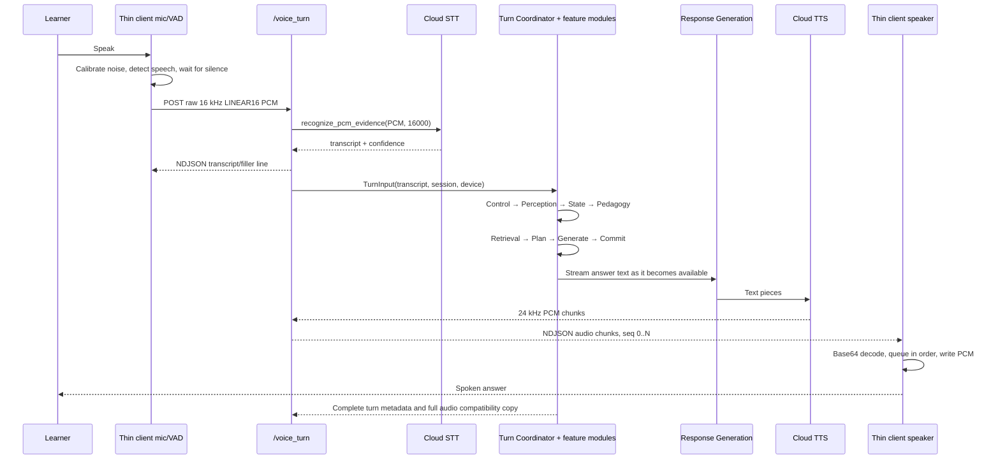

# Wini: Input-to-Audio Architecture Flow

**Status: explainer** — the only end-to-end walk of the audio path; useful precisely because
it is not a contract. Read it to understand the flow; read `WINI_ARCHITECTURE.md` for the
normative layer boundaries.

This document explains one complete Wini interaction in simple terms:

> The learner speaks → Wini understands the speech → chooses how to teach →
> creates a grounded answer → converts that answer to audio → the device plays it.

The main implementation is split into two sides:

- **Thin client:** `wini_client/` — microphone, network call, speaker, and display.
- **Brain service:** `cloud_run_service/` — speech recognition, tutoring decisions,
  retrieval, response generation, and text-to-speech orchestration.

The root `wini_server.py` is only a compatibility wrapper. It loads the canonical
server from `cloud_run_service/wini_server.py`.

## 1. The big picture

```text
┌────────────────────── Device / Thin Client ──────────────────────┐
│                                                                  │
│  Microphone                                                      │
│      │ 16 kHz mono LINEAR16 PCM                                  │
│      ▼                                                           │
│  Adaptive RMS VAD                                                │
│      │ one finished utterance                                    │
│      ▼                                                           │
│  HTTP POST /voice_turn                                           │
│      ▲                                                           │
│      │ NDJSON: transcript, UI metadata, audio chunks, final turn │
│      │                                                           │
│  Display sink ◄──────────────┐                                   │
│  Persistent speaker ◄────────┘                                   │
└──────────────────────────────┼───────────────────────────────────┘
                               │ network
┌──────────────────────────────▼───────────────────────────────────┐
│                         Brain Service                             │
│                                                                   │
│  Cloud STT → Interaction Control → Perception → State Views       │
│                                      │                             │
│                                      ▼                             │
│  Pedagogy → Grounded Retrieval → Response Plan → Text Generation  │
│                                                        │           │
│                                      State commit ◄────┘           │
│                                                        ▼           │
│                        Text chunks → TTS → PCM audio chunks       │
└───────────────────────────────────────────────────────────────────┘
```

There is no local ASR, LLM, or TTS model in the thin client. Its job is to capture,
transport, display, and play.

## 2. Layer-by-layer workflow

The brain service is easiest to understand as a chain of layers. Each layer has one
job, receives a structured result from the previous layer, and passes a more useful
structured result to the next layer.

```text
TurnInput
   │
   ▼
1. Interaction Control ──► admitted learning turn
   │
   ▼
2. Perception ───────────► intent + signals + concept
   │
   ▼
3. Assessment & Evidence ► prior grade / evidence facts
   │
   ▼
4. State & Persistence ──► immutable learner-state views
   │
   ▼
5. Pedagogy ──────────────► teaching action and mode
   │
   ▼
6. Retrieval ─────────────► grounded evidence manifest
   │
   ▼
7. Response Planning ─────► approved speech/display plan
   │
   ▼
8. Response Generation ───► answer text
   │
   ├──────────────► State & Persistence: commit authorized changes
   │
   ▼
9. Presentation + Voice ──► display metadata + TTS audio + speaker
```

### Layer 1 — Interaction Control

**Purpose:** Decide whether the input is allowed to enter the learning pipeline.

**Receives:** `TurnInput` containing the transcript, learner/session identity, and
device capabilities.

**Produces:** An admission/routing decision: continue learning, answer with a safe
or persona response, or end the session.

**Connects to:** Only an admitted `LEARNING` turn continues to Perception. Safety,
social, off-domain, and goodbye paths can finish without changing cognitive state.

**Example:** “Bye Wini” is recognized as session control. Interaction Control returns
a scripted farewell and `session_ended = true`; Perception is not needed.

### Layer 2 — Perception

**Purpose:** Understand what the learner is trying to say and what learning signals
are present.

**Receives:** The admitted learner text and optional prior context.

**Produces:** Intent, cognitive signals, concept ID, continuity information, and
visual/clarification signals.

**Connects to:** Assessment and State use these observations to interpret the new turn
against the learner's history. Perception does not choose the teaching action.

**Example:** “I don't understand why this quadratic has two roots” becomes:

```text
intent          = LEARNING
concept         = quadratic equations / nature of roots
confusion       = high
wants_visual    = possibly true
```

### Layer 3 — Assessment & Evidence

**Purpose:** Handle verified assessable items and determine whether the learner has
answered a pending probe, practice item, or test item.

**Receives:** Perception observations, the pending assessment from the previous turn,
and the learner's current response.

**Produces:** A typed grading/evidence outcome such as correct, partial, wrong, or
not-assessable. It may propose evidence-backed state changes.

**Connects to:** State and Persistence exposes the facts needed by Pedagogy. This
layer is what prevents a casual sentence from directly changing mastery.

**Example:** If the previous turn asked “What is the discriminant when `D = 0`?”
and the learner says “equal roots”, this layer records a verified correct outcome.

### Layer 4 — State & Persistence

**Purpose:** Own durable learner/session state and provide a safe snapshot for the
current turn.

**Receives:** Learner identity, current session, and authorized evidence changes.

**Produces:** Immutable views of mastery, misconception status, hint level, history,
current mode, and served-item history. At the end it produces the durable Turn Commit.

**Connects to:** Pedagogy reads the snapshot; no later layer directly edits the shared
state. Proposed changes wait until the commit boundary.

**Example:** The learner has weak mastery for “nature of roots” and an active
misconception about the discriminant. Pedagogy can see both facts before choosing a
response.

### Layer 5 — Pedagogy

**Purpose:** Choose the best teaching move for this learner at this moment.

**Receives:** Perception, assessment outcome, and immutable state views.

**Produces:** A `PedagogicalDecision`: action, learning mode, need, hint level,
pacing constraints, and whether assessment is appropriate.

**Connects to:** Retrieval uses the action and concept to gather the right evidence;
Response Planning later turns the decision into teachable modalities.

**Example:** Because confusion is high and a misconception is active, Pedagogy chooses
`MISCONCEPTION_PROBE` instead of immediately revealing the correction.

### Layer 6 — Retrieval

**Purpose:** Find the exact curriculum evidence that may be used in the response.

**Receives:** Pedagogical action, concept, learner-state views, and assessment needs.

**Produces:** A provenance manifest containing ranked textbook chunks, figures, graph
relationships, bridge recaps, or verified probe questions.

**Connects to:** Response Planning and Generation are grounded by this manifest. The
model should not invent unsupported textbook claims from free memory.

**Example:** For a visual explanation of `D = 0`, Retrieval returns the NCERT passage,
the relevant graph/figure crop, and a verified diagnostic question.

### Layer 7 — Response Planning

**Purpose:** Convert the teaching decision and evidence into an approved response
plan before any learner-facing output is generated.

**Receives:** Pedagogical decision, evidence manifest, state view, and device profile.

**Produces:** Approved speech/display modalities, answer budget, teaching script,
visual intent, and an optional assessment proposal.

**Connects to:** Response Generation receives this plan and must follow its teaching
steps, grounding, and budget. Presentation later realizes the approved modalities.

**Example:** The plan says: speak two short sentences, show the quadratic figure,
then ask the verified probe “What happens when the discriminant is zero?”

### Layer 8 — Response Generation

**Purpose:** Produce the learner-facing answer text from the approved plan and evidence.

**Receives:** Response plan, grounded manifest, learner text, relevant history, and
speech budget.

**Produces:** Short answer text, optionally incrementally as it is generated.

**Connects to:** The answer text is sent both to the state/commit completion path and
to the speech-output path. It is not audio yet.

**Example:** “When the discriminant is zero, the graph touches the x-axis once.
That means the two roots are equal. What happens when the discriminant is zero?”

### Layer 9 — Presentation and Voice Output

**Purpose:** Realize the approved answer as display content and audible speech.

**Receives:** Answer text, display metadata/figure IDs, and device capabilities.

**Produces:** NDJSON metadata plus base64-encoded 24 kHz LINEAR16 PCM chunks for the
thin client.

**Connects to:** The client decodes the audio, queues chunks in order, and writes them
to the persistent speaker stream. It resolves display IDs locally and updates the
screen/face.

**Example:** The answer text is split into text pieces, synthesized by Cloud TTS,
and returned as `audio seq 0`, `audio seq 1`, and so on. The client plays them as one
continuous utterance while showing the figure.

### How the layers connect in one running example

```text
Learner says:
"I don't understand why this quadratic has two roots."
        │
        ▼
Interaction Control
        │ learning turn admitted
        ▼
Perception
        │ concept=nature of roots, confusion=high
        ▼
Assessment & Evidence
        │ no pending answer; no mastery change yet
        ▼
State & Persistence
        │ weak mastery + active misconception loaded
        ▼
Pedagogy
        │ choose MISCONCEPTION_PROBE / visual explanation
        ▼
Retrieval
        │ NCERT explanation + figure + verified probe
        ▼
Response Planning
        │ two-sentence speech + display figure + question
        ▼
Response Generation
        │ grounded answer text
        ▼
Presentation + Voice
        │ figure metadata + TTS PCM chunks → speaker
        ▼
State Commit
        │ record the served probe; wait for the learner's next answer
```

The next learner answer starts another turn. If it answers the probe, Assessment &
Evidence grades it, and only then can the relevant mastery or misconception state be
updated at the next commit.

## 3. One turn, step by step

### Step 1 — The device listens

`wini_client/client.py` opens the microphone as mono, 16-bit PCM at 16 kHz.
The default trigger is adaptive RMS voice activity detection (VAD):

1. Measure the room-noise floor.
2. Wait until the input rises above the speech-start gate.
3. Keep recording while speech continues.
4. End after enough quiet blocks, or at the hard capture limit.
5. Return one byte buffer containing the utterance.

The client also supports push-to-talk (`--trigger enter`). A future touch trigger
can use the same boundary: the trigger starts capture, and the VAD ends it.

```text
room noise → calibrate floor → speech starts → speech continues → silence
       (ignore)                    (capture PCM)              (finish turn)
```

The output of this layer is not text. It is raw PCM bytes.

### Step 2 — The device sends the utterance

The client sends:

```http
POST /voice_turn
Content-Type: application/octet-stream
X-Sample-Rate: 16000

<raw mono LINEAR16 PCM bytes>
```

The server replies as a newline-delimited JSON (NDJSON) stream. Streaming matters:
the client can begin reacting and playing audio before the complete turn is ready.

### Step 3 — Speech becomes text (STT)

`cloud_run_service/wini_server.py` passes the PCM buffer to
`cloud_run_service/voice/cloud_stt.py`.

The Cloud STT adapter is configured for English (`en-US`) and includes mathematics
phrase hints such as “discriminant”, “quadratic”, and “real roots”. It returns a
transcript and confidence evidence.

```text
PCM bytes + sample rate
          │
          ▼
CloudStt.recognize_pcm_evidence(...)
          │
          ▼
"show me the graph of a quadratic polynomial"
```

If the transcript is empty, the server does not create a teaching answer. The client
returns to listening instead.

### Step 4 — Interaction Control decides whether this is a learning turn

The transcript is wrapped in a typed `TurnInput` containing information such as:

- learner/session identity;
- device capabilities (speech, display, touch);
- current session information;
- the learner's text;
- any trusted precomputed observations.

The `TurnCoordinator` starts the turn and calls Interaction Control first. This is
the front door for safety, nonsense, greetings, off-domain conversation, and session
control.

```text
Transcript
   │
   ▼
Interaction Control
   ├─ safety / invalid → safe scripted response, no learning-state update
   ├─ social / meta / off-domain → persona response, no cognitive-state update
   ├─ goodbye / session stop → farewell and session end
   └─ learning → continue through the tutoring pipeline
```

This prevents a non-learning message from accidentally changing mastery or
misconception state.

### Step 5 — Perception extracts what the learner means

For a learning turn, the Perception module determines structured observations:

- learning intent;
- cognitive signals such as confusion, frustration, or confidence;
- the NCERT concept involved;
- continuity with the prior topic/problem.

The important design point is that later layers receive typed observations, not a
bag of unrelated flags. The concept is resolved against the project's curriculum
concepts, and uncertain perception can degrade to neutral signals and inherited
context.

```text
Learner text
    │
    ▼
Perception
    │
    ├─ intent: LEARNING
    ├─ concept: quadratic polynomial
    └─ signals: wants_visual, confusion_risk, etc.
```

### Step 6 — The runtime reads the learner's current state

State and Persistence provides immutable views for this turn, including:

- mastery and misconception status;
- active hint/probe information;
- recent conversation and served-history;
- current mode: `EXPLAIN`, `PRACTICE`, or `TEST`.

The coordinator uses these views rather than allowing every module to mutate shared
state directly. Proposed changes are collected and committed at the turn boundary.

This is why Wini can answer “try that another way” differently from a first question:
the answer is based on both the new transcript and the learner's recorded history.

### Step 7 — Pedagogy chooses the teaching move

The Pedagogy module combines the perception result with state views and selects one
teaching action. Examples include:

- direct explanation;
- misconception probe;
- prerequisite bridge;
- fading hint;
- Socratic question;
- representation translation / visual analogy;
- transfer problem or reflection.

```text
Perception observations + learner state
                  │
                  ▼
             Pedagogy rules
                  │
                  ▼
     action + mode + pacing + assessment intent
```

The policy is evidence-oriented: mastery and misconception status advance from
verified assessment outcomes, not merely because a message contained a keyword.

### Step 8 — Retrieval gathers the allowed teaching evidence

Retrieval searches the curriculum knowledge base in `rag_store/`. It can use concept
cards, graph relationships, textbook chunks, figures, bridge recaps, and verified
probe items.

It returns a provenance manifest: the exact evidence that the next layers are allowed
to use. This is the grounding boundary.

```text
Pedagogical action + concept + state views
                    │
                    ▼
             Retrieval / RAG
                    │
                    ▼
  Provenance manifest: chunks, figures, probes, bridges
```

Response generation is not supposed to freely invent textbook facts outside this
manifest.

### Step 9 — Response Planning turns the decision into an approved plan

`cloud_run_service/response_planning/` converts the pedagogical decision and evidence
manifest into a response plan. It decides:

- what should be spoken;
- whether a display/figure/card is intended;
- the speech word/sentence budget;
- whether a verified assessment question should be appended;
- which modalities the device actually supports.

The plan is validated before generation. A visual may be intended but removed from
the approved modalities if the device has no display.

```text
Pedagogy + evidence + device capabilities
                    │
                    ▼
             Response Plan
             ├─ approved speech
             ├─ optional display metadata
             └─ optional verified spoken check
```

### Step 10 — Response Generation produces the answer text

`cloud_run_service/response_generation/` builds a prompt from:

- the selected action;
- the learner's text and relevant history;
- the learner-state view;
- the response budget;
- the grounded evidence manifest.

It then uses the configured model gateway (or a deterministic scripted response for
fast paths). The generated text is budgeted and validated. If model generation is
unavailable, the runtime can produce a safe non-assessing fallback rather than
advancing learning state incorrectly.

For streaming turns, generated text is handed to the server's speech-stream worker
as soon as usable text is available. The rest of the answer can still be generated.

```text
Approved ResponsePlan + grounded manifest
                    │
                    ▼
             Model Gateway
                    │
                    ▼
             Answer text
        "Look at the figure on the screen..."
```

### Step 11 — The turn commits its state changes

Before the turn is finalized, assessment hooks are armed when appropriate, and the
authorized learner/session changes are committed through State and Persistence.

The commit is the boundary between “we intend to say/show this” and “this turn is a
durable result”. If an integrity-critical operation fails, the runtime fails closed
and avoids a partial learner-state update.

```text
proposed state changes
          │
          ▼
State transaction / Turn Commit
          │
          ├─ success → durable learner/session state
          └─ failure → safe recovery, no corrupt partial commit
```

### Step 12 — The server converts answer text to audio

The speech-output path is separate from the tutoring decision path:

```text
answer text
    │
    ▼
sentence/text chunker
    │
    ▼
CloudTts.synth_stream(...)
    │
    ▼
24 kHz LINEAR16 PCM chunks
    │
    ▼
base64-encoded NDJSON audio parts
```

`cloud_run_service/voice/cloud_tts.py` receives text pieces and returns PCM audio.
The server base64-encodes each audio chunk because JSON transports text, then emits
one line per chunk with a sequence number:

```json
{"part":"audio","seq":0,"audio_b64":"...","audio_rate":24000}
{"part":"audio","seq":1,"audio_b64":"...","audio_rate":24000}
```

The final response line also contains the complete `audio_b64` for compatibility
with clients that do not consume the stream incrementally. A streaming client sees
`audio_streamed: true` and must not play that final copy again.

## 4. What the client receives and does

The usual stream is:

```text
1. filler / transcript       → client can show thinking state
2. turn_meta                 → answer text + display metadata
3. audio seq 0, 1, 2, ...    → client plays in order
4. final complete turn       → compatibility record; do not replay streamed audio
```

The client has two independent output paths:

```text
turn_meta.display ─► display sink ─► local figure/card/face

audio_b64 chunks ─► base64 decode ─► int16 PCM
                                  │
                                  ▼
                       persistent sounddevice stream
                                  │
                                  ▼
                                speaker
```

Display entries normally contain stable local image IDs such as `image_path`; image
pixels do not need to cross the network. The client resolves the ID against its local
knowledge store and renders it through a console, ROS, in-process, or touch UI sink.

For audio, the client:

- consumes chunks in `seq` order;
- keeps one output stream open across chunks and turns;
- keeps the speaking/TTS flag active for the whole answer;
- adds edge fades and a short tail to avoid clicks and buffered overlap;
- does not record from the microphone while playing (half-duplex operation).

## 5. The audio-specific sequence diagram



## 6. Typed input follows the same brain path

For tests and local tools, `POST /turn` accepts JSON instead of microphone PCM:

```json
{"text":"explain quadratic zeroes", "speak":true}
```

This skips the microphone and STT edges, but after text enters `text_turn()` it uses
the same tutoring core and can use the same TTS/output contract. That makes it useful
for testing the complete response path without a physical microphone.

```text
POST /turn (text)
       │
       └──────────────► same TurnInput → same tutor core → same TTS path
```

## 7. Failure and fallback flow

Each feature module reports typed failure signals. The coordinator chooses the
recovery action; individual modules do not secretly mutate global state or decide
the whole-turn recovery policy.

```text
module failure
     │
     ▼
FailureSignal
     │
     ├─ DEGRADE       → neutral/inherited optional observation
     ├─ SAFE_FALLBACK → scripted, non-assessing response
     └─ FAIL_CLOSED   → stop turn; preserve learner state
```

Examples:

- Empty STT transcript: listen again; do not speak an invented answer.
- Optional perception enrichment failure: continue with neutral signals where safe.
- Retrieval/generation failure: use a safe non-assessing response.
- State, identity, safety, or assessment-integrity failure: fail closed.
- Missing display asset: keep the current face/screen; do not crash the audio turn.

## 8. The simplest mental model

Think of Wini as two pipelines joined at the transcript and answer-text boundaries:

```text
VOICE EDGE                         TUTOR BRAIN                    VOICE EDGE

mic → VAD → PCM → STT → transcript → understand → decide → ground → answer text
                                                                          │
                                                                          ▼
speaker ◄─ PCM ◄─ TTS ◄─ text chunker ◄──────────────────────────────────┘
```

The tutoring brain decides **what Wini should teach**. The voice edge decides **how
to transport and play that teaching**. The typed contracts, NDJSON stream, provenance
manifest, and turn-commit boundary keep those responsibilities connected without
making the device responsible for the intelligence.

## 9. Source map

| Concern | Main implementation |
|---|---|
| Compatibility server entry point | `wini_server.py` |
| Canonical HTTP server and voice orchestration | `cloud_run_service/wini_server.py` |
| Microphone, VAD, HTTP client, playback | `wini_client/client.py` |
| Display realization | `wini_client/display_sinks.py` |
| Audio arbitration and TTS exclusivity | `wini_client/audio_manager.py` |
| Cloud speech recognition | `cloud_run_service/voice/cloud_stt.py` |
| Cloud speech synthesis | `cloud_run_service/voice/cloud_tts.py` |
| Text-to-speech chunk boundaries | `cloud_run_service/voice/chunker.py` |
| Turn sequencing and recovery | `cloud_run_service/runtime/coordinator.py` |
| Canonical phase execution | `cloud_run_service/runtime/turn_runtime.py` |
| Typed turn contracts | `cloud_run_service/runtime/contracts.py` |
| Retrieval and provenance | `cloud_run_service/retrieval/` |
| Response plan and modalities | `cloud_run_service/response_planning/` |
| Answer generation | `cloud_run_service/response_generation/` |
| Durable state and commit | `cloud_run_service/state_and_persistence/` |
