# Codebase Architecture, Coupling Metrics, and Layered System Specification

**Status: research (dated 2026-08-25; findings on coupling superseded by ticket 13's correction
of the live-caller inventory — see §"Correction of record" in
`.scratch/…/issues/13-decide-dead-code-and-seam-disposition.md`).**

**Generated:** August 25, 2026  
**System:** Wini Tabletop AI Tutor (Core Tabletop Brain)  
**Scope:** Full codebase architecture, 5-layer system design, and measured Coupling Metrics Matrix ($C_a$, $C_e$, $I$).

---

## 1. Coupling Metrics Matrix

Coupling metrics quantitatively measure the architecture's stability, modularity, and risk areas:
- **Afferent Coupling ($C_a$)**: The number of modules that depend on module $X$ (incoming dependencies / centrality).
- **Efferent Coupling ($C_e$)**: The number of modules that module $X$ depends on (outgoing dependencies).
- **Instability Factor ($I$)**:
  $$I = \frac{C_e}{C_a + C_e}$$
  - $I = 0.000$: Maximally **stable**, depended upon by many modules; changes here have high ripple effects.
  - $I = 1.000$: Maximally **unstable/volatile**, depends on many modules; ideal for top-level coordinators or leaf scripts.

### 1.1 Measured Codebase Coupling Metrics Table

| Module | Afferent ($C_a$) | Efferent ($C_e$) | Instability ($I$) | Architectural Role & Stability Analysis |
| :--- | :---: | :---: | :---: | :--- |
| [`runtime.contracts`](file:///d:/AI_tutor/wini_tabletop/cloud_run_service/runtime/contracts.py) | **10** | **0** | **0.000** | **Pure Core Contract**: Highly stable data invariants. |
| [`learner_state`](file:///d:/AI_tutor/wini_tabletop/cloud_run_service/learner_state.py) | **10** | **1** | **0.091** | **State Core**: High stability; central persistence domain model. |
| [`evidence`](file:///d:/AI_tutor/wini_tabletop/cloud_run_service/evidence) | **8** | **0** | **0.000** | **Core Domain**: High stability evidence ledger. |
| [`perception`](file:///d:/AI_tutor/wini_tabletop/cloud_run_service/perception) | **7** | **0** | **0.000** | **Interface Seam**: Stable perception contract. |
| [`cognitive_classifier.cues`](file:///d:/AI_tutor/wini_tabletop/cloud_run_service/cognitive_classifier/cues.py) | **7** | **0** | **0.000** | **Surface Rules**: Shared deterministic linguistic cues. |
| [`pedagogy`](file:///d:/AI_tutor/wini_tabletop/cloud_run_service/pedagogy) | **5** | **0** | **0.000** | **Feature Module Seam**: Isolated pedagogical engine. |
| [`assessment_evidence`](file:///d:/AI_tutor/wini_tabletop/cloud_run_service/assessment_evidence) | **4** | **0** | **0.000** | **Feature Module Seam**: Grader and probe manager. |
| [`retrieval`](file:///d:/AI_tutor/wini_tabletop/cloud_run_service/retrieval) | **4** | **0** | **0.000** | **Feature Module Seam**: NCERT chunk retrieval. |
| [`cognitive_input_processor`](file:///d:/AI_tutor/wini_tabletop/cloud_run_service/cognitive_input_processor) | **3** | **2** | **0.400** | **Deep Module**: Well-balanced normalization and problem detection. |
| [`session_modes`](file:///d:/AI_tutor/wini_tabletop/cloud_run_service/session_modes.py) | **3** | **2** | **0.400** | **Deep Module**: Pedagogy mode state transition rules. |
| [`query`](file:///d:/AI_tutor/wini_tabletop/cloud_run_service/query.py) | **3** | **2** | **0.400** | **Deep Module**: RAG query formation and reranking. |
| [`perception.gemini_perception`](file:///d:/AI_tutor/wini_tabletop/cloud_run_service/perception/gemini_perception.py) | **2** | **9** | **0.818** | **Perception Engine**: Bridges Gemini and MiniLM. |
| [`cognitive_analyzer.analyzer`](file:///d:/AI_tutor/wini_tabletop/cloud_run_service/cognitive_analyzer/analyzer.py) | **1** | **4** | **0.800** | **Analyzer Adapter**: Assembles perception and deltas. |
| [`interaction_control.control`](file:///d:/AI_tutor/wini_tabletop/cloud_run_service/interaction_control/control.py) | **1** | **5** | **0.833** | **Admission & Control**: Session gatekeeper. |
| [`runtime.coordinator`](file:///d:/AI_tutor/wini_tabletop/cloud_run_service/runtime/coordinator.py) | **0** | **7** | **1.000** | **Turn Coordinator**: Sequences modules without policy. |
| [`runtime.legacy_adapter`](file:///d:/AI_tutor/wini_tabletop/cloud_run_service/runtime/legacy_adapter.py) | **0** | **11** | **1.000** | **Compatibility Seam**: Temporary bridge to legacy runtime. |
| [`wini_server`](file:///d:/AI_tutor/wini_tabletop/cloud_run_service/wini_server.py) | **1** | **20** | **0.952** | **Edge Server**: HTTP/NDJSON transport and cloud RPCs. |
| [`tutor_loop`](file:///d:/AI_tutor/wini_tabletop/cloud_run_service/tutor_loop.py) | **3** | **38** | **0.927** | **Legacy Monolith Hub**: High coupling hotspot being dismantled. |

---

### 1.2 Hot-Spot & Bottleneck Analysis

1. **`tutor_loop.py` ($C_e = 38, I = 0.927$) — The Primary Historical Hotspot**:
   - *Issue*: Historically held all logic (normalization, safety, pacing, modes, retrieval, prompting, grading).
   - *Resolution Progress*: Subsystems have been successfully extracted into deep modules (`perception`, `interaction_control`, `cognitive_input_processor`, `pedagogy`, `retrieval`, `response_generation`). `tutor_loop.py` now functions primarily as a compatibility composition root.

2. **`runtime.contracts` ($C_a = 10, C_e = 0, I = 0.000$) — The Ultimate Stable Core**:
   - *Design*: Pure immutable dataclasses (`TurnInput`, `ModuleOutcome`, `StateChange`, `TurnResult`) with zero external dependencies. Ensures complete decoupling across the lifecycle.

3. **`cognitive_input_processor` ($C_a = 3, C_e = 2, I = 0.400$) — Ideal Deep Module Metric**:
   - *Design*: Low outgoing coupling ($C_e = 2$, only standard unicode/regex and surface cues) with clean incoming utility for `CognitiveAnalyzer`, `GeminiPerception`, and `InteractionControl`.

---

## 2. Interactive Mermaid Architecture Diagram (5-Layer System)

```mermaid
graph TD
  %% Layer Styling
  classDef hardware fill:#1e293b,stroke:#475569,stroke-width:2px,color:#f8fafc;
  classDef client fill:#0f172a,stroke:#38bdf8,stroke-width:2px,color:#f8fafc;
  classDef engine fill:#1e1b4b,stroke:#818cf8,stroke-width:2px,color:#f8fafc;
  classDef state fill:#064e3b,stroke:#34d399,stroke-width:2px,color:#f8fafc;
  classDef services fill:#451a03,stroke:#fb923c,stroke-width:2px,color:#f8fafc;

  subgraph L1 ["1. Platform & Hardware Layer"]
    MIC["Microphone (LINEAR16 PCM 16kHz)"]:::hardware
    SPK["Speaker & DAC (24kHz Audio Playback)"]:::hardware
    DISP["Display Screen (Figure Specs & Visuals)"]:::hardware
    TCH["Capacitive Touch UI (Mode Selectors)"]:::hardware
    RPI["Tabletop Embedded OS (Raspberry Pi / Linux)"]:::hardware
  end

  subgraph L2 ["2. UI & Client Layer"]
    CLIENT_DAEMON["Wini Device Daemon (Thin Client)"]:::client
    STREAM_PARSER["NDJSON Stream Consumer (Early Fillers + Audio Chunks)"]:::client
    UI_FACE["Thinking Face & Transcript Animator"]:::client
    METADATA_RESOLVER["Local Figure Crop Resolver"]:::client
  end

  subgraph L3 ["3. Core Tutor Engine (Cloud Run Service)"]
    direction TB
    WINI_SRV["wini_server.py (HTTP /turn & /voice_turn)"]:::engine
    
    subgraph INTAKE ["Input & Admission Layer"]
      INPUT_PROC["cognitive_input_processor (Math Norm & Problem Detect)"]:::engine
      GATES["perception.gates (Deterministic SAFETY & NONSENSE)"]:::engine
      INT_CTRL["interaction_control (Identity, STT Confidence, also_learning)"]:::engine
    end

    subgraph COORD ["Coordination & Reasoning Pipeline"]
      TURN_COORD["runtime.coordinator (TurnCoordinator)"]:::engine
      PERCEPTION["perception (GeminiPerception / 38-Signals / Intent)"]:::engine
      PEDAGOGY["pedagogy (Rules, Mode Offers, Pacing)"]:::engine
      ASSESS["assessment_evidence (Grounded Grader & Misconceptions)"]:::engine
      RETRIEVE["retrieval (NCERT Chunk Search & Cohesion)"]:::engine
      PLAN["response_planning (Pedagogical Action & Script)"]:::engine
      GEN["response_generation (Vertex Gemini / Qwen Generator)"]:::engine
    end
  end

  subgraph L4 ["4. State & Data Stores"]
    LSTATE[("LearnerState (Firestore / JSON Backend)")]:::state
    CHUNKS[("NCERT Chunk DB & FAISS Index")]:::state
    GRAPH[("NCERT Curriculum Concept DiGraph")]:::state
    SAFETY_LOGS[("Redacted Safety Alerts & Incident Logs")]:::state
    EVID_INDEX[("Evidence Ledger & Mastery History")]:::state
  end

  subgraph L5 ["5. RAG & External LLM Services"]
    GEMINI_LLM["Google Gemini 2.5 Flash (Schema-Enforced Perception & Gen)"]:::services
    MINILM["all-MiniLM-L6-v2 Local Embedder (384-dim S_rel & HOPE)"]:::services
    STT_SVC["Google Cloud STT (en-US Recognition)"]:::services
    TTS_SVC["Google Cloud TTS (en-IN Chirp3-HD Streaming)"]:::services
  end

  %% Flow Connections
  MIC -->|Raw Audio| CLIENT_DAEMON
  CLIENT_DAEMON -->|POST /voice_turn| WINI_SRV
  WINI_SRV -->|Audio PCM| STT_SVC
  STT_SVC -->|Transcript + Confidence| WINI_SRV

  WINI_SRV --> GATES
  WINI_SRV --> INPUT_PROC
  INPUT_PROC --> INT_CTRL
  GATES --> INT_CTRL
  
  INT_CTRL --> TURN_COORD
  TURN_COORD --> PERCEPTION
  PERCEPTION --> GEMINI_LLM
  PERCEPTION --> MINILM
  
  TURN_COORD --> PEDAGOGY
  PEDAGOGY --> LSTATE
  
  TURN_COORD --> ASSESS
  ASSESS --> GEMINI_LLM
  
  TURN_COORD --> RETRIEVE
  RETRIEVE --> CHUNKS
  RETRIEVE --> MINILM
  
  TURN_COORD --> PLAN
  PLAN --> GRAPH
  
  TURN_COORD --> GEN
  GEN --> GEMINI_LLM

  INT_CTRL -->|Safety Escalation| SAFETY_LOGS
  TURN_COORD -->|State Commit| LSTATE
  LSTATE --> EVID_INDEX

  GEN -->|Streaming Text| TTS_SVC
  TTS_SVC -->|Streaming PCM Chunks| WINI_SRV
  WINI_SRV -->|NDJSON Line Stream| STREAM_PARSER
  STREAM_PARSER --> UI_FACE
  STREAM_PARSER --> SPK
  STREAM_PARSER --> METADATA_RESOLVER
  METADATA_RESOLVER --> DISP
  TCH -->|X-Wini-Mode| CLIENT_DAEMON
```

---

## 3. Data Boundary & Child Safety Compliance
As mandated by the *Child Safe Interaction Specification*:
1. **Zero Disclosure State Mutation**: Disclosures triggered by `gates.py` write strictly to `safety_alerts.jsonl` and alert channels. They never mutate `LearnerState` mastery, confidence, or engagement.
2. **Never-Downgrade Safety Rule**: The deterministic front gate (`perception.gates.gate`) is model-free and cannot be bypassed or downgraded by LLM outputs.
3. **STT Quality Fallback**: Transcripts with STT confidence below 0.60 trigger `CONFIRM_LOW_CONFIDENCE` re-prompts before executing state-altering actions.
4. **Mixed Intent Support**: Turns with greetings and questions (*"hi, explain area of circle"*) preserve the learning inquiry through `also_learning=True`.
