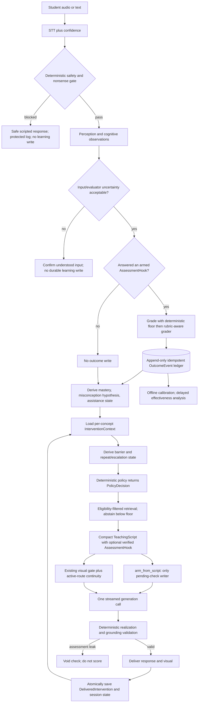

# Wini Final Pedagogical Architecture Plan

**Status: ARCHIVED 2026-08-27 (ticket 18).** This document reviewed commit `8343074` on a
branch of a *different repository* (`jainprathwi-stack/cloud-CLI`, not this one) and cannot
be reconciled against this history. It is kept as a readable record of the pedagogical
reasoning from that audit cycle; it is not normative. Do not edit this file.

**Repository reviewed:** [`jainprathwi-stack/cloud-CLI`, branch `feat/t9-display-and-grading-fixes`](https://github.com/jainprathwi-stack/cloud-CLI/tree/feat/t9-display-and-grading-fixes)  
**Reviewed commit:** `8343074e3450380f086fc29dbf3e606a950dc644`  
**Compared documents:** `FINAL_PEDAGOGICAL_ARCHITECTURE.md` and `TUTOR_PIPELINE_IMPLEMENTATION_PLAN.md`  
**Purpose:** Resolve the rule-based policy limitation without weakening Wini's deterministic safety, grounding, grading, and visual-integrity controls.

---

## 1. Final decision

The best design is a **deterministic, evidence-first, stateful teaching policy**.

It combines:

- the **evidence integrity, gradeability, compact implementation, and code-specific sequencing** from `FINAL_PEDAGOGICAL_ARCHITECTURE.md`;
- the **teaching continuity, previous-turn attribution, and clear distinction between lesson action and presentation form** from `TUTOR_PIPELINE_IMPLEMENTATION_PLAN.md`;
- the existing repository's strong deterministic safety, retrieval, response, visual, and grounding controls.

The key ordering is:

```text
First make learning evidence valid and gradeable.
Then add small state that remembers what the tutor actually tried.
Only later learn which interventions are effective.
```

Do **not** immediately build eleven new runtime layers, a new `pedagogy/` package, a universal lesson-stage machine, an LLM pedagogy judge, reinforcement learning, or a “visual learner” profile.

The immediate solution to the original conversation is not to infer that “wow nice” proves a visual method succeeded. It is to retain the active teaching route and the learner's explicit request while mastery remains unverified:

```text
explicit request for a visual explanation
    + visual worked example actually delivered
    + “wow nice” (engagement only)
    + request for another example
    -> another visual worked example
    -> short gradeable check
    -> no mastery change until the learner answers
```

---

## 2. Sources and verification scope

This plan was produced from the two supplied Markdown files and the specified repository branch. The following repository facts were independently confirmed on the reviewed commit:

- `rules_decide()` is a first-match rule table and defaults to `QUIZ`.
- `_practice_gradeable()` requires stored `expected_answer` values on schema instances.
- The RAG graph has 3,562 nodes.
- Only 338 nodes have answer keys: 276 misconceptions and 62 Grade-9 bridge diagnostics.
- The 647 exercises, 324 CT probes, and schema instances provide no gradeable practice bank.
- Of the keyed diagnostics, 56 are binary: 48 have “no” as the key and 8 have “yes”.
- The 306-turn learning log contains only 23 writebacks.
- `generate_quiz_item()` generates the question and answer together at temperature `0.7`; no independent verification follows.
- `judge_answer()` accepts a rubric, but the live serial call passes only question, expected answer, and learner text.
- `apply_probe_result()` creates a misconception record with status `active`, including when the first response is correct.
- `BRIDGE_MASTERY_DELTA` treats `partial` the same as `wrong`.
- `transfer_readiness()` exists but is not consumed by `rules_decide()`.
- `AssessmentHook` and `session["pending_check"]` are separate representations of an outstanding assessment.
- The response-layer outcome path contains idempotency machinery, but the normal grading path does not use it.
- `WINI_RESPONSE_LAYER` defaults differ between `tutor_loop.py` and `wini_server.py`.
- `WINI_MODE_OFFERS` defaults off.
- `WINI_LEARNER_ID` defaults to `default`.
- Server-side grading can run concurrently and return `precomputed_grade`, but this improves latency, not evidence validity or deduplication.

These facts make evidence acquisition and grading correctness the first architectural dependency.

---

## 3. What both documents agree on

| Shared conclusion | Architectural meaning |
|---|---|
| Keep deterministic policy | The LLM must not freely choose safety-sensitive or mastery-changing actions. |
| Preserve grounding | Retrieval and abstention continue to constrain factual generation. |
| Current-turn-only policy is insufficient | A later teaching decision needs selected history from prior turns. |
| Praise is not mastery | “Wow”, “nice”, and “I understand” cannot independently move mastery. |
| Learner state and teaching history differ | Knowledge evidence must not be mixed with records of what the tutor tried. |
| Decisions must be auditable | Actions need reason codes and traceable inputs. |
| Rules need richer context | `rules_decide()` should not reconstruct history from many booleans. |
| RL is premature | Sparse, biased outcomes cannot support policy optimization. |
| Safe migration matters | Feature flags, shadow mode, regression tests, and rollback are required. |

---

## 4. Important differences between the documents

| Question | `TUTOR_PIPELINE_IMPLEMENTATION_PLAN.md` | `FINAL_PEDAGOGICAL_ARCHITECTURE.md` | Final resolution |
|---|---|---|---|
| Primary defect | Stateless teaching policy. | Starved and partly invalid evidence stream. | Evidence stream is the blocking defect; continuity is the next defect. |
| Main addition | Evaluator, teaching memory, stage manager, representation selector. | Verified item supply, one arming path, ledger, richer deterministic policy. | Implement evidence foundation first, then compact continuity state. |
| Meaning of effectiveness | Infer whether the previous strategy helped from the next reply. | Intervention effectiveness needs reliable and preferably delayed outcomes. | Do not promote a strategy from generic praise; distinguish continuity from measured effectiveness. |
| Personalization | Per-concept preferred representations and weighted strategy scores. | Contextual effectiveness only after sufficient comparable outcomes; no learning styles. | Retain explicit requests and active route now; statistical effectiveness memory only at P2 gates. |
| Lesson progression | Nine-stage state machine. | Existing EXPLAIN/PRACTICE/TEST outer loop plus richer action/scaffolding state. | Keep coarse modes; represent simplification, visualisation, and examples as actions/routes, not durable stages. |
| Representation | New selector module after policy. | Existing visual gate is already factored and grounded. | Extend the decision record and existing visual gate; no new selector module now. |
| Software structure | Many new modules and models. | Three small additions, no new service boundary. | Prefer existing modules plus typed contracts; extract later only if complexity proves it necessary. |
| Mastery | Numeric learner state updated from verified performance, with cautions. | Append-only evidence ledger; derived mastery; purpose and assistance provenance. | Ledger is the source of truth; mastery is a replayable derived view. |
| Assessment supply | Assumes retriever can provide grounded examples/checks. | Demonstrates that the store lacks practice/test answer keys. | Generated questions require independent verification and caching before use. |

---

## 5. Strengths and weaknesses of each proposal

### 5.1 `TUTOR_PIPELINE_IMPLEMENTATION_PLAN.md`

#### Strengths

- Directly addresses the original repeated-example failure.
- Correctly separates what to teach from how to present it.
- Correctly links feedback to metadata about the prior tutor turn.
- Keeps safety and final policy validation deterministic.
- Defines typed state, reason codes, persistence, fallbacks, shadow rollout, and useful integration tests.
- Explicitly prevents praise-only mastery updates.

#### Weaknesses

- It starts downstream of the repository's actual binding constraint: Wini has almost no valid practice/test evidence.
- Its effectiveness evaluator may confuse engagement, politeness, perceived clarity, and demonstrated learning.
- Weighted preferences can become confident from sparse or noisy feedback.
- “Preferred representation” risks becoming a learning-style proxy unless narrowly scoped and evidence-gated.
- A nine-stage universal sequence duplicates existing modes and overlaps with action and modality.
- Eleven conceptual layers mapped to separate modules would increase failure modes and latency without improving the first release.
- The plan assumes grounded/gradeable examples are retrievable, but the repository's item inventory disproves that assumption.

### 5.2 `FINAL_PEDAGOGICAL_ARCHITECTURE.md`

#### Strengths

- It is grounded in the real code, graph, persisted state, and 306-turn log.
- It identifies the zero-key practice bank as the actual P0 blocker.
- It makes item purpose, key verification, arming, grading provenance, confidence, assistance, and idempotency explicit.
- It avoids invalid misconception inference and unsupported mastery changes.
- It reuses `AssessmentHook`, `OutcomeEvent`, the RAG graph, authored hint chains, visual gate, and existing modes.
- It distinguishes conceptual layering from unnecessary software decomposition.
- It protects latency by keeping only perception and generation on the critical model-call path.
- It rejects learning styles, immediate RL, and unobservable learner traits.

#### Weaknesses

- Its P2 effectiveness memory is too delayed to fully specify the immediate continuity behavior requested in the original conversation.
- “Same strategy is never used three times” needs an explicit representation of a delivered route, not only an action label.
- `explain_count` alone cannot distinguish verbal, symbolic, graph, analogy, and worked-example routes.
- Its intervention history requires a clear current-route rule so that “another example” preserves the active visual form without pretending success was measured.
- The proposed generated-and-verified item pipeline needs a concrete verifier contract and golden-set release gate.

### 5.3 Which proposal is better?

`FINAL_PEDAGOGICAL_ARCHITECTURE.md` is the better **implementation baseline** because it addresses defects that would invalidate the new memory's inputs. `TUTOR_PIPELINE_IMPLEMENTATION_PLAN.md` is the better **description of teaching continuity**.

The best final architecture is therefore not a 50/50 merge. It is:

```text
FINAL_PEDAGOGICAL_ARCHITECTURE as the foundation
    + compact delivered-route continuity from TUTOR_PIPELINE_IMPLEMENTATION_PLAN
    - premature effectiveness scoring
    - universal stage machine
    - extra module/service boundaries
```

---

## 6. Architectural principles

1. **Safety precedes every learning write.** Preserve the deterministic safety and nonsense gates.
2. **No ungradeable assessment.** If a question is meant to assess, it must have a verified key/rubric and an armed hook.
3. **No undelivered intervention history.** Record a teaching action only after its response passes validation and is delivered.
4. **Observations are not evidence.** Sentiment, acknowledgement, inferred confusion, and STT text are observations.
5. **Evidence is purpose-bound.** A diagnostic outcome, practice result, transfer result, and retention result support different claims.
6. **Item outcome does not prove a misconception.** A misconception needs converging evidence.
7. **Teaching continuity is not effectiveness.** Reusing an explicitly requested visual route next turn does not mean the system has learned a permanent preference.
8. **Mastery is derived and replayable.** Every mastery change corresponds to exactly one immutable outcome event.
9. **Explicit current requests outrank remembered routes.** Memory is assistance, not control.
10. **One function may contain several conceptual concerns.** Split software only when there is a real independent consumer or test boundary.
11. **The LLM realizes a plan; it does not authorize one.** Policy, grading gates, and state writes remain deterministic.
12. **Uncertainty suppresses consequences.** Low STT/perception/grader confidence triggers confirmation or no-write behavior.

---

## 7. Final architecture

### 7.1 Logical flow



### 7.2 Runtime responsibilities

| Runtime part | Answers | Must not do |
|---|---|---|
| Perception/cognitive observation | What did the learner say and what signals are present? | Declare mastery or strategy success. |
| Evidence/grading | Did the learner answer a known task, and with what outcome/confidence? | Select the next teaching style. |
| Derived learner state | What gradeable evidence exists for this concept? | Store unverified affect as a durable trait. |
| Intervention context | What did Wini actually try, what was explicitly requested, and what route is active? | Claim that a route caused learning. |
| Barrier derivation | Is there an observed prerequisite, misconception, representation, or unknown barrier? | Invent unobservable diagnoses. |
| Deterministic policy | What authorized teaching action should happen next? | Generate prose or mutate state. |
| TeachingScript/AssessmentHook | What compact beats and gradeable check will realize the action? | Grade the response. |
| Existing visual gate | Does this response merit a static/dynamic/symbolic visual? | Override test integrity or safety. |
| Retriever | What eligible grounded objects support the plan? | Serve keys before attempts or content below the relevance floor. |
| Generator | How should the authorized grounded response be worded? | Change action, mastery, barrier, or memory. |
| Validator/committer | Was the plan safely realized, and what was actually delivered? | Commit a planned but failed intervention. |

---

## 8. Minimal state model

### 8.1 Preserve epistemic partitions

| Partition | Examples | Persistence | Moves mastery? |
|---|---|---|---:|
| Observations | perception signals, praise, confusion plea, STT confidence | turn/TTL | No |
| Hypotheses | candidate misconception, derived barrier | decaying/derived | No |
| Confirmed learner state | evidence-backed mastery, supported misconception | durable | Derived from ledger |
| Evidence ledger | gradeable outcomes with provenance | append-only | Source of mastery |
| Intervention context | delivered routes, active route, repeat count, assistance | session/concept | No |
| Session | mode, pending hook, served items | TTL | No |

### 8.2 New compact `InterventionContext`

This is the justified part of “teaching memory” that should ship in P1.

```python
@dataclass
class InterventionContext:
    learner_id: str
    concept_id: str
    active_route: str | None
    last_delivered_action: str | None
    last_delivered_representations: tuple[str, ...]
    explicit_representation_requests: tuple[str, ...]
    actions_tried: tuple[str, ...]
    routes_tried: tuple[str, ...]
    explain_count: int
    assistance_offered: int
    assistance_consumed: int
    pending_objective: str | None
    expected_evidence_next_turn: str | None
```

Rules:

- `active_route` may continue because the learner explicitly requested it or because it is the current coherent teaching route.
- A generic acknowledgement does not mark the route successful.
- Explicit negative feedback marks the route as failed for the current concept/session.
- An explicit new request replaces the route when safe and available.
- Context resets or decays on concept change, long inactivity, or explicit learner request.
- Do not persist a learner-wide “visual preference”.

### 8.3 `PolicyDecision`

Extend the existing policy result instead of creating multiple planners:

```python
@dataclass(frozen=True)
class PolicyDecision:
    action: str
    need: str
    reason_code: str
    barrier: str = "unknown"
    barrier_confidence: float = 0.0
    route: str | None = None
    assistance_level: int = 0
    delivery_style: str = "neutral"
    assessment_purpose: str | None = None
    objective: str | None = None
    expected_evidence_next_turn: str | None = None
    constraints: tuple[str, ...] = ()
```

`route` expresses the missing continuity dimension, for example:

```text
plain_verbal
simple_verbal
symbolic_step_by_step
graph_visual
concrete_analogy
worked_example_graph
completion_problem
```

### 8.4 `DeliveredIntervention`

```python
@dataclass(frozen=True)
class DeliveredIntervention:
    turn_id: str
    learner_id: str
    concept_id: str
    action: str
    route: str
    representations: tuple[str, ...]
    assistance_level: int
    objective: str | None
    expected_evidence_next_turn: str | None
    source_ids: tuple[str, ...]
    script_id: str | None
    hook_id: str | None
```

Save it only after response and board validation succeed.

### 8.5 Extend existing `AssessmentHook`

Make the script hook the sole arming record:

```python
@dataclass
class AssessmentHook:
    # existing fields remain
    item_id: str | None = None
    question: str | None = None
    expected_answer: str | None = None
    rubric: str | None = None
    assessment_purpose: str | None = None
    reveal_policy: str = "after_attempt"
    item_verified: bool = False
    hint_chain: list[dict] = field(default_factory=list)
```

If the hook lacks a verified item, the beat becomes non-assessing and must not pose a question that appears gradeable.

### 8.6 Reuse and extend `OutcomeEvent`

The live path should reuse the existing response-layer event and idempotency concept:

```text
event_id, timestamp, learner_id, concept_id, kc_id,
item_id, item_source, assessment_purpose,
outcome, grader_path, grader_confidence, stt_confidence,
assistance_offered, assistance_consumed, delay_days,
action, route, barrier, mode, idempotency_key
```

Invariant: every mastery mutation has exactly one ledger event, and ledger replay reconstructs mastery.

---

## 9. Evidence and evaluation policy

### 9.1 Separate four questions

| Question | Evidence source | State affected |
|---|---|---|
| Was the learner engaged? | praise, willingness to continue | turn observation only |
| Did the learner say a route helped? | explicit attribution such as “the graph made roots clear” | weak route feedback, not mastery |
| Did the learner demonstrate the objective? | verified assessment with rubric/key | learner evidence ledger |
| Did this intervention improve later independent learning? | comparable independent/retention outcomes | P2 effectiveness statistics |

The original “Pedagogy Evaluator” is therefore split conceptually without adding an extra model call:

- **feedback interpretation** records explicit positive/negative route feedback;
- **gradeable outcome evaluation** records task performance;
- **offline effectiveness analysis** estimates intervention effectiveness only after sufficient data.

### 9.2 Response examples

| Learner response | Allowed interpretation | Forbidden interpretation |
|---|---|---|
| “Wow, nice” | Positive engagement | Visual teaching succeeded; concept mastered |
| “Now the graph makes the roots clear” | Explicit route-helpfulness signal | Full quadratic mastery |
| “I still don't understand” | Current route did not resolve the learner's problem | Learner lacks ability or effort |
| Correct independent solution | Gradeable evidence for specified criteria | Every related concept is mastered |
| Correct after full solution | Completion/participation evidence | Independent mastery |
| Correct near-transfer after delay | Strong transfer/retention evidence | Permanent mastery without future decay/review |

### 9.3 Item validity before state writes

Every assessing item must have:

```text
item_id
concept_id / kc_id
assessment_purpose
question
verified expected answer or rubric
response type
assistance rules
reveal policy
verification provenance/version
```

Generated item flow:

```text
problem schema
    -> generate question + proposed key at temperature 0
    -> independent verifier derives/checks the answer
    -> normalize and compare
    -> cache only verified agreements
    -> human-check golden set before rollout
```

Release gate: at least 98% agreement on a human-checked 50-item golden set, or keep practice assessment disabled for unsupported item classes.

### 9.4 Misconception evidence

- A wrong answer creates or strengthens only a `candidate` hypothesis when the answer is consistent with that misconception.
- One binary item cannot produce `supported` status.
- Promotion requires converging non-binary evidence or repeated consistent evidence.
- Corrective content is eligible only for `supported` misconceptions.
- Two consecutive independent correct responses may resolve it.
- Store evidence references on every status transition.

---

## 10. Stateful deterministic policy

### 10.1 Barrier derivation

Use only barriers with existing observables:

```text
prerequisite_gap
misconception
representation_gap
unknown
```

Do not create an eleven-kind barrier ontology until each kind has an instrument and a distinct policy effect.

### 10.2 Policy priority

Keep a clear first-match table with richer context:

1. Safety/domain/grounding/uncertainty fallback.
2. Student-provided problem.
3. Purpose/connection question.
4. Explicit representation request or representation gap.
5. Hint request within an armed check; otherwise invite an attempt or start the authored ladder.
6. Supported misconception repair; candidate misconception probe.
7. Explicit confusion using repeat-aware escalation.
8. New topic introduction—never quiz first.
9. Example request, preserving or explicitly changing the active route.
10. High load/frustration changes delivery style and assistance, not the learning objective.
11. Transfer only when `transfer_readiness()` and evidence-purpose guards pass.
12. Pure acknowledgement: acknowledge briefly and continue/check; never treat as mastery.
13. Phase-appropriate explain, guided practice, or verified assessment fallback.

Delete the unconditional `QUIZ` fallback. If there is no verified item, explain, offer practice, or ask a non-scored conversational clarification—do not pretend to assess.

### 10.3 Repeat-aware confusion escalation

```text
First confusion:
    explain more simply

Second confusion on same concept/route:
    choose a different route + invite one concrete attempt

Third confusion or repeated route failure:
    force a representation change using existing safe visual machinery

After any full solution:
    no mastery credit; queue an independent isomorphic reattempt
```

The policy checks `routes_tried`, not merely `EXPLAIN` count, so “simpler words” and “the same explanation with minor rephrasing” cannot masquerade as different strategies.

### 10.4 No separate lesson-stage manager

Keep existing macro modes:

```text
EXPLAIN -> PRACTICE -> TEST/ASSESS -> REVIEW/TRANSFER
```

Treat introduction, simplification, visualisation, worked example, completion step, and Socratic question as actions/routes inside those modes. This avoids conflicting state among mode, stage, action, and representation.

### 10.5 No separate representation-selector module yet

Use two deterministic inputs:

- `route` in `PolicyDecision` selects the instructional form;
- the existing visual gate decides whether and how a board/figure should be rendered.

Priority:

1. Explicit request.
2. Accessibility and device capability.
3. Active route for conversational continuity.
4. Avoid a route explicitly reported as unhelpful.
5. Pedagogically appropriate default for the action.

An active visual route does not require generated imagery every time. It may use the existing symbolic board, graph, number line, retrieved figure, or grounded static diagram.

---

## 11. TeachingScript, retrieval, generation, and validation

### 11.1 Compact script

Keep scripts to one to three beats for the voice device. The script owns:

- atomic learning claim;
- action route and realization constraints;
- optional verified `AssessmentHook`;
- visual candidacy;
- answer-leak and response-budget constraints.

### 11.2 One arming path

Implement:

```python
arm_from_script(script, session)
```

It is the only writer of `session["pending_check"]`.

This replaces the separate bridge/misconception, PRACTICE, and TEST arming blocks. A missing or unverified key means no assessment is armed and no assessing question is spoken.

### 11.3 Retrieval

Enrich the graph; do not rebuild it.

```text
hard eligibility filter:
    action, purpose, barrier, reveal policy, test integrity,
    verified key, not previously served

then rank:
    semantic relevance, pedagogical-role fit, difficulty/ZPD,
    novelty, representation fit, safe contextual nudges

then enforce:
    absolute abstention floor 0.28
```

Priority metadata additions:

1. `expected_answer` plus verification provenance.
2. `reveal_policy`.
3. `assessment_purpose`.
4. `kc_id` defaulting to `concept_id`.
5. optional barrier eligibility.

### 11.4 Generation

- Keep one streamed generation call.
- Feed the generator the authorized action, route, objective, expected evidence, assistance level, prior failed routes, and retrieved manifest.
- Do not expose internal labels to the learner.
- Do not let the prompt override deterministic constraints.

### 11.5 Streaming-compatible validation

| Timing | Check | Failure behavior |
|---|---|---|
| Pre-stream | Test/diagnostic question delivered verbatim from verified item | Serve stored text, not paraphrase |
| Post-hoc | Answer-key leak, unsupported numbers, response budget, invalid misconception correction | Void pending check; never score corrupted evidence |
| Compile time | Board values match spoken answer; visual capabilities | Degrade/crop to speech-only safely |

Preserve the existing Board Buddy grounding belt and visual restrictions.

---

## 12. Exact original-problem walkthrough

### Turn 1

Learner: “Explain quadratic equations.”

```text
action: EXPLAIN
route: symbolic_step_by_step
mode: EXPLAIN
mastery: unchanged
```

After successful delivery, store that this route was actually tried.

### Turn 2

Learner: “I don't understand. Explain with an example and visuals.”

```text
observation: explicit confusion
route feedback: symbolic route explicitly failed
explicit request: example + visual
action: WORKED_EXAMPLE
route: worked_example_graph
```

The visual gate chooses a grounded graph/symbolic-board realization. Store the delivered route after validation.

### Turn 3

Learner: “Wow, nice.”

```text
engagement: positive
route effectiveness: unproven
mastery: unchanged
active route: remains worked_example_graph for continuity
next action: brief acknowledgement + verified micro-check if available
```

If no verified micro-check exists, do not ask a pseudo-assessment question. Offer to continue or explain the key idea briefly.

### Turn 4A

Learner: “Explain another example.”

```text
action: WORKED_EXAMPLE
route: worked_example_graph
reason: explicit earlier visual request + current active route + no override
mastery: still unchanged
```

This solves the original failure without claiming the learner is a visual learner or that praise proved effectiveness.

### Turn 4B

If the learner answers a verified micro-check correctly:

```text
write one OutcomeEvent
update only the tested criterion/concept evidence
advance toward guided practice if assistance and confidence allow
do not infer complete quadratic mastery from one item
```

---

## 13. Repository implementation mapping

| Priority | Repository location | Change |
|---|---|---|
| P0 | `cloud_run_service/tutor_loop.py::generate_quiz_item` | Temperature 0, independent verification, cache only verified items. |
| P0 | `cloud_run_service/response_layer/contracts.py::AssessmentHook` | Add item, key, rubric, purpose, verification, reveal, and hint fields. |
| P0 | `cloud_run_service/tutor_loop.py` arming blocks | Replace with sole `arm_from_script`. |
| P0 | `cloud_run_service/tutor_loop.py::judge_answer` and live call sites | Pass rubric; return confidence/path; use same contract in serial and concurrent paths. |
| P0 | `cloud_run_service/wini_server.py` concurrent grader | Propagate rubric, STT confidence, grader confidence, and idempotency inputs. |
| P0 | `cloud_run_service/learner_state.py::apply_probe_result` | `candidate -> supported -> weakening/resolved`; no active-on-first-result. |
| P0 | `cloud_run_service/learner_state.py` | Fix bridge partial weighting; route every mutation through ledger event. |
| P0 | `cloud_run_service/tutor_loop.py::rules_decide` | Remove unconditional QUIZ fallback; wire transfer readiness. |
| P0 | `cloud_run_service/tutor_loop.py`, `wini_server.py` | One response-layer flag source/default. |
| P0 | `cloud_run_service/voice/cloud_stt.py` | Carry confidence into the turn/evidence path. |
| P0 | `cloud_run_service/state_backend.py` | Resolve learner ID from authenticated device/session identity. |
| P1 | `cloud_run_service/response_layer/contracts.py` | Add `PolicyDecision`/`DeliveredIntervention` or place compact equivalents beside current contracts. |
| P1 | `cloud_run_service/learner_state.py` | Add append-only evidence ledger and per-concept intervention context. |
| P1 | `cloud_run_service/tutor_loop.py::rules_decide` | Accept typed context; derive barrier; use route/repeat/assistance/purpose. |
| P1 | `cloud_run_service/tutor_loop.py` turn close | Commit actual delivered intervention after validation. |
| P1 | existing hint-chain path | Generalize authored three hints with attempt below and worked/full solution above. |
| P1 | `cloud_run_service/query.py` | Eligibility filter before ranking; use verified/purpose/reveal metadata. |
| P1 | `cloud_run_service/response_layer/outcomes.py` | Activate existing idempotent event application on the live path. |
| P1 | response/visual planning | Carry active route and explicit-request reasons into existing visual gate. |
| P2 | offline analysis, not critical turn path | Calibrate grading and derive intervention-effectiveness statistics. |

Prefer modifications within existing files for P0/P1. Extract a module only when file size, test ownership, or multiple consumers create a proven boundary.

---

## 14. Delivery phases

### P0 — Evidence and correctness foundation

This phase blocks adaptive effectiveness memory.

1. Build generated-plus-independent-verification item supply and verified cache.
2. Make `AssessmentHook` the outstanding-check contract.
3. Implement `arm_from_script()` as the sole arming path.
4. Pass rubric and confidence through serial and concurrent graders.
5. Add live idempotency and one evidence-ledger funnel.
6. Repair misconception candidate/support lifecycle and invalid inference.
7. Delete unconditional QUIZ fallback.
8. Wire `transfer_readiness()`.
9. Carry STT confidence and suppress low-confidence state writes.
10. Fix response-layer flag consistency, learner identity, safety tiering/redaction, and bridge partial treatment.
11. Add deterministic post-generation checks that void leaked assessments.

### P1 — Stateful teaching continuity

1. Add `PolicyDecision`, `DeliveredIntervention`, and `InterventionContext`.
2. Persist the actual delivered route and explicit request history per concept.
3. Add deterministic barrier derivation and repeat-aware route escalation.
4. Generalize the existing authored assistance ladder.
5. Make policy log objective and expected evidence.
6. Enable route continuity for repeated examples/explanations.
7. Keep praise separate from helpfulness and mastery.
8. Activate mode offers only after verified items can close the loop.
9. Run the new decisions in shadow mode, then guarded rollout.

### P2 — Calibrated personalization

Only after P0/P1 produce reliable data:

```text
effectiveness[(barrier, action, route, assistance_band)] =
    n, independent_success_rate, delayed_success_rate, decay
```

Hard gates:

- adequate comparable sample size;
- calibrated grader performance;
- independent or delayed outcome, not praise;
- tie-breaker only among already-safe actions;
- never overrides explicit request, barrier, accessibility, or test integrity;
- learner/parent override and subgroup fairness review.

Do not call this a learning style or permanent preference.

### P3 — Policy optimization

Defer RL/bandits until there is sufficient valid, delayed, comparable evidence and reproducible offline policy evaluation. The deterministic policy remains the production authority.

---

## 15. Testing strategy

### 15.1 Non-negotiable invariants

1. No assessing question without a verified item and armed hook.
2. No durable learner-state change without exactly one ledger event.
3. Ledger replay reproduces derived mastery.
4. A non-attempt never grades.
5. Praise or self-reported understanding never changes mastery.
6. A generic acknowledgement never promotes an active route to “effective”.
7. Correctness after full assistance never counts as independent mastery.
8. One binary response never establishes a supported misconception.
9. A duplicate reply grades at most once.
10. A planned but undelivered intervention is never stored as tried.
11. Explicit current representation request overrides active-route continuity.
12. The same failed route is not repeated a third time on the same concept.
13. Low STT/perception/grader confidence produces confirmation/no-write behavior.
14. TEST never displays a key or instructional visual.
15. Visual values match the spoken answer.
16. Retrieval abstains below the existing floor.
17. Two learner identities never share state.
18. Feature flag off preserves legacy-compatible behavior where retained.

### 15.2 Core scenarios

| Scenario | Expected result |
|---|---|
| Verbal explanation -> explicit visual request -> “wow nice” -> another example | Another visual worked example; mastery unchanged. |
| “Nice, but I still don't understand” | Engagement observation plus route failure; repair by a different route. |
| Visual route active, learner asks for symbolic steps | Symbolic route wins. |
| Visual route used for quadratics, then learner changes to poetry | No automatic carryover as a global preference. |
| Same explanation route fails twice | Third response changes representation. |
| Praise followed by correct verified independent answer | Only the answer creates mastery evidence. |
| Full solution followed by correct copied answer | No independent mastery credit; schedule parallel reattempt. |
| Retrieval/item verification fails | No assessment posed; grounded fallback. |
| Concurrent grade and retried client response | One idempotent ledger row. |
| First misconception probe is correct | No active/supported misconception created. |
| Wrong answer contradicts the named misconception | Do not strengthen that misconception. |

Use the existing 306-turn learning log as a seed regression corpus, especially the known duplicate-grade and false-misconception cases.

---

## 16. Observability and rollout gates

Log facts and reason codes, not chain-of-thought:

```text
turn_id, learner_hash, concept_id,
observed intent/signals/confidence,
previous delivered action/route,
barrier and derivation code,
policy action/route/reason,
assessment purpose/item/verification,
grader path/confidence/outcome,
ledger event/idempotency key,
fallbacks, latency, source ids
```

Monitor:

- percentage of assessing questions with verified hooks—target 100%;
- duplicate write rate—target 0%;
- praise-only mastery changes—target 0%;
- unsupported misconception promotions—target 0%;
- route repetition after explicit failure—target 0%;
- verified-item agreement on human golden set;
- grader calibration by response modality;
- independent and delayed success by action/route;
- retrieval abstention and grounding failure rate;
- P95 latency for perception, concurrent grading, generation, and board compilation.

Roll back the stateful influence while retaining logs if any safety, grading, identity, or state-integrity invariant fails.

---

## 17. Explicitly rejected for the current implementation

| Rejected design | Reason |
|---|---|
| Eleven separately deployed/intelligent layers | More failure boundaries without current consumers or evidence. |
| Universal nine-stage lesson state machine | Duplicates existing modes, actions, and routes. |
| Per-turn LLM pedagogy evaluator | Adds latency and converts ambiguous feedback into unreliable state. |
| Permanent `preferred_representation` / “visual learner” | Unsupported learning-style inference and cross-topic overgeneralization. |
| Weighted strategy success from “wow nice” | Engagement is not causal learning evidence. |
| New vector database or RAG rewrite | Existing graph/rerank/abstention is valuable; missing gradeability metadata is the real gap. |
| New five-policy module tree | Richer typed inputs and output record are sufficient now. |
| New visual-selection service | Existing visual gate is the correct extension point. |
| Runtime RL/bandit | Sparse, biased, invalid outcomes and no delayed reward. |
| Direct mastery scalar writes from sentiment | Violates evidence provenance and replayability. |

---

## 18. Definition of done

The architecture is successfully implemented when all of the following are true:

- Wini can remember the route it actually used for the current learner and concept.
- A later example continues an explicitly requested visual route unless the learner overrides it or it is unsafe/unavailable.
- Generic praise changes neither mastery nor statistical route effectiveness.
- Repeated confusion changes the teaching route instead of repeating the same explanation.
- Every assessing question has a verified key/rubric and one armed hook.
- Every mastery mutation maps to one idempotent, replayable ledger event.
- Misconceptions require converging evidence and cannot be created as active by one result.
- Existing safety, grounding, abstention, hint integrity, visual grounding, and streaming latency constraints remain intact.
- The feature can be disabled without corrupting session or learner state.

The decisive proof case is:

```text
visual explicitly requested
    -> visual explanation delivered
    -> praise without demonstrated mastery
    -> another example requested
    -> visual worked example delivered again
    -> verified formative check when available
    -> mastery changes only from the learner's gradeable response
```

That is the desired “smart teacher” behavior: coherent across turns, honest about what it knows, grounded in valid evidence, and still controlled by deterministic safeguards.
