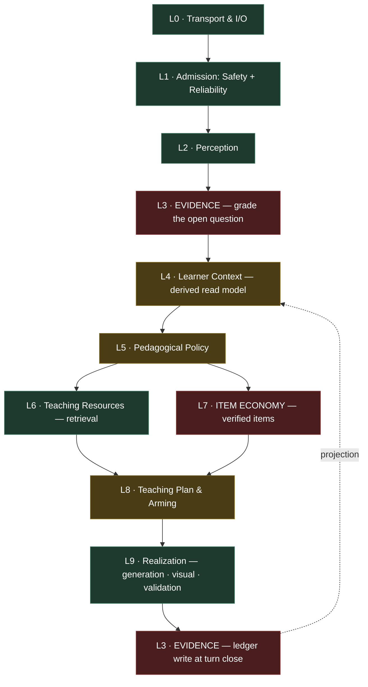
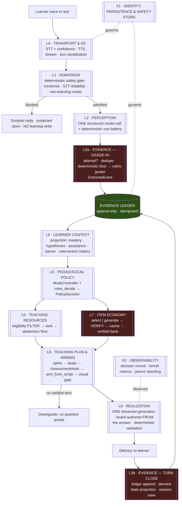
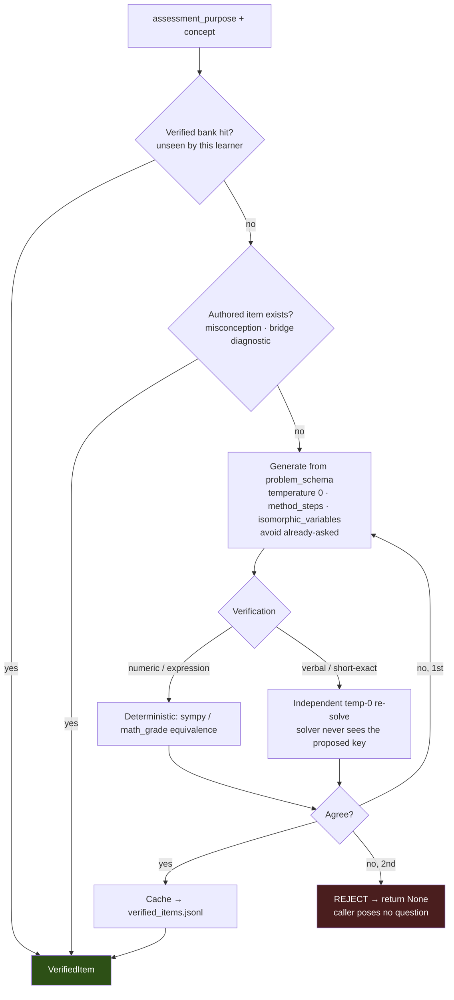
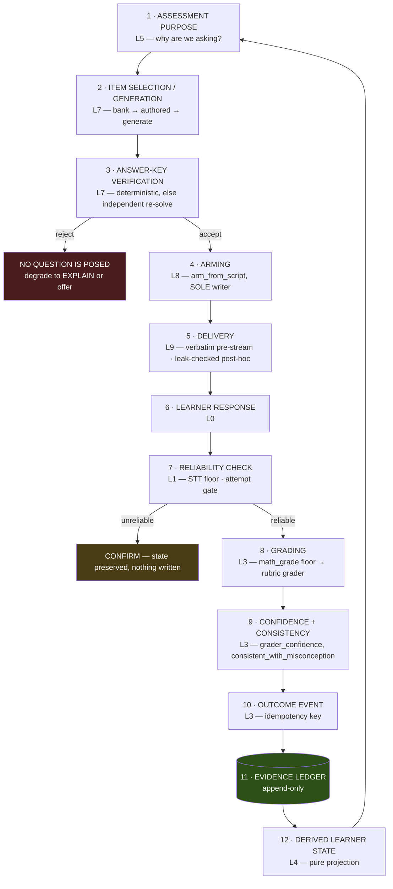
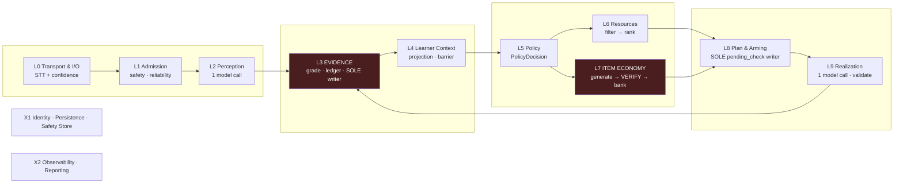

# Wini AI Tutor — Final Layered Architecture

**Status: ARCHIVED 2026-08-27 (ticket 18).** Superseded by
`docs/architecture/WINI_ARCHITECTURE.md`. This copy is the **reasoning record** that produced
the L0–L9 + X1/X2 layer model; the new document inherits that structure and re-derives the
content against all resolved tickets. Do not edit this file.

**Document type:** implementation-oriented architecture specification
**Author role:** senior AI systems architect / backend architect / ITS researcher / learning-science engineer
**Date:** 2026-08-05
**Workspace:** `D:\cloud CLI\cloud_run_service`
**Status:** specification. No production code was changed in producing this document.

**Inputs synthesized:** the Terra audit set (`PEDAGOGICAL_ARCHITECTURE_*.md`), the Fable audit set (`FABLE_*.md`), the adjudication (`FINAL_PEDAGOGICAL_ARCHITECTURE.md`, `ARCHITECTURE_ADJUDICATION_REGISTER.md`, `PEDAGOGICAL_IMPLEMENTATION_SPEC.md`, `PEDAGOGICAL_POLICY_TEST_MATRIX.md`), the response-layer and Board Buddy design documents, plus direct inspection of the source tree, the persisted learner state, the 306-turn learning log, and the 3,562-node RAG graph.

**Evidence precedence applied throughout:** source code > persisted runtime data > passing tests > architecture documents > proposed designs > general assumptions.

Labels: **FACT** (verified here) · **RESEARCH** (peer-reviewed) · **INFERENCE** · **DECISION** · **HYPOTHESIS** (must be tested before being believed).

---

# 1. Executive Summary

Wini today is a well-engineered deterministic tutor with a **broken evidence economy**. The teaching machinery — safety gates, probe-before-correct, hint fading, earned visuals, grounding belts — is genuinely good. What is missing is the ability to *learn anything true about the child*.

Three facts establish this, and they drive the entire architecture below.

> **FACT 1 — There is no item bank.** The RAG store's complete gradeable inventory is **338 items, all diagnostics**: 276 misconception diagnostics + 62 Grade-9 bridge diagnostics. 647 exercise nodes, 245 problem schemas (18 referenced instances), and 324 CT probes carry **zero** answer keys. `_practice_gradeable()` searches for a stored `expected_answer` and therefore **always returns `None`**.
>
> **FACT 2 — Most questions are never scored.** Only three code sites arm `pending_check` (bridge/misconception, PRACTICE, TEST). The fallback action `QUIZ` arms nothing — and its TeachingScript spine nonetheless *declares* an assessment hook. 30 QUIZ turns in the log produced zero evidence.
>
> **FACT 3 — The learner model is empty.** After 306 logged turns across seven weeks: 23 graded writebacks (7.5%), 21 of them `wrong`; the live `learner_state.json` holds 8 concepts with **zero** mastery values, an empty `misconception_states`, and global `curiosity`/`cognitive_load` decayed to 0.0001.

Everything downstream — ZPD banding, rerank terms, transfer readiness, the 80% mastery gate, the parent dashboard — computes over cold-start constants.

**The architectural consequence.** The layer that must be built first is not a richer learner model. It is an **Evidence layer with a real item supply**. A knowledge-tracing model over this stream would produce precisely calibrated nothing.

## The architecture in one picture

**Ten runtime layers, two cross-cutting concerns.** Nine of the ten already exist in some form inside `tutor_loop.turn()`; this document mostly *names boundaries that are already there* and adds the two that are genuinely missing (Evidence, Item Economy).



Green = exists and largely correct · amber = exists, needs restructuring · red = the two genuinely new layers.

**Note the asymmetry:** L3 (Evidence) appears **twice** in a turn — once at the start to grade the previously armed question, once at the close to write the ledger. This is not a diagram artifact; it is the shape of a turn-based tutor and the architecture must make it explicit, because today the "grade" half exists and the "ledger" half does not.

## What this document decides

| Decision | Choice |
|---|---|
| Number of runtime layers | **10**, each with an argued reason to exist as a boundary |
| New deployment boundaries (services) | **Zero.** One process, as today. |
| New software modules | **Two** (`evidence/`, `items/`) plus three functions |
| New conceptual-only boundaries | Six (diagnostic vs scaffolding policy, observation vs hypothesis vs evidence, etc.) |
| Barrier taxonomy | **Four values**, three of which already have working code carriers |
| Knowledge tracing | **Stage 1 only** — ledger + existing deltas. No BKT/IRT until data earns it |
| RL / bandits | **Not in this architecture.** Prerequisites specified in §19 |
| Assistance ladder | **6 levels wrapping the 908 hint chains already authored in the store** |

## The progression this enables

```text
Reliable Tutor  →  Evidence-Aware Tutor  →  Adaptive Tutor  →  Calibrated Personalized Tutor  →  Experimentally Self-Improving
    P0                     P0/P1                  P1                    P2                              P3
```

We are currently at the left edge of "Reliable". P0 is entirely about reaching "Evidence-Aware". **No layer above L5 changes materially until L3 and L7 work.**

---

# 2. Architectural Principles

These are binding. Every layer specification below is checked against them.

| # | Principle | Consequence in this document |
|---|---|---|
| **P1** | **Instrument before you model.** | L3 and L7 are P0; learner modeling is P2. |
| **P2** | **Observations, hypotheses, and evidence are different kinds of thing.** | Enforced by contract at every layer boundary (§7). Only L3 may produce evidence. |
| **P3** | **No unscored questions.** If Wini poses a question it must be able to produce evidence, or it must not pose it. | L8's arming function is the sole gate; no verified item ⇒ no question. |
| **P4** | **No durable state without an evidence event.** | L3 is the sole writer of the ledger; L4 is a pure projection. |
| **P5** | **An item outcome licenses only claims that item supports.** | Wrong-on-item ≠ holds-misconception-M (§10.4). |
| **P6** | **Uncertainty is a first-class output, not a failure.** | `unknown`, `insufficient_evidence`, `candidate` are valid terminal values. |
| **P7** | **Determinism where correctness matters; models where language matters.** | Safety, arming, grading floor, validation, policy = deterministic. Perception, generation, item text = model. |
| **P8** | **Extend working mechanisms; do not replace them.** | 908 authored hint chains, the concept graph, the abstention floor, the grounding belt, the visual gate all survive unchanged or extended. |
| **P9** | **Conceptual separation ≠ software separation ≠ deployment separation.** | §4 states explicitly which boundaries stay conceptual. |
| **P10** | **Do not invent learner signals that cannot be observed.** | Four barriers, not eleven. No affect traits. No learning styles. |
| **P11** | **Latency is a pedagogical constraint.** | Two model calls stay on the critical path. Verification and item generation are cached and off it. |
| **P12** | **Every durable claim must be traceable to the evidence that justifies it.** | The eight questions of §29 must be answerable from logs + state alone. |

---

# 3. Current Problems Being Solved

Ordered by severity. Each carries its code or data citation, and the layer that fixes it.

| # | Problem | Evidence | Fixed by |
|---|---|---|---|
| **C1** | **No practice/test item bank exists.** | Store audit: 338 gradeable items, all diagnostics; 647 exercises / 245 schemas / 324 ct_probes have 0 answer keys | **L7** |
| **C2** | **Questions posed into the void.** `QUIZ` (tutor_loop.py:187) arms nothing; arming exists only at :2863, :2879, :2887 | 30 QUIZ turns → 0 outcomes | **L8** |
| **C3** | **Answer keys unverified.** `generate_quiz_item` (tutor_loop.py:986–1032) emits a key from one temperature-0.7 call; it decides the 80% mastery gate | code | **L7** |
| **C4** | **Grading is under-informed.** `judge_answer` accepts a `rubric`; its only call site (tutor_loop.py:2615) never passes it — 276 authored `why_wrong` texts are dead | code | **L3** |
| **C5** | **Invalid inference from item outcome to belief.** Child said *"it can have zero, one or two real zeroes"*; graded wrong; system set `quadratic_always_has_two_real_zeroes` **active** — a belief that sentence denies. 3 occurrences | log 2026-06-20, 2026-07-20 ×2 | **L3** |
| **C6** | **Misconception born confirmed.** `apply_probe_result` uses `setdefault(..., {"status":"active"})` — the record is `active` even when the first probe is answered *correctly* | learner_state.py:360–362 | **L3/L4** |
| **C7** | **No idempotency on the live path.** `"The answer is 5"` produced three writebacks in 16 s | log 2026-07-25T17:01 | **L3** |
| **C8** | **STT confidence discarded.** `alternatives[0].confidence` is available and thrown away | voice/cloud_stt.py:55,116 | **L1** |
| **C9** | **No failed-strategy memory.** Rule 1b fires identically on every confusion plea; EXPLAIN is 95/306 turns | code + log | **L4/L5** |
| **C10** | **Assistance unavailable outside a pending check.** Rule 3 → `ANALOGOUS_EXAMPLE`, while 908 nodes carry an authored 3-level ladder | code + store | **L5** |
| **C11** | **Outcome bridge dormant.** `apply_response_outcomes` (tutor_loop.py:1851) has zero call sites; `state_update_intent` never populated | code | **L3/L8** |
| **C12** | **Script declares assessment the runtime ignores.** `QUIZ` spine has `AssessmentHookType.MICRO_CHECK`; nothing arms it | templates.py:136 | **L8** |
| **C13** | **Dashboard fields are degenerate.** Global EMAs update on every turn regardless of signal; live `curiosity` = 0.0001; read by no decision code | analyzer.py:149; grep | **L4 / cross-cutting** |
| **C14** | **`transfer_readiness` computed and ignored.** Built to fix rule 5; rule 5 still keys on a one-turn signal | learner_state.py:175 vs tutor_loop.py:173 | **L5** |
| **C15** | **Identity is a deployment env var.** `WINI_LEARNER_ID` defaults `"default"`; no auth identity flow | state_backend.py:62 | **X1** |
| **C16** | **Flag contract split.** tutor defaults `WINI_RESPONSE_LAYER=1`; server defaults `0` | tutor:88 / server:88 | **X1** |
| **C17** | **Binary diagnostics carry durable weight.** 56 of 338 keys are yes/no, skewed 48 "no" : 8 "yes" — a response-biased child scores ~86% | store audit | **L3/L7** |
| **C18** | **Outer loop inert.** `WINI_MODE_OFFERS` defaults off; `concepts_due_for_review` exists and nothing calls it | tutor_loop.py:1145 | **L5** |

---

# 4. Three Kinds of Boundary

**P9 in practice.** The single most common architectural error in the prior audits was conflating these. Terra proposed five policy *services* for what are five policy *concerns*.

## 4.A Conceptual boundaries — reasoning distinctions, NOT modules

These must be visible in **data and naming**, never in a directory structure.

| Conceptual boundary | Why it must exist | Where it lives |
|---|---|---|
| Observation ≠ Hypothesis ≠ Evidence ≠ Confirmed state | Prevents a classifier score becoming a claim about a child | Field types and partitions in L4; `status` vocabularies |
| Diagnostic policy ≠ Instruction policy ≠ Scaffolding policy ≠ Assessment policy | Different questions, different inputs | **Fields of one `PolicyDecision`** (L5). Not five modules. |
| Retrieval relevance ≠ Pedagogical appropriateness | Semantic similarity cannot pick a remedy | Filter-then-rank inside L6, one module |
| Assistance offered ≠ assistance consumed | Correctness after help is not mastery | Two ledger fields |
| Item validity ≠ item relevance | A relevant question with a wrong key is worse than no question | L7 verification vs L6 retrieval |
| Delivery style ≠ pedagogical action | Encouragement must not replace a remedy | `PolicyDecision.delivery_style`, not an action |

**DECISION.** Six conceptual boundaries stay conceptual. Zero become modules.

## 4.B Software boundaries — modules with an interface and a test suite

| Software boundary | Justification for module status |
|---|---|
| `perception/` (exists) | Different failure mode (model), own eval harness, memoized, swappable backend |
| **`evidence/` (NEW)** | Sole writer of durable truth; must be independently testable and replayable; today this logic is smeared across `tutor_loop` §1b and three `learner_state` APIs |
| **`items/` (NEW)** | Different *lifecycle* — cacheable, batchable, runnable offline; must not be entangled with turn latency |
| `query.py` (exists) | Distinct data dependency (graph + embeddings), own regression suite |
| `response_layer/` (exists) | Already a clean module with 81 passing tests |
| `learner_state.py` (exists) | Persistence + projection; becomes narrower once L3 owns writes |
| `session_modes.py` (exists) | Outer-loop state machine, independently testable |

**DECISION.** Two new modules. Everything else is an extension of an existing one.

## 4.C Deployment boundaries — separate processes or network calls

| Candidate | Verdict | Reason |
|---|---|---|
| Cloud Run brain (`wini_server`) vs device client | **KEEP — real boundary** | Already exists; the ESP32-P4 thin-client target depends on it |
| Vertex AI (perception, generation, grading) | **KEEP — real boundary** | External service, already isolated behind `qwen_chat` / `llm_vertex` |
| Cloud STT / TTS | **KEEP — real boundary** | External service |
| Firestore state | **KEEP — real boundary** | Already exists |
| Board Buddy renderer | **KEEP — process boundary on device only** | Renders in a pygame child process on the client; the *authoring* stays in-brain |
| Item Economy | **NO — same process, async allowed** | Cacheable work, not a service. May later become a batch job; that is a scheduling change, not an architecture change |
| Evidence / Ledger | **NO — same process** | Must be transactionally close to the turn; a network hop would introduce exactly the duplicate-write class of bug (C7) we are fixing |
| Policy / Diagnosis / Scaffolding | **NO — emphatically** | Terra's five-service proposal. Five interacting network policies before any policy has an evidence stream would be the largest possible over-engineering |

**DECISION. Zero new deployment boundaries.** The architecture below runs in the same single Cloud Run process it runs in today.

---

# 5. Final End-to-End Pipeline

## 5.1 The illustrative pipeline in the brief, corrected against code

The brief's illustration is close but wrong in three ways, each of which matters:

| Brief's illustration | Correction | Why |
|---|---|---|
| Evidence sits *after* perception, once | Evidence appears **twice** — grade-in at turn start, ledger-write at turn close | A turn-based tutor grades *last* turn's question at the start of *this* turn. This is already how `turn()` works (stage 1b at :2556, log/persist at :3376) |
| "Retrieval / Teaching Resources" is one box | **Split**: content retrieval (L6) and item supply (L7) | Different lifecycles: retrieval is per-turn and latency-bound; item verification is cacheable and can run ahead. Conflating them is how C1 stayed invisible |
| "Assessment / Grading" comes after the learner response as a separate stage | Grading belongs **inside the Evidence layer**, and *arming* belongs to the Teaching Plan | Splitting arm from grade across two layers is exactly the C12 defect |

## 5.2 The final pipeline



## 5.3 Why each boundary earns its existence

Every boundary below must pass three tests: **(a)** does it have a distinct failure mode? **(b)** can it be tested independently? **(c)** does the responsibility genuinely belong to no other layer?

| Boundary | (a) Distinct failure | (b) Independently testable | (c) Belongs nowhere else | Verdict |
|---|---|---|---|---|
| L0 / L1 | transport error vs safety miss | yes — gate recall suite | safety must precede everything | **KEEP** |
| L1 / L2 | gate miss vs misclassification | yes — perception eval | admission is model-free by mandate | **KEEP** |
| L2 / L3 | wrong intent vs wrong grade | yes — grading golden set | **only L3 may create evidence (P4)** | **KEEP — critical** |
| L3 / L4 | bad grade vs bad projection | yes — ledger replay | writes vs reads must not be the same code | **KEEP — critical** |
| L4 / L5 | wrong belief vs wrong choice | yes — policy scenario tests | "what is true" ≠ "what to do" | **KEEP** |
| L5 / L6 | wrong action vs wrong content | yes — retrieval eligibility tests | retrieval must not choose strategy | **KEEP** |
| L6 / L7 | irrelevant content vs invalid key | yes — key-agreement golden set | **different lifecycle: cacheable vs per-turn** | **KEEP — new** |
| L7 / L8 | no valid item vs bad plan | yes — arming invariant tests | arming is the single choke point for P3 | **KEEP** |
| L8 / L9 | wrong plan vs wrong words | yes — validator tests | plan must not be reconstructed from prose | **KEEP** |
| Diagnosis / Scaffolding / Assessment *inside* L5 | same failure mode: a wrong `PolicyDecision` | tested through one interface | **fails (c)** | **CONCEPTUAL ONLY** |
| Board Buddy planner separate from L8 | would create a *second* pedagogical planner | — | **fails (c) catastrophically** | **REJECTED** |

---

# 6. Layer Map

| ID | Layer | Status | Module | New? | On critical path? | Model calls |
|---|---|---|---|---|---|---|
| **L0** | Transport & I/O | exists | `wini_server.py` | extend | yes | STT, TTS |
| **L1** | Admission (Safety + Reliability) | exists | `perception/gates.py`, `route.py` | extend | yes | **none** |
| **L2** | Perception | exists | `perception/gemini_perception.py`, `cognitive_analyzer/` | keep | yes | **1** (memoized) |
| **L3** | **Evidence & Grading** | **partial → new module** | **`evidence/`** | **NEW** | grading parallel | ≤1 (grader) |
| **L4** | Learner Context | partial | `learner_state.py`, `query.Snapshot` | restructure | no | none |
| **L5** | Pedagogical Policy | partial | `tutor_loop.rules_decide`, `session_modes.py` | extend | no | none |
| **L6** | Teaching Resources | exists | `query.py`, `rag_store/` | extend | yes (local) | none |
| **L7** | **Item Economy** | **absent** | **`items/`** | **NEW** | **no — cached** | 2, cached |
| **L8** | Teaching Plan & Arming | partial | `response_layer/` | extend | no | none |
| **L9** | Realization | exists | `tutor_loop.qwen_answer`, `response_layer/`, `board_buddy/` | extend | yes | **1** + ≤1 board |
| **X1** | Identity, Persistence & Safety Store | partial | `state_backend.py`, `wini_server.py` | extend | no | none |
| **X2** | Observability & Reporting | partial | `_log`, `learning_log.jsonl` | extend | no | none |

**Critical-path model calls: 2** (perception, generation) — unchanged from today. Grading runs in parallel (already does, `_maybe_speculate_grade` at wini_server.py:524). Item verification is cached and off-path. **This architecture does not regress TTFA.**

---

# 7. Layer-by-Layer Specification

Each layer follows the required 20-field format via a specification table plus implementation discussion.

---

## L0 — Transport & I/O

| Field | Description |
|---|---|
| **Purpose** | Terminate the network/audio boundary; produce a transcript with reliability metadata; stream speech back; serialize turns; trigger persistence. |
| **Inputs** | HTTP POST (`/turn`, `/voice_turn`), PCM audio + rate, `X-Wini-Key`, `X-Wini-Mode`, device profile |
| **Outputs** | `transcript`, **`stt_confidence`**, `n_best` (optional), `answer_budget`, streamed TTS, `turn_meta` |
| **Reads** | learner document (boot), device profile |
| **Writes** | learner document at turn close (Firestore + local atomic save) |
| **Deterministic logic** | API-key gate, CORS, turn serialization, streaming chunking, budget derivation |
| **Model usage** | Cloud STT, Cloud TTS. **No LLM.** |
| **Existing components** | `wini_server.Brain` (:104), `text_turn` (:347), `voice_turn` (:559), `_persist_state` (:511), `_maybe_speculate_grade` (:524), `Handler` (:691) |
| **New components** | STT confidence plumbing; single-source flag resolution |
| **Failure modes** | STT timeout; empty transcript; client retry causing duplicate turn (**observed — C7**); Firestore write failure |
| **Safeguards** | Bounded timeouts (`_bounded`, :98); local atomic save is authoritative if Firestore fails; **turn-level idempotency key generated here and carried down** |
| **Logging** | `latency_ms` breakdown (exists), `stt_confidence`, `turn_id`, client retry detection |
| **Tests** | Contract: transcript + confidence reach `turn()`. Retry with identical payload produces one turn. Flag defaults agree between server and tutor. |
| **Latency** | **Critical.** STT ~1.0–1.5 s (Cloud STT chosen over Gemini Live on measured latency grounds — keep). TTS streamed. |
| **Dependencies** | none (entry layer) |
| **Must not do** | Interpret meaning · touch learner cognitive state · decide pedagogy · grade |

### Implementation

The one substantive change is **C8**: `voice/cloud_stt.py` already reads `result.alternatives[0]` (lines 55, 116) and discards `.confidence`. Carry it. Add `turn(..., stt_confidence: float | None = None)`; text-path callers pass `None` and are unaffected.

Second change: generate a `turn_id` (UUID) at the transport boundary and thread it through. This is what makes L3's idempotency defensible against *client retries*, which is the actual observed cause of the triple-grade — a dedupe key computed only from reply text cannot distinguish a retry from a child genuinely repeating themselves, but a `turn_id` can.

**What NOT to implement yet:** N-best alternative reconciliation, speaker diarization, on-device VAD changes. Single-best plus confidence resolves the observed failure class.

---

## L1 — Admission (Safety + Reliability)

| Field | Description |
|---|---|
| **Purpose** | Decide whether this utterance may enter the learning pipeline at all. Two independent gates: *is it safe?* and *is it reliable enough to have consequences?* |
| **Inputs** | `transcript`, `stt_confidence`, `session.pending_check` (is a consequential answer expected?) |
| **Outputs** | `AdmissionResult{admitted: bool, route: SAFETY\|NONSENSE\|SOCIAL\|OFF_DOMAIN\|CONFIRM\|LEARNING, risk_tier, reason}` |
| **Reads** | session (pending check presence only) |
| **Writes** | **protected safety store only** — never learner cognitive state |
| **Deterministic logic** | High-recall SAFETY lexicon; conservative NONSENSE gate; STT confidence floor; **all regex/threshold, zero models** |
| **Model usage** | **NONE by mandate.** The Gemini `safety` flag may only *add* recall downstream, never remove it. |
| **Existing components** | `perception/gates.py` (`is_safety` :76, `is_nonsense` :81, `gate` :109), `perception/route.py`, `_handle_nonlearning` (tutor_loop.py:1869), `rag_store/safety_alerts.jsonl` |
| **New components** | Risk tiering (self-harm / abuse disclosure / PII / distress); reviewed template per tier; **`CONFIRM_UNDERSTOOD_INPUT` route**; redaction on the learning log |
| **Failure modes** | Gate miss on oblique or gerund phrasing (**historically real** — first-pass lexicon scored 0.75 recall); over-trigger interrupting a lesson; false confirm-loop nagging the child |
| **Safeguards** | Over-trigger by design on a child-facing device; confirm route fires **only** when a check is armed *and* the reply is an attempt (never nag on chit-chat); gate recall measured directly, never assumed |
| **Logging** | Risk tier, matched pattern class (**not raw text in the learning log**), STT confidence, confirm-route firings |
| **Tests** | Red-team suite per tier including gerunds/oblique phrasings; `eval.perception_eval --gates` recall bar; no safety row in `learning_log.jsonl`; low-confidence attempt → confirm, no state write |
| **Latency** | Negligible (regex) |
| **Dependencies** | L0 |
| **Must not do** | Call a model · analyze cognition · write learner state · let a model override a deterministic safety verdict |

### Implementation

**Why admission is a layer and not part of perception.** It has a different *correctness standard*. Perception may be 93% accurate and useful; the safety gate must be near-total **on its own**, before any model runs, and its failure is categorically different. Merging them would put a child-safety guarantee behind a model call.

**Risk tiering (C-class).** Today one broad route handles everything. Split into tiers with a reviewed template each. **Correcting Terra's PED-023:** a dedicated `rag_store/safety_alerts.jsonl` *does* exist with a supervisor-notify path. What is missing is tiering, access control, identity (`learner_id` is `null` in every row), and redaction — not the store itself.

**The reliability gate is new and belongs here, not in L3.** Rationale: it is an *admission* decision (may this utterance have consequences?), it is deterministic, and it must run before any expensive work. When `stt_confidence < STT_CONFIRM_FLOOR` (start 0.6, calibrate per DEC-044) **and** a check is armed **and** the reply looks like an attempt → emit `CONFIRM_UNDERSTOOD_INPUT`: *"I heard 'x equals five' — is that your answer?"* The pending check is **preserved**, nothing is written, and the confirmation **replaces** the generation call, so it adds zero latency.

**What NOT to implement yet:** a model-based safety classifier as the primary gate; sentiment-based distress detection; automated escalation beyond the existing supervisor notify.

---

## L2 — Perception

| Field | Description |
|---|---|
| **Purpose** | Convert one utterance into typed, turn-scoped **observations**. Nothing more. |
| **Inputs** | normalized transcript, conversation context, current concept, pending-check context, concept catalog |
| **Outputs** | `TurnObservation{intent, concept_candidate, concept_confidence, answer_attempt, signals[], safety_flag, uncertain: bool}` + deterministic cues |
| **Reads** | session context, current concept (for INHERIT), concept catalog |
| **Writes** | **nothing durable.** TTL'd concept flags only, and only via L4's projection |
| **Deterministic logic** | `InputProcessor.normalize_input` (idempotent — memoization depends on it); the cue battery (clarification / visual / animation / real-life / purpose / learning-request / answer-attempt / student-problem / `non_attempt`); `is_pure_ack` |
| **Model usage** | **ONE** schema-constrained Gemini 2.5 Flash call, `temperature=0`, memoized by normalized text, served from a Vertex context cache |
| **Existing components** | `perception/gemini_perception.py`, `perception/vertex_cache.py`, `cognitive_analyzer/analyzer.py`, `cognitive_classifier/cues.py` |
| **New components** | Explicit `uncertain` flag on fallback; **stop persisting degenerate global EMAs** |
| **Failure modes** | Model timeout → `_fallback` currently returns `LEARNING + INHERIT + neutral` (:402), silently fabricating an instructional context; wrong-but-schema-valid concept; signal miscalibration |
| **Safeguards** | Response-schema enums block *invented* values (not *wrong* ones — keep the local validation belt); OOV → INHERIT; signal firing gated on `PERCEPTION_SIGNAL_THRESHOLD` calibrated on the frozen TEST split, never the raw score; **deterministic cues outrank the classifier** where they disagree (the ack case is the documented precedent) |
| **Logging** | intent, concept + confidence, fired signals, `uncertain`, cache hit/miss, latency |
| **Tests** | `perception.test_perception`, `eval.perception_eval --gates`, `eval.behavioral_eval`; **new:** a fallback turn arms nothing and writes nothing |
| **Latency** | **Critical path.** One call; context-cached (6,062 tokens). Client construction is memoized per process — the dominant cold-start cost (~4–9 s), which is why `min-instances=1` matters. |
| **Dependencies** | L1 |
| **Must not do** | **Move mastery · confirm a misconception · create durable traits · grade an answer · choose a teaching action** |

### Implementation

Perception is already correct in structure and stays largely as-is. Three changes.

**1. The fallback must not lie (C-class, PED-009).** `_fallback` returning `LEARNING + INHERIT_CURRENT_CONCEPT + neutral signals` preserves availability but fabricates instructional certainty. Add `uncertain=True` to the observation, and have L8 **suppress arming** on such turns. Availability is preserved; the fabricated confidence is not.

**2. Stop persisting degenerate globals (C13).** `apply_deltas` (analyzer.py:149–151) emits a global target on *every* learning turn including turns where the source signal did not fire, so the EMA measures message-type frequency, not the child — live `curiosity` = 0.0001. **Verified: no decision code reads these.** They feed the parent dashboard, which makes this a *product truthfulness* defect, not a cosmetic one. Fix: signal-gate the EMA (update only when the source signal exceeded a floor) and record `n_observations` so X2 can suppress an unsupported value.

**3. Keep the observation/state firewall explicit.** Perception's output type must make it impossible to write mastery. This is enforced by contract (§7) and by module boundary — `evidence/` is the only importer of the state-write APIs.

**What NOT to implement yet:** a second perception call for diagnosis (latency + the reliability problem the gates exist to bound); per-turn affect modeling; promoting HOPE beyond a rerank nudge (unvalidated construct — DEC-045).

---

## L3 — Evidence & Grading ★ NEW MODULE

**This is the layer the system is missing, and the reason the learner model is empty.**

| Field | Description |
|---|---|
| **Purpose** | The **sole producer of durable truth.** Convert an answered question into a verified, provenance-carrying, idempotent `OutcomeEvent`, and append it to the ledger. Nothing else in the system may write learning evidence. |
| **Inputs** | armed `pending_check` (item, key, purpose, rubric), learner reply, `answer_attempt`/`non_attempt`, `stt_confidence`, `turn_id`, assistance counters |
| **Outputs** | `OutcomeEvent` (§18) or `None`; grading verdict for the ladder/mode machinery |
| **Reads** | `session.pending_check`, `session.graded_keys`, concept/misconception graph node (for rubric), assistance counters |
| **Writes** | **`evidence_log`** (append-only) — and, via the projection in L4, the derived summary fields. **This layer is the only writer of learning evidence in the system.** |
| **Deterministic logic** | Attempt gate; **idempotency key**; `math_grade` floor (numeric/expression/yes-no equivalence); outcome→delta mapping; assistance discount; **misconception-consistency rule** |
| **Model usage** | ≤1 rubric grader call (`small=True` tier), only when the deterministic floor defers. Runs **in parallel** with perception. |
| **Existing components** | `math_grade.py` (good — keep), `judge_answer` (tutor_loop.py:925), the three evidence APIs (`apply_probe_result` :342, `apply_bridge_result` :430, `apply_item_result`), `response_layer/outcomes.py::OutcomeEvent` **(already has idempotency keys — reuse, do not reinvent)**, `_maybe_speculate_grade` (wini_server.py:524) |
| **New components** | `evidence/ledger.py` (append + replay), `evidence/grade.py` (rubric-aware grading + confidence), `evidence/record_outcome.py` (the single funnel), dedupe store |
| **Failure modes** | **C4** rubric never passed · **C5** invalid inference · **C7** duplicate grade · **C17** binary-item over-confidence · grader timeout · ledger unbounded growth |
| **Safeguards** | Non-attempt gate (**exists and works — regression-guard it**); deterministic floor first; grader failure degrades to `not_an_answer` (never moves state); idempotency key; low STT confidence handled upstream at L1; **binary items may raise a hypothesis but never confirm one** |
| **Logging** | Full `OutcomeEvent` with `grader_path`, `grader_confidence`, `stt_confidence`, `assistance_offered/consumed`, `idempotency_key` |
| **Tests** | Golden re-grade of the 306-turn log; **one ledger row per mastery mutation (I2)**; **replay reproduces derived mastery (I3)**; the three `"The answer is 5"` rows → one row; the three `"zero, one or two"` rows → hypothesis not strengthened |
| **Latency** | Off the critical path — grading already runs in parallel with perception (`WINI_PARALLEL_GRADER=1`). Ledger append is O(1). |
| **Dependencies** | L1 (reliability), L2 (attempt status), L8 of the *previous* turn (the armed hook) |
| **Must not do** | Choose the next action · retrieve content · generate language · **infer beliefs the item does not support** |

### Implementation

#### The four grading defects, and their fixes

**(1) Pass the rubric — C4, one line.** `judge_answer(question, expected, student_answer, rubric="")` builds a `GRADING NOTES` prompt block from `rubric`. The sole call site (tutor_loop.py:2615) never passes it. All 276 misconceptions carry `why_wrong`; problem schemas carry `trap_steps`. Populate it. *(This also corrects Fable's claim that the grader "does" receive question semantics — it receives question + key, not the rubric.)*

**(2) Return confidence and consistency.** Change the return from `str` to:

```python
@dataclass
class GradeResult:
    outcome: str                  # correct | partial | wrong | not_an_answer
    grader_path: str              # "deterministic" | "llm"
    grader_confidence: float      # 1.0 deterministic; high/medium/low → 0.9/0.6/0.3
    consistent_with_misconception: bool | None = None   # probe turns only
```

The deterministic path always reports 1.0. The LLM path extends its response schema. `consistent_with_misconception` is requested **only** on misconception probes where a rubric was supplied.

**(3) Forbid the invalid inference — C5, the most important fix in this layer.**

The observed case, traced precisely:

```
Q (stored):  "Does the quadratic polynomial x² + 1 have two distinct real zeros?"
Key:         "No"
Child:       "i think the answer is it can have zero, one or two real zeroes"
math_grade:  defers (key is non-numeric) → LLM grades "wrong"
System then: sets misconception::quadratic_always_has_two_real_zeroes = ACTIVE
```

`wrong` is *defensible as an item grade* — the child did not answer about x²+1. But the system then asserted **"this child believes a quadratic always has two real zeros"** from a sentence that explicitly denies it. Three times.

The rule:

```python
# wrong + consistent is True  → consecutive_failures += 1        (as today)
# wrong + consistent is False → do NOT increment; the reply refutes the
#                               misconception even though the item was missed.
#                               Still apply the item/concept mastery delta.
# wrong + consistent is None  → record outcome; leave hypothesis unchanged.
```

**P5 in code.** An item outcome licenses a claim about the *item* and the *concept mastery*. It licenses a claim about a *belief* only when the reply is consistent with that belief.

**(4) Idempotency — C7.** `idempotency_key = sha1(turn_id | pending_check.id | normalize(reply))`, checked against a bounded `session.graded_keys` before dispatch. The `turn_id` from L0 is what distinguishes a client retry from a child genuinely repeating an answer. The only idempotency machinery in the codebase today (`OutcomeEvent.idempotency_key`) sits on the dormant path — **move it to the live path rather than writing a second implementation.**

#### The ledger is the point of this layer

```python
def record_outcome(state, event: OutcomeEvent) -> dict:
    """The ONLY function in the system that may create learning evidence."""
    if event.idempotency_key in state.recent_keys:
        return state.last_result_for(event.idempotency_key)
    state.evidence_log.append(asdict(event))          # append-only, immutable
    return project_derived_state(state, event)        # L4's projection
```

The three existing evidence APIs become the *projection* invoked by `record_outcome`, not independent writers. **Day-one behaviour is identical** — the same deltas run — which is exactly what makes the ledger safe to ship before anything depends on it.

**What NOT to implement yet:** BKT/IRT; evidence-weighted mastery (Stage 2 — needs the ledger to exist first); a separate ledger service; cross-learner evidence pooling.

---

## L4 — Learner Context (derived read model)

| Field | Description |
|---|---|
| **Purpose** | Answer *"what do we believe about this learner, and why?"* as a **pure projection** of the ledger plus session state. Read-only with respect to evidence. |
| **Inputs** | `evidence_log`, session, concept graph, current concept |
| **Outputs** | `LearnerContext{mastery, mastery_status, active_hypotheses, barrier, barrier_confidence, assistance_state, intervention_history, reps_missing, transfer_readiness, cold_recall, zpd_band}` |
| **Reads** | ledger, `concept_states`, `misconception_states`, session, graph |
| **Writes** | derived summary fields **only via L3's projection**; session counters (`explain_count`, `last_route`) |
| **Deterministic logic** | Mastery projection; **`derive_barrier`**; ZPD banding; `transfer_readiness`; `cold_recall_strength`; misconception status machine; struggle thresholds |
| **Model usage** | **NONE** |
| **Existing components** | `learner_state.py` (mastery, `transfer_readiness` :175, `cold_recall_strength`, `misconception_status`, `is_struggling`), `query.Snapshot` (:145) with its 7-term rerank inputs |
| **New components** | `derive_barrier()` (~25 lines); `intervention_history` partition; `mastery_status` enum; `candidate`/`supported` misconception tiers |
| **Failure modes** | Projection drift from the ledger; **C6** hypothesis born confirmed; **C9** no failed-strategy memory; false precision on unmeasured concepts |
| **Safeguards** | `mastery_measured` flag (**already exists — good**) extended to a `mastery_status` enum including `insufficient_evidence`; replay test asserts projection == ledger; `barrier` may never be asserted to the learner or the parent as fact |
| **Logging** | The full context snapshot on every decision (the `ranking_trace` precedent — already good) |
| **Tests** | Replay reproduces mastery (I3); a correct first probe never creates a confirmed record; barrier precedence tests; `explain_count` resets on concept change/success |
| **Latency** | Negligible; O(recent ledger rows) |
| **Dependencies** | L3 |
| **Must not do** | **Write evidence · call a model · choose an action · manufacture a number it cannot justify** |

### Implementation

#### The four partitions (P2 made concrete)

| Partition | Contains | May move mastery? | Lifetime |
|---|---|---|---|
| **Observations** | perception signals, cues, STT confidence, self-reports | **No** | turn / TTL flag |
| **Hypotheses** | misconception `candidate`, derived `barrier`, suspected prerequisite gap | **No** | decays or is rejected |
| **Evidence** | ledger rows | is the source | immutable |
| **Confirmed / derived** | mastery, `supported` misconceptions, bridge status, representation coverage | **Yes, by projection only** | durable |
| **Intervention history** | what was tried, at what assistance, and what followed | **No** | concept-scoped |

#### Fixing the misconception tiers (C6)

`apply_probe_result` uses `setdefault(mid, {"status": "active", ...})` — so the record is born `active` even when the first probe is answered **correctly** (then downgraded to `weakening`). Meanwhile `query.Snapshot` (:155) filters for status `"suspected"`, which **nothing ever writes** — a dead branch marking an epistemic tier that was designed and never built.

```
candidate   ← flag, or one failure, or a binary-item failure
supported   ← two convergent failures, OR one high-confidence failure on a NON-BINARY item
weakening / resolved / recurring   ← unchanged (this part works)
```

Gate the corrective phase (`query.py:356`) and `misconception_confirmed` (`tutor_loop.py:1785`) on **`supported`** only. Write `candidate` so the phantom filter becomes live.

#### `derive_barrier` — a function, not a subsystem

```python
def derive_barrier(ctx) -> tuple[str, float, str]:
    if ctx.wants_visual or ctx.reps_missing:
        return "representation_gap", 0.8, "explicit plea | reps_missing"
    if ctx.candidate_misconceptions:
        return "misconception", 0.5, ctx.candidate_misconceptions[0]
    if ctx.weakest_bridge_mastery < 0.6:
        return "prerequisite_gap", 0.6, ctx.weakest_bridge_id
    return "unknown", 0.0, ""
```

**Precedence rationale:** representation first because the learner *named* it (an explicit request outranks an inference — the existing rule 1a-vis encodes this for a documented regression); misconception second because probe-before-correct is a hard invariant; prerequisite third because the bridge gate already runs ahead of new instruction (**RESEARCH:** IES/WWC 2021 supports activating prior knowledge first). `unknown` is the honest majority case.

**What NOT to implement yet:** additional barrier kinds; KC decomposition below concept (`kc_id` defaults to `concept_id` so the door stays open at zero authoring cost); psychological traits; evidence-weighted mastery.

---

## L5 — Pedagogical Policy

| Field | Description |
|---|---|
| **Purpose** | Decide **one** thing: given what we believe and what happened, what should Wini do next, with how much help, and to gather what evidence? |
| **Inputs** | `LearnerContext`, perception observations + cues, mode state, last outcome, `intervention_history` |
| **Outputs** | `PolicyDecision` (§12.1) |
| **Reads** | learner context, session mode/offers/test state |
| **Writes** | session mode transitions, offer flags, `explain_count`, `last_route` |
| **Deterministic logic** | `ModeController` (outer loop) + `rules_decide` first-match tiers (inner loop) + assistance ladder selection + assessment-purpose determination + failed-strategy escalation |
| **Model usage** | **NONE.** A policy-shadow model may be logged but must never choose. |
| **Existing components** | `rules_decide` (:109–187), `session_modes.ModeController` (:76) with `resolve_mode` (:168), `maybe_offer_practice` (:196), `next_practice_item` (:239), `advance_test` (:320), `policy_shadow/` |
| **New components** | `PolicyDecision` dataclass; four new inputs; `ELICIT_ATTEMPT`, `ASSESS_*`, `EXPLAIN_*` split actions; `delivery_style` |
| **Failure modes** | **C2** purposeless quiz fallback · **C9** repeating a failed strategy · **C10** wrong assistance response · **C14** ignoring measured readiness · **C18** inert outer loop · rule-order regressions |
| **Safeguards** | First-match order stays legible and inspectable; safety/test-integrity/explicit-request tiers are inviolable; **every rule carries the transcript regression that motivated it** (existing practice — preserve it) |
| **Logging** | Complete `PolicyDecision` on every learning turn, plus the shadow suggestion side-by-side (existing practice) |
| **Tests** | The full scenario matrix (`PEDAGOGICAL_POLICY_TEST_MATRIX.md`); no action without a purpose; no thrice-repeated strategy (I10) |
| **Latency** | Negligible (pure function) |
| **Dependencies** | L4 |
| **Must not do** | **Call a model · retrieve content · write the words · move mastery · pose a question without a purpose and a verified item** |

### Implementation

#### One function, richer inputs — the rejection of five services

**DECISION.** Terra proposed factoring policy into five services. Verified against code: **modality is already factored** (`visual_gate.decide`), assessment factoring reduces to fixing arming and purpose, scaffolding factoring reduces to generalising the hint chain. None requires a module split. Fable proposed leaving the table alone, which under-delivers on Terra's valid point that the table takes no objective, barrier, assistance state, or assessment purpose as input.

**Third position: one function, four new parameters, one structured return.** The conceptual separation lives in the *fields of the decision record*, not in a directory tree. Full rationale and the full action taxonomy are in §12.

#### Failed-strategy memory (C9)

The single most valuable addition. Two facts per concept in session state:

```python
intervention_history[concept_id] = {
    "explain_count": int,        # times an EXPLAIN-family action was used
    "last_route": str,           # which explanatory route was used
    "actions_tried": list[str],  # bounded
}
```

Escalation on `barrier == "unknown"`:

| Occurrence | Action |
|---|---|
| 1st confusion | `EXPLAIN_SIMPLER` |
| 2nd confusion | `EXPLAIN_DIFFERENT_ROUTE` + `ELICIT_ATTEMPT` |
| 3rd confusion | forced `REPRESENTATION_TRANSLATION` |

**Critical boundary — escalation is not withholding.** Wini must never refuse an explanation to a child who asks for one. The codebase already learned this: rule 4b (`SOLVE_STUDENT_PROBLEM`) exists because withholding a requested answer was a real regression. **HYPOTHESIS (DEC-041):** that cue-first outperforms re-explanation in a *voice-only* turn is untested — all supporting evidence (Sinha & Kapur 2021, g≈0.36; VanLehn et al. 2003; D'Mello & Graesser 2012) is classroom or screen-based with designed problem-solving phases. Ship the *escalation* (don't repeat a failed strategy — justified now); A/B the *rung ordering* later.

**What NOT to implement yet:** learned policy, bandits, per-turn LLM diagnosis, five policy modules, curriculum sequencing beyond the existing review fields.

---

## L6 — Teaching Resources (Retrieval)

| Field | Description |
|---|---|
| **Purpose** | Select the **pedagogically eligible and relevant** content objects that realize the decision. |
| **Inputs** | `PolicyDecision`, `LearnerContext`, concept ids, served set |
| **Outputs** | evidence manifest (typed blocks with provenance and reasons) |
| **Reads** | `rag_store/` graph, chunks, embeddings, `formula_links.json`, `concept_figures.json`, learner snapshot |
| **Writes** | `session.served_items`, `bridges_served` |
| **Deterministic logic** | **Eligibility filter → rank**; bridge gate (mastery < 0.6, relevance ≥ 0.20, max 1/turn); misconception probe-vs-corrective phase; role preferences per need; 7-term snapshot rerank; **absolute abstention floor 0.28**; difficulty-spread cohesion |
| **Model usage** | Local MiniLM embeddings only (in-container, ~0 marginal cost). Optional cohesion judge is cost-gated. |
| **Existing components** | `query.py` in full (`Snapshot` :145, `bridge_evidence`, `misconception_evidence` :350, `snapshot_rerank`, `cohesion_filter`) |
| **New components** | The eligibility **pre-filter**; `reveal_policy`, `assessment_purpose`, `kc_id` metadata |
| **Failure modes** | Serving corrective content while a probe is open (reveal violation); irrelevant-but-on-topic content; over-serving repeats |
| **Safeguards** | **Abstention floor with a logged reason — keep unchanged, this is a genuinely good invariant**; served-item exclusion; correction-without-misconception pruning |
| **Logging** | `ranking_trace` (exists and is good), abstention reason, eligibility rejections |
| **Tests** | Eligibility by action/barrier/purpose; a `before_attempt` object never appears while a probe is armed; abstention unchanged; existing retrieval regressions pass |
| **Latency** | Moderate; local, no network. Embedder prewarm matters (documented race, already fixed). |
| **Dependencies** | L5 |
| **Must not do** | **Choose the teaching strategy · decide assistance level · generate items · write learner state** |

### Implementation

**DECISION: enrich, do not rebuild.** Terra's `PedagogicalObject` registry is substantially a rename of what the graph encodes. The graph already carries `pedagogical_role`, need-specific role preferences, misconception phase discipline, mastery-gated transfer edges, KI figure matching, and metacognitive prompts keyed on struggle state. This is genuinely better than generic semantic RAG and must be preserved.

**The one structural change: filter before rank.** Today phase discipline and role preferences are applied *inside* ranking. Eligibility — *may this object legally be shown right now, given an armed probe, a test turn, or a reveal policy?* — must be a **hard pre-filter**. A relevance score must never be able to surface a corrective explanation while its probe is open.

**Relevance vs pedagogical appropriateness, made concrete:**

```
eligible = filter(action, assessment_purpose, barrier, reveal_policy,
                  test_integrity, not_served)                    ← appropriateness
score    = semantic_relevance × role_fit(need) × difficulty_fit(zpd)
           × novelty × representation_fit(reps_missing) × hope_nudge(w7)   ← relevance
subject to abstention floor 0.28                                  ← honesty
```

**How policy context drives retrieval:**

| Policy context | Retrieval effect |
|---|---|
| `barrier=prerequisite_gap` | bridge recap + Grade-9 diagnostic prepended |
| `barrier=misconception` + `candidate` | diagnostic **only**; `why_wrong`/`correct_idea` withheld |
| `barrier=misconception` + `supported` | corrective phase unlocked + disambiguating figure |
| `barrier=representation_gap` | KI figures matched to `reps_missing`; `integrate` need |
| `assistance_level ≥ 4` | worked/completion objects; full-solution objects only at level 5 |
| `assessment_purpose=check_transfer` | transfer edges, gated on mastery ≥ 0.7 |
| high `cognitive_load` | narrower manifest, lower difficulty spread |

**What NOT to implement yet:** vector-DB migration; learned rerank weights (hand-set weights are acknowledged in code and tunable *from the ledger* once it exists — that is the right sequence); counterexample-role authoring.

---

## L7 — Item Economy ★ NEW MODULE

**The keystone. Without this layer nothing downstream can produce evidence.**

| Field | Description |
|---|---|
| **Purpose** | Guarantee a supply of **valid, gradeable, provenance-carrying assessment items** for every assessment purpose. |
| **Inputs** | `assessment_purpose`, concept id, `problem_schema`, learner's `item_history`, difficulty target |
| **Outputs** | `VerifiedItem{item_id, question, expected_answer, answer_form, purpose, difficulty, verified_by, provenance}` — or **`None`**, which is a legitimate and important answer |
| **Reads** | graph (`problem_schema`, `misconception`, `grade9_concept` nodes), verified item bank, `item_history` |
| **Writes** | `rag_store/verified_items.jsonl` (append-only, cross-learner) |
| **Deterministic logic** | Bank lookup; `item_history` exclusion; sympy/`math_grade` equivalence verification; **binary-key demotion**; rejection |
| **Model usage** | Item generation (temp **0**, was 0.7) + independent re-solve (temp 0), **both cached** — amortized to ~0 per turn |
| **Existing components** | `generate_quiz_item` (:986–1032), `_practice_gradeable`, `_concept_schema_ids`, `math_grade.py`, the 338 authored diagnostics, 245 problem schemas with `method_steps`/`isomorphic_variables` |
| **New components** | `items/verify.py`, `items/bank.py`, `items/select.py`; the `verified_items.jsonl` store |
| **Failure modes** | **C1** no stored items · **C3** unverified keys · generator loops · verification false-accept · bank staleness · **C17** binary-key overuse |
| **Safeguards** | **An unverified item is never served.** Regenerate once, then reject and degrade (the "end the set early" path already exists). Deterministic verification preferred; independent model re-solve only when the answer form resists it. |
| **Logging** | Generation attempts, verification verdict + method, rejection rate, bank hit rate, per-schema yield |
| **Tests** | **Golden set of 50 human-checked items: key agreement ≥ 98%** (this is the gating experiment); a corrupted key is rejected; verification cached (second request → 0 model calls); rejected items never reach arming |
| **Latency** | **Off the critical path.** Bank hits are free. Misses cost ~0.5–1.5 s on assessment turns only, which already tolerate generation latency. Can be pre-warmed. |
| **Dependencies** | L5 (purpose), L6 (schema selection) |
| **Must not do** | **Serve an unverified key · decide whether to assess · generate at temp > 0 · write learner state** |

### Implementation

#### Why this deserves to be a layer

Two arguments, both decisive.

**(1) It has a different lifecycle from everything around it.** Retrieval is per-turn and latency-bound. Item verification is *idempotent, cacheable, cross-learner, and batchable* — it can run ahead of demand or as an offline job. Burying it inside retrieval or the tutor loop is exactly how C1 remained invisible to two thorough audits: `_practice_gradeable` *looks* correct, and only a store audit reveals that its precondition is satisfied by zero nodes.

**(2) It is the system's single point of assessment validity.** An assessment is worth exactly the validity of its key. Concentrating that guarantee in one testable place is worth a module.

#### The item pipeline



#### Item supply per assessment purpose

| Purpose | Source today | Source after L7 | Notes |
|---|---|---|---|
| prerequisite diagnosis | **62 authored bridge diagnostics** ✅ | unchanged | Already works. Genuinely good cold-start probe. |
| misconception diagnosis | **276 authored diagnostics** ✅ | unchanged + **non-binary preference** | 56 are yes/no — usable to raise a `candidate`, never to confirm |
| immediate comprehension | generated micro-check, **ungraded** | generated + verified, **armed** | Weak evidence by design; must not drive the gate |
| guided practice | **none** ❌ | generated from `problem_schema` + verified | `COMPLETION_STEP` shape; assistance-tagged |
| independent practice / mastery | **none** ❌ | generated + verified, isomorphic to a worked example | The primary mastery instrument |
| retention | **none** ❌ | bank item unseen ≥ 1 day (`item_history` + `cold_recall_strength`) | **Strongest available evidence** — the machinery exists, the items do not |
| near transfer | graph transfer edges (no keys) | generated from the transfer target schema + verified | Gated on `transfer_readiness` |

**Reusing what exists.** The 245 `problem_schema` nodes carry `method_steps` and `isomorphic_variables` — the raw material for controlled generation is already authored and unused for this purpose. The 908 nodes carrying 3-level hint chains supply the assistance ladder for generated items (§13). **This layer is largely about *harvesting content the store already has*, not authoring new content.**

**Deterministic vs model verification.** Prefer deterministic whenever the answer form permits — `generate_quiz_item` already biases toward "a single specific number or short exact expression … fully-simplified, ALREADY-EVALUATED", which is precisely the form `math_grade` and sympy can check. Reserve the independent model re-solve for short-exact verbal answers. The solver **must not see the proposed key** — otherwise it confirms rather than verifies.

**Provenance is mandatory:** `{item_id, schema_id, concept_id, kc_id, generator_model, generated_at, verified_by, verified_at, answer_form, purpose}`. Without it, a later key-quality problem is unattributable and un-recallable.

**What NOT to implement yet:** adaptive difficulty calibration (IRT `b` parameters); learner-specific generation; distractor generation for multiple choice; automatic authoring of *new concepts*.

---

## L8 — Teaching Plan & Arming

| Field | Description |
|---|---|
| **Purpose** | Turn a `PolicyDecision` + content + item into a compact executable plan, **and be the single choke point where a question becomes gradeable.** |
| **Inputs** | `PolicyDecision`, evidence manifest, `VerifiedItem \| None`, device profile, learner context |
| **Outputs** | `TeachingScript` (1–3 beats, hooks, constraints), `VisualIntent`, `pending_check` (armed), generation constraints |
| **Reads** | device profile, session, scene availability, crop availability |
| **Writes** | **`session.pending_check` — and this is the ONLY writer in the system** |
| **Deterministic logic** | Spine selection per action; beat instantiation; `arm_from_script`; visual benefit gate; script validator (allowed steps, probe-before-correct, evidence grounding, device capability) |
| **Model usage** | **NONE.** Template-first. (An LLM planner remains explicitly out of scope.) |
| **Existing components** | `response_layer/templates.py` (SPINES :74), `planner.py` (:35), `validator.py` (:61), `visual_gate.py` (`decide` :77), `adapter.build_response_context` (:33), `contracts.py` |
| **New components** | `arm_from_script()`; `AssessmentHook` extension; the three legacy arming blocks merged |
| **Failure modes** | **C12** hook declared but never armed · **C2** question posed with no key · **C11** `state_update_intent` unpopulated · spine/validator mismatch |
| **Safeguards** | **No verified item ⇒ beat downgraded to non-assessing ⇒ question not posed**; arming precedence preserved (TEST > bridge/misconception > practice); `misconception_confirmed` passed only for `supported` |
| **Logging** | Script id, beats, hook (item, purpose, `state_update_intent`), visual decision + reason (allow *and* reject reasons — existing practice, keep) |
| **Tests** | Exactly one assignment to `session["pending_check"]` in the codebase; every declared hook either arms or its question is not posed (I1); the three legacy paths produce byte-identical dicts given identical inputs |
| **Latency** | Negligible (templates) |
| **Dependencies** | L5, L6, L7 |
| **Must not do** | **Change the macro action (L5 owns it) · retrieve content · generate language · grade** |

### Implementation

#### The unification that fixes three defects at once

Today `AssessmentHook` (declarative, in the script) and `session["pending_check"]` (operative, in state) are **two disconnected encodings of the same fact**. Consequences: the `QUIZ` spine declares a `MICRO_CHECK` nothing arms (C12); the planner never populates `state_update_intent` so the dormant outcome bridge could not dispatch even if wired (C11); arming logic is triplicated (:2863, :2879, :2887).

**DECISION.** `AssessmentHook` **becomes** the arming record.

```python
@dataclass
class AssessmentHook:
    # existing
    hook_id: str
    hook_type: AssessmentHookType
    expected_response_type: str | None = None
    correctness_rule: str | None = None
    state_update_intent: str | None = None    # EXISTS but never set — POPULATE
    branch_targets: dict[str, str] = field(default_factory=dict)
    # new — makes the hook the armed check
    item_id: str | None = None
    question: str | None = None
    expected_answer: str | None = None
    assessment_purpose: str | None = None
    reveal_policy: str = "after_attempt"
    item_verified: bool = False               # False ⇒ MUST NOT be posed
    hint_chain: list[dict] = field(default_factory=list)
    rubric: str | None = None                 # why_wrong / trap_steps → L3
```

```python
def arm_from_script(script, session) -> dict | None:
    """The ONLY writer of session['pending_check'] in the system."""
    hook = first_assessing_hook(script)
    if hook is None:
        return None
    if not hook.item_verified or not hook.expected_answer:
        downgrade_beat_to_non_assessing(script, hook)   # the question is NOT asked
        return None
    session["pending_check"] = {...}                     # from the hook
    return session["pending_check"]
```

**This single change** closes the unscored-question loop, makes P3 structural rather than remembered, populates `state_update_intent`, gives L3 the rubric it needs, and gives the dormant outcome bridge something valid to dispatch.

#### Beat patterns — compact by decision

**DECISION.** 1–3 beats. **Long multi-beat scripts are rejected** for a voice device with a ~4 s TTFA budget and a Class-10 attention span. Terra's longer spines are cost without evidence; Fable is right. The script gains *one* responsibility (owning the armed check), not more beats. Full beat table in §16 of the adjudication; unchanged here.

**What NOT to implement yet:** an LLM planner; per-beat modality selection (one visual per turn — no consumer); beat-level realization decomposition of the generated answer; branch execution on-device.

---

## L9 — Realization (Generation · Visual · Validation)

| Field | Description |
|---|---|
| **Purpose** | Turn the plan into words and pixels **without redesigning the lesson**, and prevent an unconstrained generation from corrupting evidence. |
| **Inputs** | `TeachingScript`, evidence manifest, conversation continuity, assistance/reveal constraints, `figure_on_screen`, budgets, grounding mode |
| **Outputs** | streamed answer text, board/scene artifacts, `realization_flags`, display payload |
| **Reads** | manifest, session context (8-turn), device profile |
| **Writes** | session context, `served_items`; **may VOID `pending_check` on a validation failure** |
| **Deterministic logic** | Budget truncation; **pre-stream verbatim delivery**; **post-hoc leak + numeric allowlist**; board value-grounding belt; no-deictic-promise; degrade chain scene → crop → speech |
| **Model usage** | **ONE** streamed generation call (critical path) + ≤1 board authoring call (post-speech) |
| **Existing components** | `qwen_answer` (:493), `llm_vertex.py`, `scene_author`, `board_buddy_author/compile`, `board_buddy_caps`, `compilers.compile_response` (:216), grounding belt |
| **New components** | `realization_checks()` (~40 lines); verbatim probe delivery |
| **Failure modes** | Answer key leaked into a probe delivery; invented numbers; scaffold violation (revealing at level 1); correction on an unconfirmed misconception; board contradicting speech; streaming makes sentence 0 unrecallable |
| **Safeguards** | **On failure: void the pending check, never retract audio.** Board authored *from the answer* (claim-grounding by construction). Test turns suppress visuals. High-load rejects decorative visuals. |
| **Logging** | `realization_flags`, visual allow/suppress reason, board segments, generation latency, void events |
| **Tests** | Injected leaky generation voids the check; **zero false positives across the 306-turn corpus**; board values match spoken values; overhead < 5 ms |
| **Latency** | **Critical.** One call, streamed. TTFA 3.3–4.4 s achieved in Part 13 — **must not regress.** |
| **Dependencies** | L8 |
| **Must not do** | **Choose the action · introduce new pedagogical claims · reveal beyond the assistance level · author a second lesson plan inside Board Buddy** |

### Implementation

#### What the generator receives, and what it may improvise

| May improvise | May NOT change |
|---|---|
| Wording, register, warmth, sentence rhythm | The macro action |
| Example surface details within the manifest | The learning claim of the beat |
| Ordering within a beat | Assistance level / what may be revealed |
| Analogy choice from grounded material | Whether a question is asked, and which |
| Pacing within the word budget | Numbers not in the manifest or conversation |

#### Validation timing, forced by streaming

Terra's recommendation is silent on streaming; Fable is right that it is decisive. Three classes:

| Class | Timing | Checks | On failure |
|---|---|---|---|
| **A. Verbatim** | **pre-stream** | Test questions (already verbatim) — **extend to misconception probes**: serve the stored diagnostic text, never a paraphrase | serve stored text |
| **B. Content** | **post-hoc, full answer** | (1) expected-answer leak — substring + numeric equivalence vs the armed key; (2) numeric allowlist vs manifest + history; (3) budget/step count; (4) no correction while not `supported` | **VOID the pending check**, flag the turn |
| **C. Board** | compile-time | value-grounding belt *(exists)* | degrade scene → crop → speech |

**Why "void the check, don't retract speech" is the correct design.** Streaming makes sentence 0 unrecallable — that is physics, not a bug. The *recoverable* harm is not the utterance; it is the **invalid evidence** the utterance would produce. If Wini leaks the answer and then scores the child's echo as knowledge, the learner model is corrupted. Voiding the check prevents exactly that. Cost: <5 ms, no model call.

#### Board Buddy is a compiler target, not a planner

**DECISION, emphatic.** Board Buddy must not contain a second pedagogical planner. It renders a claim that L8 decided and L9 grounded in the actual spoken answer. The orchestrator (`WINI_BB_ORCHESTRATOR`, default off, one LLM call per segment) stays off — it is the exact shape of a competing planner.

The existing design is already correct and unusually well-earned: the board is authored **from the generated answer**, so coherence (Mayer) is satisfied *by construction* rather than by hope. The value belt grounds numerals to the spoken text. Animation requires the answer to name a changing quantity with from/to. **Preserve all of this.**

Two small additions: attach `claim` (the source sentence) and `reveal_order` to the board payload — the light version of Terra's `VisualLearningContract`, which is ~80% present already. Sync points and misconception-contrast fields have **no renderer consumer** and are rejected.

**Visual policy summary:** visuals are earned per-response (not per-beat); a **real-life example request is a verbal move** and must be unfolded from `wants_visual` (C-class defect: today `is_real_life_request` folds into it, forcing a picture); TEST turns suppress visuals; high load rejects decorative visuals but exempts a representation remedy (it *reduces* load); assistance level constrains reveal — a level-1 hint may not draw the completed solution.

**What NOT to implement yet:** post-generation LLM judge (latency + reliability — both audits agree); beat-decomposed generation; multi-visual turns; the Board Buddy orchestrator.

---

## X1 — Identity, Persistence & Safety Store (cross-cutting)

| Field | Description |
|---|---|
| **Purpose** | Know *whose* learner model this is; keep session, durable, and safety data in separate lifecycles with separate access. |
| **Inputs** | device auth handshake, `learner_id` |
| **Outputs** | scoped state handles |
| **Reads / Writes** | `profile` (durable evidence + derived), `session` (TTL), `safety` (restricted collection) |
| **Deterministic logic** | Identity resolution; atomic save + backup recovery (**exists, works**); TTL; redaction after N days |
| **Model usage** | none |
| **Existing components** | `state_backend.py` (:62), `learner_state.py` save/backup, `rag_store/safety_alerts.jsonl` |
| **New components** | Identity from auth; three-way document split; log redaction |
| **Failure modes** | **C15** all children share `"default"` · session bloat inside the durable document · ledger exceeding the Firestore 1 MiB document limit · raw utterances retained indefinitely |
| **Safeguards** | Local atomic save authoritative on Firestore failure; **verify the 1 MiB ceiling before shipping the ledger — if exceeded, move it to a subcollection** |
| **Tests** | Two simulated learners never cross-contaminate (I18); safety rows absent from the learning log; identity migration preserves existing state rather than orphaning it |
| **Latency** | Turn-boundary write only |
| **Dependencies** | L0 |
| **Must not do** | Store safety events in the learning log · retain raw child utterances indefinitely · infer identity from content |

### Parent-facing reporting — evidence thresholds

**DECISION.** A parent may be shown only what evidence supports. This is a product-integrity boundary, not a UI preference.

| Shown to parent | Required evidence | Currently shown? |
|---|---|---|
| "Worked on: *concept*" | ≥1 turn on the concept | ✅ |
| "Mastery: *n*%" | ≥3 independent-purpose outcomes | ❌ **shown from cold-start constants — must stop** |
| "Still developing: *concept*" | ≥2 independent outcomes below threshold | ❌ |
| "Common mix-up: *misconception*" | status `supported` (≥2 convergent) | ❌ shown from `active` |
| "Remembered after a week" | `cold_recall_strength` from a ≥1-day-gap item | ❌ |
| Curiosity / confidence / engagement | **none exists** — these are degenerate EMAs | ❌ **must be removed or gated** |
| Any psychological trait or learning style | **never** | — |

Below threshold the honest display is **"not enough practice yet to say"** — not a number. This directly implements P6 and §29.

---

## X2 — Observability & Reporting (cross-cutting)

| Field | Description |
|---|---|
| **Purpose** | Make the eight questions of §29 answerable from logs and state alone. |
| **Inputs** | every layer's decision record |
| **Outputs** | `learning_log.jsonl` rows, funnel metrics, calibration inputs |
| **Deterministic logic** | Structured logging; funnel aggregation |
| **Existing components** | `_log` (:3447), `learning_log.jsonl`, `ranking_trace`, shadow-policy logging, `debug_logger.py`, `latency_ms` breakdown |
| **New components** | Complete `PolicyDecision` in the log; the evidence funnel; verification metrics |
| **Failure modes** | Metrics that measure engagement rather than learning; raw-text retention |
| **Tests** | Every learning turn carries a complete decision record; the funnel is computable from the log alone |
| **Must not do** | Promote engagement/session length/message count to a success metric · retain raw utterances past the retention window |

**The decision-side logging is already good** — `ranking_trace`, `action_reason` carrying the motivating regression, `shadow_suggestion`, `latency_ms`, `manifest`. Fable is right that the gap is outcomes, not decisions. Metrics are in §22.

---

# 8. Contracts Between Layers

Each contract states inputs, outputs, and — most importantly — **MUST NOT**.

### L1 → L2 · Admission

```text
IN:   transcript, stt_confidence, pending_check_present
OUT:  AdmissionResult{admitted, route, risk_tier, reason}
MUST NOT: call a model · analyze cognition · write learner state
          · let a model override a deterministic safety verdict
```

### L2 → L3/L4 · Perception

```text
IN:   normalized transcript, conversation context, active concept, pending-check context
OUT:  TurnObservation{intent, concept_candidate, concept_confidence,
                      answer_attempt, signals[], safety_flag, uncertain}
      + deterministic cues{clarification, visual, real_life, purpose,
                           student_problem, ack, non_attempt}
MUST NOT: directly change mastery · confirm misconceptions
          · create durable learner traits · choose a teaching action
          · grade an answer
```

### L3 → L4 · Evidence

```text
IN:   armed hook (item, key, purpose, rubric), reply, attempt status,
      stt_confidence, turn_id, assistance counters
OUT:  OutcomeEvent | None
MUST NOT: choose the next action · retrieve content · generate language
          · infer a belief the item does not support (P5)
          · write twice for one turn_id + reply
INVARIANT: sole writer of evidence in the system
```

### L4 → L5 · Learner Context

```text
IN:   evidence ledger, session, graph
OUT:  LearnerContext{mastery, mastery_status, active_hypotheses,
                     barrier, barrier_confidence, assistance_state,
                     intervention_history, reps_missing, transfer_readiness,
                     cold_recall, zpd_band}
MUST NOT: write evidence · call a model · choose an action
          · report a number it cannot justify (use insufficient_evidence)
```

### L5 → L6/L7/L8 · Policy

```text
IN:   LearnerContext, observations + cues, mode state, last outcome
OUT:  PolicyDecision (§12.1)
MUST NOT: call a model · retrieve content · write the words
          · move mastery · pose a question without a purpose AND a verified item
```

### L6 → L8 · Retrieval

```text
IN:   PolicyDecision, LearnerContext, concept ids, served set
OUT:  evidence manifest[{id, type, reason, text, provenance}]
MUST NOT: choose the strategy · decide assistance level · generate items
          · surface a before_attempt object while a probe is armed
          · serve below the abstention floor
```

### L7 → L8 · Item Economy

```text
IN:   assessment_purpose, concept, schema, item_history, difficulty target
OUT:  VerifiedItem | None            ← None is a valid, expected answer
MUST NOT: serve an unverified key · decide whether to assess
          · generate at temperature > 0 · write learner state
```

### L8 → L9 · Teaching Plan

```text
IN:   PolicyDecision, manifest, VerifiedItem|None, device profile
OUT:  TeachingScript{beats[1..3], hooks, realization_constraints}, VisualIntent
SIDE: arms session.pending_check   ← SOLE WRITER
MUST NOT: change the macro action · retrieve · generate · grade
          · arm an unverified item
```

### L9 → learner / L3 · Realization

```text
IN:   TeachingScript, manifest, continuity, constraints, budgets
OUT:  streamed answer, board artifacts, realization_flags
MUST NOT: introduce pedagogical claims not in the plan
          · reveal beyond assistance_level
          · emit numbers absent from manifest + history
          · author a second lesson plan inside Board Buddy
ON FAILURE: void the pending check; never retract audio
```

---

# 9. Evidence Architecture

**This section is the heart of the document.** The evidence system is the architectural bottleneck.

## 9.1 The complete lifecycle



## 9.2 Step-by-step

| # | Step | Layer | What it guarantees | Failure handling |
|---|---|---|---|---|
| 1 | **Assessment purpose** | L5 | The question answers a stated information need | No purpose ⇒ no question |
| 2 | **Item selection/generation** | L7 | An item of the right type and difficulty exists | Bank → authored → generate → `None` |
| 3 | **Key verification** | L7 | The key is correct | Regenerate once, then reject |
| 4 | **Arming** | L8 | The question is gradeable *before* it is asked | Unverified ⇒ downgrade, don't ask |
| 5 | **Delivery** | L9 | The question reaches the child intact and unleaked | Verbatim pre-stream; leak voids the check |
| 6 | **Learner response** | L0 | Captured with reliability metadata | — |
| 7 | **Reliability check** | L1 | Consequences require adequate input certainty | Confirm turn; state preserved |
| 8 | **Grading** | L3 | Deterministic where possible, rubric-informed otherwise | Failure ⇒ `not_an_answer`, no state move |
| 9 | **Confidence + consistency** | L3 | Weak evidence is *labelled* weak | Low confidence ⇒ no hypothesis promotion |
| 10 | **OutcomeEvent** | L3 | One answer ⇒ one event | Idempotency key |
| 11 | **Ledger** | L3 | Immutable, replayable, provenance-carrying | Append-only |
| 12 | **Derived state** | L4 | Every durable claim traces to events | Replay test |

## 9.3 Invariants

| # | Invariant | Enforced by | Test |
|---|---|---|---|
| **E1** | **No unscored assessment questions.** | L8 `arm_from_script` — the only path from plan to question | I1 · PT-07/08 |
| **E2** | **No mastery mutation without an evidence event.** | L3 `record_outcome` is the sole writer | I2 · PT-32 |
| **E3** | **Every state-changing outcome is idempotent.** | `idempotency_key(turn_id, item, reply)` | I11 · PT-11 |
| **E4** | **A generated key must be verified before it can affect learner state.** | L7; `item_verified=False` ⇒ never armed | PT-09 |
| **E5** | **Low-confidence STT or grading must not silently produce durable change.** | L1 confirm route; L3 confidence gating | I13 · PT-12 |
| **E6** | **An item outcome licenses only what that item supports.** | L3 `consistent_with_misconception` | I9 · PT-14 |
| **E7** | **A non-attempt never grades.** | L2 `non_attempt` cue (**exists — regression-guard**) | I4 · PT-13 |
| **E8** | **Self-report never moves mastery.** | L3 refuses acks (**exists**) | I5 · PT-27 |
| **E9** | **Assisted correctness ≠ independent mastery.** | `assistance_consumed` on every row; gate uses independent + retention only | I6 · PT-23/25/31 |
| **E10** | **A binary item may raise but never confirm a hypothesis.** | L3 promotion rule | I7 · PT-15 |
| **E11** | **Ledger replay reproduces derived state exactly.** | L4 is a pure projection | I3 · PT-32 |
| **E12** | **A leaked answer produces no evidence.** | L9 voids the check | PT-39 |

---

# 10. Learner Model

## 10.1 The four kinds of thing (P2)

| Kind | Examples | Durable? | May move mastery? | Lifetime |
|---|---|---|---|---|
| **Observations** | transcript, detected request, STT confidence, answer-attempt status, turn signals, self-report | flags only, TTL | **No** | turn / 14-day flag |
| **Hypotheses** | `candidate` misconception, prerequisite gap, representation gap, `unknown` barrier | yes, with decay | **No** | until confirmed or rejected |
| **Evidence** | graded independent item, guided item, diagnostic probe, delayed recall, transfer item | **immutable** | is the source | permanent |
| **Confirmed / derived** | mastery estimate, `supported` misconception, prerequisite status, representation coverage | yes | **Yes, by projection** | durable |
| **Intervention history** | action, assistance level, representation, subsequent independent outcome | yes | **No** | concept-scoped |

## 10.2 Field specification

**KEEP** = exists and is correct · **MODIFY** = exists, needs change · **NEW**.

| Field | Status | Observed how | Reliability | Policy effect | Invalidation |
|---|---|---|---|---|---|
| `mastery[concept]` | KEEP | graded outcomes only | medium (over-driven by diagnostics today) | ZPD band, gates | decays via cold recall |
| `mastery_status` | **MODIFY** (extends `mastery_measured`) | derived | high | blocks false confidence | — |
| `misconception.status` | **MODIFY** | graded probes | **low today** | unlocks corrective phase | 2 consecutive corrects |
| `misconception.evidence_refs` | **NEW** | ledger ids | high | auditability | — |
| `barrier` | **NEW (derived, not stored)** | bridge mastery / status / plea | medium | selects confusion branch | recomputed per turn |
| `intervention_history[concept]` | **NEW** | action log | high | escalation ladder | reset on success/concept change |
| `assistance_offered/consumed` | **NEW** | ladder events | high | discounts credit | per problem |
| `hints_used_current`, `hint_dependency` | KEEP | explicit requests | high | struggle, rerank w6 | per-problem reset |
| `item_history[item]` | KEEP | graded items | high | exclusion, review | — |
| `cold_recall_strength` | KEEP | correct after ≥1 day | **high — best retention signal present** | review, transfer | — |
| `transfer_readiness` | KEEP (**wire it**) | mastery + hint-freedom + cold recall | medium | **must gate rule 5** | — |
| `representations_known` | KEEP | correct rep-bearing item ≫ ack | medium | rerank w4, figures | — |
| `test_history`, `mastery_gate` | **MODIFY** | test sets | medium (key validity!) | gate, review | retest |
| `hope_rolling` | KEEP **as observation** | local logreg | **unvalidated construct** | rerank w7 nudge **only** | — |
| `struggle` | KEEP | hints ≥3 or 2 consecutive fails | high | metacognitive variant | on probe |
| `global.{confidence,curiosity,cognitive_load,engagement}` | **MODIFY/DROP** | signal EMA | **degenerate** | **none** (verified) | signal-gate or remove |

## 10.3 Constructs deliberately excluded

**DECISION.** These do not become learner state — they fail observability or policy-effect:

- **curiosity / confidence / engagement as traits** — decay to floor, read by nothing, unobservable from one voice turn.
- **"productive struggle" as an inferred label** — use the existing hard thresholds plus, when uncertain, one elicited self-report ("which part — the words, the first step, or the arithmetic?").
- **learning style / modality preference** — **RESEARCH: STRONG negative** (Pashler et al. 2009). Record representation *coverage*, never preference.
- **frustration as a durable field** — turn-scoped; may modify delivery, never the record.
- **attention, motivation, general ability** — no instrument exists.

## 10.4 The firewall

Observations become durable truth **only** by passing through L3. Enforced three ways: (1) `evidence/` is the only module importing the state-write APIs; (2) `record_outcome` is the only function appending to the ledger; (3) L4 is a pure projection with a replay test that fails if anything writes around it.

---

# 11. Minimal Barrier Model

**DECISION: four values, retained as specified.**

```text
prerequisite_gap · misconception · representation_gap · unknown
```

| Barrier | Evidence that produces it | Reliability | How it changes the next decision | Stay `unknown` when |
|---|---|---|---|---|
| `prerequisite_gap` | Grade-9 bridge mastery < 0.6, relevance-ranked, max 1/turn | **Medium** — from a *graded* bridge diagnostic, real evidence | Bridge recap + armed diagnostic **before** new content | No bridge below threshold, or already served this session |
| `misconception` | `candidate`/`supported` status from graded probes | **Medium** at `supported`; **low** at `candidate` | `candidate` → probe; `supported` → corrective contrast + re-probe | No candidate, or the reply contradicts it |
| `representation_gap` | Explicit plea ("I can't picture it") or `representations_missing` | **High** — the learner *named* it | Switch modality; never re-define in words | No plea and no missing representation |
| `unknown` | Everything else | **Honest** | Escalation ladder driven by `explain_count` | **The default and the majority case** |

**Why not more.** Terra proposed eleven kinds. Eight of them (`conceptual_gap`, `procedural_gap`, `notation_language`, `retrieval_failure`, `transfer_failure`, `strategy_failure`, `overload`, `engagement`) have **no instrument** in a 30-word voice turn. Terra's own criterion — "Can Wini infer it reliably?" — rejects them. Adding kinds without observables manufactures fictional precision, violating P10 and the design philosophy of §29.

**Why not fewer.** Three of the four already have working code carriers and already drive different actions. Removing them would discard working differentiation.

**Constraints.** `barrier` is a routing hint with a confidence. It is **logged every turn**, **never asserted to the learner as fact**, **never shown to a parent**, and **never moves mastery**.

**HYPOTHESIS (DEC-042):** that barrier routing improves outcomes is untested. It earns its place today by making the confusion branch non-repetitive. Log it from day one; test whether it predicts outcome given action once the ledger has volume.

**Adding a fifth barrier requires:** (1) an observable that exists in the system, (2) a demonstrated action difference, (3) a scenario test showing the current four route it wrongly.

---

# 12. Pedagogical Policy

## 12.1 The decision contract

```python
@dataclass
class PolicyDecision:
    # what to do
    action: str                       # §12.2 taxonomy
    need: str                         # query.py retrieval need (unchanged)
    reason: str                       # rule id + motivating regression (existing practice)

    # why — diagnosis
    barrier: str = "unknown"
    barrier_confidence: float = 0.0

    # how much help
    assistance_level: int = 0         # 0-5, §13

    # what evidence we intend to gather
    assessment_purpose: str | None = None    # None = no question posed
    objective: str | None = None             # logged
    expected_evidence: str | None = None     # logged

    # how to say it
    representation: str | None = None
    delivery_style: str = "neutral"          # neutral | warm_encouraging | brisk
```

`objective` and `expected_evidence` are **logged, not consumed** — the reduced form of Terra's `TargetLearningDelta`. They cost nothing, make the log evaluable, and can be promoted when something branches on them. *(DEC-006.)*

## 12.2 Final action taxonomy

| Action | Change from today | Rationale |
|---|---|---|
| `EXPLAIN_INTRO` / `EXPLAIN_SIMPLER` / `EXPLAIN_DIFFERENT_ROUTE` | **SPLIT** from `EXPLAIN` | Same generator, distinct prompts and logging — this is how failed-strategy memory becomes *observable* |
| `ELICIT_ATTEMPT` | **NEW** | Ladder level 0 |
| `REPRESENTATION_TRANSLATION` | keep | Well-evidenced; handles representation gap |
| `WORKED_EXAMPLE` / `COMPLETION_STEP` | keep | `COMPLETION_STEP` already implements backward fading — **the model for level 4** |
| `MISCONCEPTION_PROBE` / `MISCONCEPTION_REPAIR` | keep + gate repair on `supported` | Probe-before-correct is inviolable |
| `HINT_LEVEL_k` | **generalise** to 0–5, available outside pending checks | C10 |
| `SOCRATIC_Q` | keep action, **replace trigger** with mastery ≥ 0.5 + rescue | **RESEARCH: STRONG** (Kirschner et al. 2006) — curiosity is consent, not readiness |
| `TRANSFER_PROBLEM` | keep, **gate on `transfer_readiness`** | C14 |
| `WHY_IT_MATTERS` | keep | Answering the child's actual question is basic dialogic repair |
| `SOLVE_STUDENT_PROBLEM` | keep unchanged | Unusually well-reasoned; encodes that withholding is also a failure |
| `METACOGNITIVE_REFLECT` | keep | Never re-explain on an ack |
| `ANALOGOUS_EXAMPLE` | keep as action, **remove from rule 3** | Valid action, wrong hint default |
| `ASSESS_INDEPENDENT` / `ASSESS_RETENTION` / `ASSESS_TRANSFER` | **NEW**, replacing `QUIZ` | Purpose-bearing assessment |
| `QUIZ` | **DELETED as a fallback** | C2 |
| `ENCOURAGE` | **DEMOTED to `delivery_style`** | **RESEARCH:** Tutor CoPilot 2024 — gains mediated by probing questions over generic praise. Only 2 turns in 306 used it; demotion is nearly free |
| `CONFIRM_UNDERSTOOD_INPUT` | **NEW** | Low-STT-confidence route |

## 12.3 Policy response table

| Situation | Barrier | Action | Assistance | Assessment purpose | State effect |
|---|---|---|---|---|---|
| First confusion | `unknown` | `EXPLAIN_SIMPLER` | 0 | none | `explain_count=1` |
| Repeated confusion (2nd) | `unknown` | `EXPLAIN_DIFFERENT_ROUTE` + `ELICIT_ATTEMPT` | 0 | none | `explain_count=2`, `last_route` changes |
| Repeated confusion (3rd) | `unknown` | forced `REPRESENTATION_TRANSLATION` | 0 | none | `explain_count=3` |
| Hint request, check armed | any | `HINT_LEVEL_k` (authored chain) | +1 | preserved | `hints_used_current` |
| Hint request, **no** check | any | graduated cue for the concept | +1 | none | assistance recorded |
| Wrong **independent** answer | derive | reteach targeted step, then isomorphic retry | 1–2 | `check_independent` | mastery −δ; ledger row |
| Wrong **heavily-assisted** answer | derive | drop to level 4 worked step | 4 | none this turn | ledger row; **no negative mastery beyond the item** |
| Suspected misconception | `misconception` | `MISCONCEPTION_PROBE` (verbatim) | 0 | `diagnose_misconception` | `candidate` only |
| Supported misconception | `misconception` | `MISCONCEPTION_REPAIR` → re-probe | 0 | `diagnose_misconception` | corrective unlocked |
| Prerequisite failure | `prerequisite_gap` | bridge recap + armed diagnostic | 0–1 | `diagnose_barrier` | bridge mastery on grade |
| Representation request | `representation_gap` | `REPRESENTATION_TRANSLATION` | 0 | interpretation check | reps on correct item |
| **Guided** success | — | fade one level; isomorphic **independent** retry | −1 | `check_independent` | hint-discounted; **not** gate-eligible |
| **Independent** success | — | advance / offer next | 0 | `check_independent` | full delta; **gate-eligible** |
| Delayed successful recall | — | acknowledge; advance | 0 | `check_retention` | `cold_recall_strength` ↑ — **strongest routine evidence** |
| Transfer success | — | advance concept; offer next | 0 | `check_transfer` | transfer evidence, labelled distinctly |

---

# 13. Assistance and Scaffolding

## 13.1 The ladder — derived from the store, not invented

**FACT.** **908 store nodes carry a uniform authored 3-level ladder**: `conceptual_nudge` → `method_recall` → `partial_first_step`. This is a professionally authored least-to-most sequence covering exercises and all 276 misconceptions.

Terra proposed a 7-level ladder; Fable proposed 5. **Both would strand 908 authored hint chains.** The store answers the question.

| Level | Name | Source | Exists today |
|---:|---|---|---|
| **0** | Invite an attempt | generated prompt | **NEW** (one line) |
| **1** | Conceptual nudge | **authored** `hint_chain[0]` | ✅ 908 nodes |
| **2** | Method recall | **authored** `hint_chain[1]` | ✅ 908 nodes |
| **3** | Partial first step | **authored** `hint_chain[2]` | ✅ 908 nodes |
| **4** | Worked step → completion | generated, tagged | **NEW** (copy `COMPLETION_STEP`) |
| **5** | Full solution — **no mastery credit**, schedules independent reattempt | generated, tagged | **NEW** |

Six levels because that is what the content supports plus the two rungs the content cannot supply. **RESEARCH:** consistent with the assistance dilemma and hint abuse (Baker et al. 2004) and with worked-example/completion evidence (Kalyuga et al. 2009).

## 13.2 Escalation and fading

| Trigger | Response |
|---|---|
| Hint request, check armed | +1 rung on the authored chain *(exists)* |
| Hint request, **no** check armed | +1 rung for the concept **(new — replaces `ANALOGOUS_EXAMPLE`)** |
| Wrong attempt after level ≥3 | level 4 |
| Struggle thresholds (3 hints \| 2 consecutive fails) | level 5, **no credit**, schedule independent reattempt |
| Correct at level ≤1 | fade — next item starts at 0 |
| Correct at level ≥4 | record as **guided**; queue an independent reattempt |

## 13.3 Assistance and evidentiary strength

```text
assistance 0  independent            → full credit · counts toward the mastery gate
assistance 1-2 lightly cued          → full credit, flagged · gate-eligible
assistance 3   substantially guided  → discounted · NOT gate-eligible
assistance 4   worked step given     → guided only · independent retry required
assistance 5   full solution         → ZERO positive credit · independent retry required
```

**Extends** the existing hint discount (`max(0.25, 1 − 0.25·hints)`), which floors at 0.25× and never reaches zero. Level 5 must reach zero.

## 13.4 Anti-over-helping invariants

- Level 5 never grants positive mastery.
- Never skip upward more than one rung per turn.
- **The full solution is always available on request** — rule 4b's lesson stands: withholding a requested answer is also a failure. It is simply tagged `assistance_consumed=5`.
- **Immediate correctness is never the optimisation target.** Any future policy comparison uses delayed/independent outcomes.

---

# 14. Assessment Architecture

## 14.1 The purpose contract

**Rule:** *If the system cannot explain how its next action would differ depending on the answer, it should not ask the question.*

This deletes `no distress → QUIZ` at the root.

| Purpose | Valid item type | Evidence produced | May update | Correct → | Incorrect → | Uncertain → |
|---|---|---|---|---|---|---|
| `diagnose_barrier` | authored bridge diagnostic *(62 exist)* | prerequisite status | bridge mastery | proceed to new concept | recap first, then reteach | re-probe with a different bridge |
| `diagnose_misconception` | authored diagnostic *(276 exist)*, **non-binary preferred** | hypothesis support | `candidate`↔`supported` | weaken → resolve | strengthen **only if consistent** | leave `candidate`, try a different discriminator |
| `check_immediate` | generated micro-check | comprehension (**weak**) | nothing durable | continue | reteach the step | ask which part |
| `check_independent` | isomorphic item, **assistance ≤1** | **independent mastery** | mastery, **gate-eligible** | advance / offer transfer | targeted reteach + retry | retry once |
| `check_retention` | bank item unseen ≥1 day | `cold_recall_strength` | mastery + retention | schedule further out | schedule sooner | keep interval |
| `check_transfer` | near-transfer item | transfer evidence | mastery + transfer flag | concept complete | return to independent practice | re-attempt later |
| `check_explanation` | HOPE CT/KT/KI probe *(324 exist)* | reasoning quality | `hope_rolling` **only** | note | prompt self-explanation | ignore |

## 14.2 Evidence-strength ordering

**RESEARCH: STRONG** for retrieval practice (Karpicke & Roediger 2008); **MODERATE** for the ordering itself.

```text
delayed independent transfer > delayed independent > independent
  > explanation > guided (2-3) > heavily guided (4-5) > self-report (zero)
```

**DECISION.** `check_immediate` is deliberately weak and must not drive the mastery gate. **The 80% gate computes from `check_independent` and `check_retention` rows only** — today it counts any item, so a gate can be passed on guided evidence.

---

# 15. RAG / Content Architecture

Covered in L6 (§7). Summary of decisions:

| Question | Decision |
|---|---|
| Rebuild RAG? | **No.** The graph + role metadata + phase discipline + abstention floor already outperform generic semantic RAG. |
| `PedagogicalObject` registry? | **No** — largely a rename of what the graph encodes. |
| Vector DB migration? | **No.** |
| Structural change? | **One: eligibility filter before rank.** |
| Metadata to add | P0: `expected_answer` on generated practice nodes (the gap that blocks the loop). P1: `reveal_policy`, `assessment_purpose`, `kc_id`. P2: `barrier_kinds`. P3: counterexample role. |
| Preserve unconditionally | Abstention floor 0.28 + logged reason; bridge gate; misconception probe/corrective phases; mastery-gated transfer edges; served-item exclusion; cohesion filter; `ranking_trace` |

**Relevance vs appropriateness** is the load-bearing distinction: relevance is a *score*, appropriateness is a *filter*. A score must never be able to surface content a reveal policy forbids.

---

# 16. Response Generation

Covered in L9 (§7). Summary:

**Receives:** `PolicyDecision` + evidence manifest + learner context + assistance constraints + reveal constraints + conversation continuity + `figure_on_screen` + budgets + grounding mode (`manifest_only` | `method_only`).

**May improvise:** wording, register, warmth, example surface detail, pacing within budget.
**May not change:** the action, the beat's learning claim, the assistance level, whether a question is asked, numbers absent from the manifest.

**Validation:** pre-stream verbatim for diagnostics/tests; post-hoc leak + numeric allowlist + budget + correction-guard, which **void the pending check** rather than retracting audio; compile-time board belt. **No default LLM judge** — both audits agree; latency confirms it.

---

# 17. Board Buddy / Visual Architecture

Covered in L9 (§7). The governing decisions:

1. **Visuals are a modality governed by the same policy.** No second planner inside Board Buddy. The orchestrator (one LLM call per segment) stays off.
2. **Justified when:** a representation gap is named or measured; the concept is inherently spatial/graphical/symbolic/procedural; a misconception is better disambiguated visually. **Rejected when:** TEST turn; high cognitive load without a representation remedy; the device cannot render; the response is non-instructional.
3. **The claim it supports** is the sentence it was authored from — the board is authored **from the generated answer**, so coherence (Mayer) holds by construction.
4. **Reveal order** = segments, constrained by assistance level: a level-1 hint may not draw the completed solution.
5. **Leak prevention:** test turns suppress visuals entirely; the board may not contain an armed key.
6. **Animation justified only when** the answer names a changing quantity with an observable from/to, plus segmented learner-controlled reveal. **This contract already exists and is enforced at generation** — correcting Terra's PED-017, which claimed no dynamic rationale exists.
7. **Grounding:** the value belt checks drawn numerals against the spoken answer; degrade chain scene → crop → speech-only.
8. **Real-life ≠ visual.** Unfold `is_real_life_request` from `wants_visual` — a real-life example is a verbal move.

---

# 18. Outcome Ledger

## 18.1 Schema

```python
@dataclass
class OutcomeEvent:
    # identity
    event_id: str
    idempotency_key: str          # sha1(turn_id | item_id | normalized_reply)
    ts: str
    learner_id: str

    # what was assessed
    concept_id: str
    kc_id: str                    # defaults to concept_id — future-proofs KC work
    item_id: str
    item_source: str              # authored | generated_verified | bridge | misconception
    assessment_purpose: str

    # what happened
    outcome: str                  # correct | partial | wrong | not_an_answer
    grader_path: str              # deterministic | llm
    grader_confidence: float
    stt_confidence: float | None
    consistent_with_misconception: bool | None

    # under what conditions
    assistance_offered: int
    assistance_consumed: int
    delay_days: float             # since last exposure — drives retention evidence
    representation: str | None

    # decision context (joins evidence to the decision that produced it)
    action: str
    barrier: str
    mode: str                     # EXPLAIN | PRACTICE | TEST
```

**Reuse, don't reinvent:** `response_layer/outcomes.py::OutcomeEvent` already exists **with idempotency keys** — on the dormant path. Extend that class and move it to the live path (C11).

## 18.2 Operational rules

| Question | Answer |
|---|---|
| **Who writes?** | **`evidence.record_outcome()` only.** One function, one module. |
| **Who reads?** | L4 projection; X2 metrics; offline calibration. Never L5/L6/L9 directly. |
| **Duplicates?** | `idempotency_key` checked against a bounded `session.graded_keys` before dispatch. |
| **Replay?** | `project_derived_state(state, events)` is pure; replaying all events reproduces mastery exactly. **This is the test that keeps L4 honest.** |
| **Mastery reconstruction?** | Stage 1: existing deltas applied in order (identical to today's behaviour). Later stages change the *projection function*, never the events. |
| **Schema evolution?** | Rows carry a `schema_version`. New fields are optional with defaults; readers tolerate missing fields. **Events are never rewritten** — a projection change is a code change, not a data migration. |
| **Storage?** | `data["evidence_log"]` inside the learner document initially. **Verify the Firestore 1 MiB ceiling before shipping**; if exceeded, move to a subcollection (X1). |
| **Retention?** | Evidence rows are pedagogical records and persist; raw reply text is truncated/hashed per the X1 retention policy. |

---

# 19. Mastery / Knowledge Modeling

**DECISION: staged, and we start at Stage 1. Do not skip.**

| Stage | What | Entry condition | Status |
|---|---|---|---|
| **1** | Existing fixed deltas + trustworthy ledger. Deltas become the *derived view*. | P0 complete | **← target** |
| **2** | Evidence-weighted mastery: independent > guided > diagnostic; delay-aware | ≥3 months of ledger data; calibration report exists | later |
| **3** | Calibration against later independent performance | Stage 2 running; hold-out set | later |
| **4** | BKT/IRT **only if** `n ≥ 50` per KC **and** it beats fixed deltas on held-out prediction | Stage 3 shows a gap | **conditional — may never happen** |

**If Stage 4 never triggers, that is a successful outcome, not a failure.** Simple evidence accumulation may be sufficient; say so plainly rather than adding machinery.

## 19.1 Evidentiary strength (Stage 2 weights, illustrative)

| Evidence type | Weight | Justification |
|---|---:|---|
| self-report | **0.0** | **RESEARCH:** confidence does not track performance (Karpicke & Roediger 2008) |
| guided success (assistance 3–5) | 0.2–0.4 | assistance dilemma |
| independent immediate success | 1.0 | baseline |
| delayed recall (≥1 day) | 1.5 | **RESEARCH: STRONG** — retention is the durable signal |
| near transfer | 2.0 | strongest routine evidence of understanding |

**Do not ship these numbers as calibrated.** They are a Stage-2 starting point to be fitted against the ledger.

## 19.2 Honest uncertainty

```python
class MasteryStatus(str, Enum):
    INSUFFICIENT_EVIDENCE = "insufficient_evidence"   # < 3 outcomes → show no number
    COLD_START           = "cold_start"               # constant 0.30, explicitly labelled
    MEASURED_LOW         = "measured_low"
    MEASURED_MID         = "measured_mid"
    MEASURED_HIGH        = "measured_high"
    STALE                = "stale"                    # no evidence in N days
```

The existing `mastery_measured` flag is the correct instinct — **extend it rather than replacing it**. `insufficient_evidence` is what the parent dashboard shows today's eight concepts, all of which currently display a fabricated cold-start number.

---

# 20. Personalization

**DECISION.** Personalization = *learning which interventions work for this learner under which conditions*. Never a durable learner-type label.

```text
context (barrier, concept difficulty band, mode)
  + intervention (action, representation)
  + assistance level
  + SUBSEQUENT INDEPENDENT OUTCOME
  ────────────────────────────────
  = intervention effectiveness evidence
```

**Stored:**

```python
effectiveness[(barrier, action, assistance_band)] = {
    "n": int,
    "independent_success_rate": float,
    "delayed_success_rate": float,     # the one that matters
    "last_updated": str,
    "decay": float,
}
```

**Never stored:** "visual learner", "prefers examples", "curious child", "struggles with algebra".

**RESEARCH: STRONG negative** — the learning-styles meshing hypothesis lacks supporting evidence (Pashler et al. 2009). **Explicitly rejected.**

**Gates before any effectiveness value influences a decision:**

1. `n ≥ 30` comparable outcomes for that learner in that cell (or a shared cross-learner prior with `n ≥ 300`);
2. it acts **only as a tie-breaker** among already-permissible actions;
3. it may never override a named barrier, an explicit learner request, or test integrity;
4. the learner/parent can override it;
5. subgroup fairness review before rollout.

**Timing: P3.** With 23 outcomes in 306 turns, every cell count is effectively zero.

---

# 21. Safety, Privacy, and Learner Identity

Covered in L1 and X1 (§7). Summary of the binding decisions:

| Area | Decision |
|---|---|
| Safety boundary | Deterministic, model-free, **before** any state write. Model flag may only *add* recall. **Unchanged — this works.** |
| Risk tiering | **NEW:** self-harm / abuse disclosure / PII / distress, reviewed template per tier |
| Safety storage | `safety_alerts.jsonl` **exists** (correcting Terra's PED-023). Needs: restricted access, real `learner_id`, exclusion from the learning log |
| Learner identity | From the device auth handshake, **not** `WINI_LEARNER_ID="default"` |
| Session vs durable | Split: `profile` (durable) / `session` (TTL) / `safety` (restricted) |
| Raw transcripts | Truncate or hash after the retention window; never in the safety store's clear |
| STT uncertainty | Confirm before consequence (L1) |
| Parent reporting | **Evidence thresholds per X1.** Below threshold: *"not enough practice yet to say"* |
| Psychological claims | **Forbidden.** No trait, style, or affect claim reaches a parent. The four degenerate EMAs must be removed or gated. |

---

# 22. Observability

**Reject** as primary metrics: session length, engagement, message count, immediate correctness. Each rewards a known failure mode — engagement rewards topic-hopping, message count rewards the unscored-quiz loop, immediate correctness rewards over-helping.

## 22.1 The evidence funnel — the primary health metric

```text
assessment questions POSED
  → successfully ARMED            target ≥ 0.95   (today: 0 for QUIZ)
  → ANSWERED                      target ≥ 0.80
  → CONFIDENTLY GRADED            target ≥ 0.90
  → LEDGERED ONCE                 target = 1.00   (today: duplicates observed)
  → later INDEPENDENTLY RECALLED  the real outcome
  → TRANSFERRED                   the strongest outcome
```

**Current baseline: 23 outcomes / 306 turns ≈ 0.075 end-to-end.**

## 22.2 Metric set

| Metric | Why | Baseline | Target |
|---|---|---:|---|
| Posed → ledgered ratio | the funnel | ~0.08 | ≥ 0.80 |
| Item verification rejection rate | generator quality | n/a | < 15% (higher ⇒ prompt problem) |
| Key agreement on golden set | assessment validity | unmeasured | ≥ 98% |
| Grader disagreement (deterministic vs LLM where both apply) | grading trust | unmeasured | < 5% |
| STT confidence distribution + confirm-route rate | input reliability | unmeasured | confirm < 10% of graded turns |
| Assistance consumed distribution | over-helping detector | unmeasured | stable, not trending up |
| `candidate` → `supported` precision | hypothesis quality | unmeasured | ≥ 80% on review |
| Independent success rate | learning | unmeasured | trending up |
| **Delayed retention rate** | **the outcome that matters** | unmeasured | trending up |
| Transfer success rate | deep understanding | unmeasured | trending up |
| Intervention effectiveness by cell | personalization readiness | n/a | `n ≥ 30` before use |
| Concepts with `insufficient_evidence` | honesty check | 8/8 | decreasing |

## 22.3 The auditability requirement

Every learning turn's log row must answer §29's eight questions. Today the decision side is good (`ranking_trace`, `action_reason` with motivating regression, `shadow_suggestion`, `manifest`, `latency_ms`). Adding the complete `PolicyDecision` and the `OutcomeEvent` closes the loop.

---

# 23. Testing Strategy

**The critical distinction:**

> **Engineering correctness test** — has a right answer, must always pass, blocks merge.
> *"No duplicate OutcomeEvent."* *"Ledger replay reproduces mastery."* *"A non-attempt never grades."*
>
> **Pedagogical effectiveness experiment** — has no known answer, is measured on outcomes, never blocks merge.
> *"Cue-first beats immediate re-explanation."* *"Barrier routing improves retention."*

Conflating them is how architectural preference gets mistaken for evidence. Nothing in §23.1–23.6 is an experiment; nothing in §23.7 is a test.

## 23.1 Unit

`math_grade` equivalence; `derive_barrier` precedence; assistance level transitions; misconception status machine; idempotency key generation; delta tables; visual gate branches.

## 23.2 Contract

One per layer boundary (§8), asserting both the output shape and the **MUST NOT** clauses. Highest value: *L2 cannot import the state-write APIs*; *exactly one assignment to `session["pending_check"]` exists in the codebase*.

## 23.3 Golden datasets

| Dataset | Size | Gates |
|---|---:|---|
| Generated item keys, human-checked | 50 | ≥98% agreement — **gates all assessment work** |
| Grading, from real transcripts | ~60 (23 historical + adversarial) | includes the four `"zero, one or two"` rows |
| Misconception consistency | ~30 | consistent / contradicting / ambiguous replies |
| Leak detection | ~20 injected | zero false positives on the 306-turn corpus |

## 23.4 Replay

The **306-turn log is the regression suite.** Required corrections:

| Rows | Original defect | Required behaviour |
|---|---|---|
| 3× `"it can have zero, one or two real zeroes"` | misconception set active from a contradicting reply | not strengthened; ideally weakened |
| 3× `"The answer is 5"` (16 s) | three writebacks | exactly one ledger row |
| June clarification pleas | graded as wrong diagnostic answers | `not_an_answer`, no state move |
| 30× `QUIZ` | posed into the void | verified armed check, or no question |
| 3× TEST items | unverified temp-0.7 keys | verified before serving |

## 23.5 Simulation

Scripted learner trajectories (perfect learner, struggling learner, guesser, hint-abuser, silent learner) run end-to-end with stubbed models, asserting the state trajectory. Extends the existing `eval/behavioral_eval.py` pattern — **which the project already correctly uses as its promotion gate instead of label-F1.**

## 23.6 Shadow mode

New learner-state calculations run **beside** production without affecting it. Precedent exists (`policy_shadow/`). Required for: ledger-derived mastery before it becomes authoritative; Stage-2 evidence weighting; barrier derivation before it routes.

## 23.7 A/B experiments — only where there is genuine pedagogical uncertainty

| Experiment | Uncertainty | Primary outcome | Status |
|---|---|---|---|
| Cue-first vs re-explain on repeated confusion | **HYPOTHESIS (DEC-041)** — all evidence is classroom/screen, voice is unstudied | delayed independent success, cold recall | after ledger |
| Barrier routing vs flat routing | **HYPOTHESIS (DEC-042)** | same | after ledger |
| Worked-example vs completion at mid mastery | expertise-reversal boundary | independent success | later |

**Never** measured on engagement, session length, or immediate correctness.

---

# 24. Implementation Roadmap

## P0 — Evidence Integrity

**Objective:** every question Wini asks can produce trustworthy evidence, and every durable claim traces to it.

| # | Component | Files | Complexity | Risk |
|---|---|---|---|---|
| 0.1 | **Answer-key verifier + item bank** | `items/` (new), `tutor_loop.generate_quiz_item` | M | **medium — keystone** |
| 0.2 | **`arm_from_script`** | `response_layer/contracts.py`, `planner.py`, `tutor_loop.py:2856-2887` | M | medium |
| 0.3 | **Grading integrity** (rubric, confidence, dedupe) | `evidence/` (new), `tutor_loop.py:925,2615` | M | low |
| 0.4 | **Misconception tiers + consistency rule** | `learner_state.py:342`, `query.py:155,356`, `tutor_loop.py:1785` | M | medium (migration) |
| 0.5 | Delete the QUIZ fallback | `tutor_loop.py:187` | S | low |
| 0.6 | STT confidence + confirm route | `voice/cloud_stt.py`, `wini_server.py`, `tutor_loop.py` | M | low |
| 0.7 | Realization checks | `tutor_loop.py` post-generation | M | low |
| 0.8 | Quick corrections: flag contract · bridge `partial` delta · `transfer_readiness` wiring · global EMA gating | 4 files | XS each | low |
| 0.9 | Safety tiering, redaction, identity | `perception/gates.py`, `state_backend.py`, `wini_server.py` | L | **high (child safety)** |

**New interfaces:** `VerifiedItem`, `GradeResult`, `OutcomeEvent` (extended), `arm_from_script`.
**Migration:** additive except the misconception status vocabulary (`active` → `candidate` unless `failures ≥ 2`). The live state has empty `misconception_states` so it is currently a no-op — **write the migration anyway**, because backups and other deployments may not be.
**Telemetry:** the funnel; verification rejection rate; confirm-route rate.
**Exit criteria:** posed→ledgered ≥ 0.80 on a live session · key agreement ≥ 98% · zero duplicate ledger rows · ≥1 concept with measured mastery after one session · all replay rows corrected.
**Risks:** ⚠️ **If the key-agreement experiment fails, the entire assessment programme must be re-planned around authored items** — escalate rather than proceeding.

## P1 — Teaching Policy

**Objective:** the tutor adapts to what it now reliably knows.

| # | Component | Files | Complexity |
|---|---|---|---|
| 1.1 | **Evidence ledger + `record_outcome` funnel** | `evidence/ledger.py`, `learner_state.py` | L |
| 1.2 | Assistance ladder on the 908 authored chains | `tutor_loop.py:149,2582` | M |
| 1.3 | `derive_barrier` + confusion escalation | `tutor_loop.py`, session counters | M |
| 1.4 | `PolicyDecision` record | `tutor_loop.py:109` + call sites | M |
| 1.5 | Outcome bridge activation | `wini_server.py`, `response_layer/outcomes.py` | M |
| 1.6 | Outer-loop activation (offers, transitions, review) | `session_modes.py`, `tutor_loop.py:1145` | M |
| 1.7 | Assessment purposes + gate recomputation | `session_modes.py`, ledger queries | M |
| 1.8 | Retrieval eligibility filter + metadata | `query.py`, `rag_store/` | M |
| 1.9 | Socratic trigger · `ENCOURAGE` demotion · real-life unfold | `tutor_loop.py` | S each |

**Dependencies:** all of P0. **⚠️ 1.6 must not precede 0.1/0.2** — enabling offers before practice can grade would multiply unscored questions.
**Migration:** 1.1 ships with **zero behaviour change** (same deltas, now recorded). 1.3 changes the highest-traffic path — **ship behind a flag** and compare on the replay corpus first.
**Exit criteria:** ledger replay reproduces mastery · no thrice-repeated strategy · hint requests outside a pending check produce graduated cues · mode engagement > 25%.

## P2 — Learner Modeling

Calibration report from the ledger; Stage-2 evidence weighting **in shadow**; KT **only if** it beats the baseline; curriculum/spaced-review scheduler; session/durable/safety store split; per-visual outcome telemetry.
**Dependencies:** P1 + **≥3 months of ledger data**. **Exit:** the calibration report regenerates from the ledger alone.

## P3 — Personalization

Intervention-effectiveness memory behind the §20 gates; fairness review.
**Dependencies:** P2 + `n ≥ 30` per cell.

## P4 — Experimental Policy Optimization

Offline policy evaluation; pre-registered deterministic A/B (first: DEC-041); reward-hacking monitors. **Contextual bandit only if** the A/B shows the instrumentation works, restricted to same-tier choices, shadow first.
**Dependencies:** P3 + ≥6 months of data + human safety/education review.

**No calendar estimates.** The evidence does not support them: the codebase has no velocity history in this workspace, and P0's scope depends on an unrun experiment (key agreement).

---

# 25. Migration Strategy

| Principle | Application |
|---|---|
| **Ship behaviour-neutral first** | The ledger runs alongside existing deltas producing identical results. Prove the replay test, *then* make it authoritative. |
| **Flag every behaviour change** | `derive_barrier` routing and confusion escalation ship behind flags. **Follow the existing project discipline: one env var, independently revertible — rollback is a flag, not a revert.** |
| **Fix the flag contract first** | C16 must be resolved before adding flags, or the tutor/server split will multiply. |
| **Migrate state forward, never orphan** | Misconception status migration; the `"default"` learner id must map to a first real learner. |
| **Additive schemas** | New ledger fields optional with defaults; `schema_version` on every row; **events are never rewritten**. |
| **Verify storage limits before shipping** | Firestore 1 MiB document ceiling vs an append-only ledger — measure, then choose in-document or subcollection. |
| **Replay before switching** | Every projection change is validated on the 306-turn corpus first. |
| **Keep the legacy path until its replacement is green** | Existing project mandate for the Qwen generation path; apply the same discipline to the three arming sites — merge them only when `arm_from_script` produces byte-identical output on all three. |

---

# 26. Do Not Build Yet

| Item | Verdict | Reasoning |
|---|---|---|
| **11-category barrier taxonomy** | **REDUCE to 4** | 8 kinds have no instrument in a 30-word voice turn. Terra's own observability criterion rejects them. Adding a 5th requires an observable + a demonstrated action difference. |
| **Five independent policy engines/services** | **REJECT as software; RETAIN as concepts** | Modality is already factored; assessment and scaffolding factoring reduce to two concrete fixes. Five interacting network policies before any policy has an evidence stream is the largest available over-engineering. |
| **`TargetLearningDelta` runtime subsystem** | **REDUCE to 2 logged fields** | No component would branch on it today. `objective` + `expected_evidence` on the decision record capture the value at zero cost. Promote when a consumer exists. |
| **Full KC decomposition** | **DEFER; keep the door open** | 108 concepts, no KC authoring budget. `kc_id` defaults to `concept_id` so decomposition later needs no schema migration. |
| **New RAG architecture** | **REJECT** | The graph + roles + phase discipline + abstention floor already beat generic semantic RAG. One structural change (filter before rank); the rest is metadata. |
| **Large `VisualLearningContract`** | **REDUCE to 2 fields** | Board authored from the answer ⇒ claim-grounding is structural; segments ⇒ reveal order. Sync points and contrast fields have **no renderer consumer**. |
| **BKT / IRT immediately** | **DEFER to Stage 4, conditional** | Requires `n ≥ 50` per KC and must beat fixed deltas on held-out prediction. Currently `n = 0`. It may correctly never trigger. |
| **Contextual bandits** | **DEFER to P4** | 23 outcomes in 306 turns — no reward mass. Deterministic policy yields near-zero action variation in comparable states, so counterfactual coverage is absent. |
| **Reinforcement learning** | **REJECT for this architecture** | Every prerequisite is unmet. **Standing rule: RL must never substitute for a correct pedagogical state/action model.** If the deterministic policy cannot express the right decision, fix the policy. |
| **Learning styles** | **REJECT permanently** | **RESEARCH: STRONG negative** (Pashler et al. 2009). Not a sequencing question. |
| **Psychological traits inferred from text** | **REJECT** | Curiosity/confidence/load/engagement are currently persisted, decay to floor, and are read by no decision code — while being shown to parents. Remove or signal-gate. |
| **Per-turn LLM diagnosis call** | **REJECT** | Latency, plus it re-imports the reliability problem the deterministic gates exist to bound. |
| **Post-generation LLM judge (default)** | **REJECT** | Deterministic checks cover the high-consequence cases at <5 ms. Both audits agree. |
| **Board Buddy orchestrator** | **KEEP OFF** | One LLM call per segment, and it is structurally a second pedagogical planner. |
| **Long multi-beat teaching scripts** | **REJECT** | Voice device, ~4 s TTFA, Class-10 attention. 1–3 beats. |
| **Per-beat modality selection** | **DEFER** | One visual per turn ⇒ no consumer. |
| **Item difficulty calibration (IRT `b`)** | **DEFER to P2** | Requires response volume that does not exist. |

---

# 27. Open Questions / Experiments

| # | Question | Type | Resolution | Blocks |
|---|---|---|---|---|
| **Q1** | Can generated+verified items reach ≥98% key agreement? | **Experiment — highest priority** | Golden set of 50, human-checked, pre/post verifier | **All assessment work.** If it fails, assessment stays diagnostic-only and P0 is re-planned |
| **Q2** | What grader-confidence threshold justifies moving a hypothesis, per modality? | Calibration | Re-grade the 306-turn log against human labels | Misconception confirmation bar |
| **Q3** | Does cue-first beat re-explanation in a **voice-only** turn? | **HYPOTHESIS** | Pre-registered A/B on delayed outcomes | Escalation *ordering* (escalation itself ships regardless) |
| **Q4** | Does `barrier` routing predict outcomes? | **HYPOTHESIS** | Log from day one; test prediction given action | Whether barrier graduates from routing hint to modeled quantity |
| **Q5** | How should a maths attempt trace be represented in speech? | Design + prototype | On-device trial; measure grading accuracy | Assistance-ladder fidelity |
| **Q6** | Which visual classes improve which Class-10 objectives vs speech + a static cue? | Experiment | Per-visual outcome telemetry (hook exists) | Modality tuning |
| **Q7** | Is `hope_rolling` a valid construct? | Validation | Correlate with independent outcomes on the ledger | Any promotion beyond rerank w7 |
| **Q8** | Does the ledger fit the Firestore document limit? | Engineering | Measure at projected volume | Ledger storage design |
| **Q9** | What child-data governance applies per locale? | Legal | Review | P0.9, P4 |

---

# 28. Scenario Traces

Each trace: `input → perception → evidence/hypothesis → policy → retrieval → generation → assessment → outcome → learner-state effect → next action`.

### Scenario A — "I want to learn quadratic equations"

```
L0   transcript, stt_conf 0.94
L2   intent LEARNING · concept jemh104__quadratic_equation_definition · explicit_learn cue
L3a  no armed check → no evidence
L4   mastery insufficient_evidence · bridge grade9::linear_equations = 0.30 (cold) → barrier=prerequisite_gap
L5   EXPLAIN_INTRO · need=explain · assistance 0 · purpose=diagnose_barrier · objective=quadratic definition
L6   bridge recap + Grade-9 diagnostic (authored, HAS a key) + explain chunks
L7   not needed — the bridge diagnostic is authored
L8   spine EXPLAIN_INTRO → hook{item=grade9::linear_equations, verified=True, purpose=diagnose_barrier,
     state_update_intent="bridge"} → ARMED · visual gate: allow (concept is symbolic/procedural)
L9   intro + prerequisite check, board authored from the answer
→    Learner state: nothing yet. Next: grade the bridge answer.
```
**Correct today except:** the hook was not the arming record, and `state_update_intent` was unset.

### Scenario B — "I don't understand" (first time)

```
L2   is_clarification_request → non_attempt=True
L3a  pending check (if any) → not_an_answer · NO state move ✅ (works today)
L4   no misconception · bridge ok · no reps_missing → barrier=unknown · explain_count=0
L5   EXPLAIN_SIMPLER · assistance 0 · purpose=None · delivery neutral
L6   explain evidence, same problem (continuity cue keeps numbers stable ✅)
L8   two beats: claim → micro-check. Micro-check needs a verified item;
     if L7 returns None → beat downgraded, no question posed ✅ P3
L9   simpler explanation
→    explain_count=1, last_route recorded. Next: watch for repetition.
```

### Scenario C — "I still don't understand" (third time)

```
L4   explain_count=2, last_route="algebraic" → barrier=unknown, escalation exhausted
L5   forced REPRESENTATION_TRANSLATION (rule 1a-vis machinery)
L6   integrate need · KI figures
L8   visual gate: allow (representation remedy — exempt even under high load)
L9   figure + mapping, board grounded in the answer
→    explain_count=3. Next: interpretation check.
```
**Today:** all three turns produce identical EXPLAIN. **This is C9, and the escalation ladder is the fix.**

### Scenario D — "Give me a hint"

```
L2   request_hint cue
L4   assistance_state: level 0, hints_used 0
L5   check armed?  → HINT_LEVEL_1 = authored conceptual_nudge (works today)
     no check?     → graduated cue for the concept, level 1  ← NEW (today: ANALOGOUS_EXAMPLE)
L8   pending check PRESERVED (a hint is not an answer)
→    hints_used_current=1, assistance_offered=1. Next: the attempt, credit discounted.
```

### Scenario E — Wrong answer

```
L1   stt_conf 0.91 → admitted
L2   answer_attempt=True, non_attempt=False
L3a  dedupe miss → math_grade defers (verbal) → rubric grader WITH why_wrong
     → {outcome: wrong, grader_path: llm, confidence: 0.6, consistent_with_misconception: true}
     → OutcomeEvent{purpose: check_independent, assistance_consumed: 0, ...} → ledger
L4   mastery −δ · misconception → candidate (not supported: one failure)
L5   barrier=misconception → MISCONCEPTION_PROBE (probe before correcting ✅)
L6   diagnostic ONLY — why_wrong/correct_idea withheld ✅ (phase discipline works)
L8   probe armed, verbatim delivery
→    One ledger row. Next: the discriminating probe.
```

### Scenario F — Suspected misconception

```
L2   misconception_clue ≥ 0.4 → flag (an OBSERVATION, not a belief)
L4   status → candidate (NOT active — this is the C6 fix)
L5   MISCONCEPTION_PROBE · purpose=diagnose_misconception · assistance 0
L6   authored diagnostic; corrective content NOT eligible (candidate, not supported)
L8   armed with the authored key + why_wrong as rubric ← the C4 fix
L9   pre-stream VERBATIM (no paraphrase, no leak)
→    Next turn's grade decides candidate → supported (needs a 2nd convergent failure,
     or one high-confidence NON-BINARY item ← the C17 fix).
```

### Scenario G — Semantically correct, wording mismatched ★ the observed failure

```
Q "Does x² + 1 have two distinct real zeros?"  key "No"
Child: "i think the answer is it can have zero, one or two real zeroes"

L3a  math_grade: expected non-numeric → DEFER (correct behaviour)
     rubric grader (WITH why_wrong) → {outcome: wrong OR partial,
                                       confidence: medium,
                                       consistent_with_misconception: FALSE}
L3a  → item mastery delta applied  (the child did not answer about x²+1 — fair)
     → hypothesis NOT strengthened; consecutive_correct += 1 — the reply REFUTES the misconception
L4   misconception stays candidate / moves toward weakening
L5   EXPLAIN targeted at the specific question, not a misconception repair
→    TODAY: set active THREE TIMES, asserting a belief the sentence denies. C5/E6/I9.
```

This scenario is why P5 exists as a principle. **Note the adjudication:** the defect is *not* primarily grader semantic-equivalence (Fable's framing) — `wrong` is defensible for the item. The defect is the **inference from item outcome to belief**.

### Scenario H — Low STT confidence

```
L0   transcript "x equals five", stt_confidence 0.41
L1   check armed + looks like an attempt + confidence < 0.6
     → CONFIRM_UNDERSTOOD_INPUT
L3a  NOT invoked — nothing graded, nothing written
L8   pending check PRESERVED
L9   "I heard 'x equals five' — is that your answer?"  (REPLACES generation — no added latency)
→    No state change. Next: the confirmed answer is graded normally.
```

### Scenario I — Success after multiple hints

```
L3a  outcome correct · assistance_offered=3 · assistance_consumed=3
     → OutcomeEvent{purpose: check_independent, assistance_consumed: 3}
L4   mastery + hint-discounted delta · flagged GUIDED · NOT gate-eligible
L5   ASSESS_INDEPENDENT — isomorphic item at assistance 0
L7   verified isomorphic item from the bank (or generated + verified)
L8   armed
→    Independent mastery remains unestablished, correctly. Next: the independent retry.
```

### Scenario J — Independent success

```
L3a  correct · assistance_consumed=0 · purpose=check_independent
L4   mastery + full delta · GATE-ELIGIBLE · confidence_trend up · transfer_readiness recomputed
L5   transfer_readiness ≥ threshold? → offer ASSESS_TRANSFER; else another independent item
→    First genuine mastery evidence. Today this only happens inside PRACTICE/TEST,
     and PRACTICE cannot arm because the store has no items (C1).
```

### Scenario K — Returns after several days and recalls

```
L4   delay_days = 6 · concept in concepts_due_for_review
L5   session-start CONSENT-GATED review offer ("want a quick one from last week?")
L7   bank item unseen by this learner
L3a  correct · delay_days=6 · purpose=check_retention
L4   cold_recall_strength ↑ — the STRONGEST routine evidence available
→    Review interval lengthens. Parent report may now honestly say "remembered after a week."
     TODAY: concepts_due_for_review exists and NOTHING CALLS IT (C18).
```

### Scenario L — Transfer success

```
L4   transfer_readiness ≥ threshold (measured mastery + hint-freedom + cold recall)
L5   ASSESS_TRANSFER  ← gated on the MEASURED quantity, not a one-turn signal (C14 fix)
L6   transfer edge from the graph (mastery-gated at 0.7 — exists)
L7   verified near-transfer item generated from the target schema
L3a  correct · purpose=check_transfer · assistance 0
L4   transfer evidence recorded DISTINCTLY (weight 2.0 at Stage 2)
L5   concept complete → offer the next objective
→    TODAY: rule 5 fires on a one-turn perception signal, and the outcome is recorded
     identically to a basic item.
```

### What the traces expose

| Gap | Scenario | Layer |
|---|---|---|
| No item bank ⇒ practice/independent/retention/transfer cannot arm | J, K, L | **L7** |
| Repeated confusion produces identical responses | C | **L4/L5** |
| Item outcome → belief inference is invalid | G | **L3** |
| Hypothesis born confirmed | F | **L3/L4** |
| Low STT confidence has no route | H | **L1** |
| Assistance not recorded against outcomes | D, I | **L3** |
| Review exists in state and is never scheduled | K | **L5** |
| Measured readiness ignored | L | **L5** |

**All eight are addressed. No trace reaches a layer that does not exist in this architecture.**

---

# 29. Design Philosophy — the auditability test

> **The system should become more reliable before it becomes more sophisticated.**

Prefer honest uncertainty:

```text
barrier        = unknown
mastery_status = insufficient_evidence
misconception  = candidate
```

over manufactured precision:

```text
conceptual_gap confidence = 0.73     ← no instrument produces this
mastery = 0.67                       ← not calibrated; today it is a cold-start constant
curiosity = 0.0001                   ← currently shown to parents (C13)
```

## The eight questions

The architecture is incomplete if these cannot be answered from logs and state alone.

| # | Question | Answered by | Available today? |
|---|---|---|---|
| 1 | What did Wini **observe**? | `TurnObservation` + cues in the log | partial |
| 2 | What does Wini **believe**? | `LearnerContext` snapshot | partial (mixes tiers) |
| 3 | **Why** does it believe it? | `evidence_refs` → ledger rows | ❌ **no ledger** |
| 4 | What did Wini **do**? | `action` + realized answer | ✅ |
| 5 | **Why** that action? | `PolicyDecision` + `reason` + `barrier` | partial (`action_reason` exists — good) |
| 6 | How much **help** did the learner get? | `assistance_offered/consumed` | ❌ |
| 7 | What **happened afterward**? | the next `OutcomeEvent` | ❌ (7.5% of turns) |
| 8 | What state change is **justified** by that evidence? | projection function + replay | ❌ |

**Five of eight are currently unanswerable.** P0 makes all eight answerable. That, not sophistication, is the measure of this architecture's success.

---

# 30. Final Recommended Architecture

## Summary

**Ten runtime layers, two cross-cutting concerns, one process.**



## The three single-writer guarantees

Everything else in this architecture is a refinement. These three make it auditable:

1. **`evidence.record_outcome()`** is the only function that may create learning evidence.
2. **`arm_from_script()`** is the only function that may make a question gradeable.
3. **`items.verify()`** is the only path by which a key becomes servable.

## What is genuinely new

| New | Why it is unavoidable |
|---|---|
| `evidence/` module | Durable truth needs one writer, one test suite, and replayability. Today the logic is smeared across `tutor_loop` §1b and three `learner_state` APIs, which is why duplicates and invalid inferences both went unnoticed. |
| `items/` module | **There is no item bank.** Without a verified supply, no assessment purpose beyond diagnosis can be served, and the closed loop stays open. |
| `arm_from_script()` | The plan and the armed check must be the same fact. Two encodings is why the QUIZ spine declares an assessment nothing arms. |
| `derive_barrier()` | ~25 lines that make the confusion branch non-repetitive. |
| Ledger partition | The substrate for every later stage — and the answer to "why does Wini believe that?" |

## What is deliberately preserved

Deterministic safety gates before any model or state write · the non-attempt guard · probe-before-correct · the 0.28 abstention floor · the concept graph with its roles and phase discipline · the 908 authored hint chains · the visual gate as narrowed after BUG-3 · board authored from the answer · the value-grounding belt · the no-deictic-promise rule · `mastery_measured` · `cold_recall_strength`'s ≥1-day gate · atomic save with backup recovery · one perception call and one generation call on the critical path · rule reasons that carry their motivating regression.

**This is a strong system with a broken instrument.** The architecture above does not redesign the tutor. It builds the instrument, connects it, and refuses to let anything claim knowledge the instrument did not produce.

---

## Appendix — Traceability

| This document | Source |
|---|---|
| Store inventory (338 gradeable, 908 hint chains, 0 practice keys) | Direct audit of `rag_store/graph.json`, 3,562 nodes |
| Funnel baseline (23/306), action distribution, duplicate + mis-grade rows | Direct parse of `rag_store/learning_log.jsonl` |
| Empty learner model, degenerate EMAs | Direct read of `learner_state.json`, `learner_state.bak` |
| Arming sites, grader, deltas, flags, status machine | Direct read of the cited source lines |
| Decision rationale for each contested point | `ARCHITECTURE_ADJUDICATION_REGISTER.md` DEC-001…045 |
| Per-change implementation detail | `PEDAGOGICAL_IMPLEMENTATION_SPEC.md` IMP-PED-001…037 |
| Scenario assertions and invariants | `PEDAGOGICAL_POLICY_TEST_MATRIX.md` PT-01…48, I1…I18 |
| Research strength ratings | `FINAL_PEDAGOGICAL_ARCHITECTURE.md` §30 |
